# B3-2 · 파일이 언제 어떻게 바뀌었는지 기록하는 작은 프로그램 만들기 (Mini Git) — 구술 평가 대비 학습 문서

> 가족 족보를 떠올려 보자. 사람마다 "내 부모가 누구인지"만 적어 두면 족보 전체가 저절로 생긴다. 거기에 가지마다 "이 가지의 막내"를 표시하는 책갈피(브랜치)를 꽂고, 지금 이어 쓰는 책갈피를 손가락(HEAD)으로 짚어 두면, 새 사람이 태어날 때 손가락이 짚은 책갈피만 한 칸 옮기면 된다. 이 과제는 그 족보를 **커밋(기록 한 장)** 으로 만드는 일이다.
>
> 정확히 말하면: 커밋을 **노드**, "이 커밋은 저 커밋 다음"이라는 관계를 **간선**으로 삼아 메모리 안에 **DAG(방향성 비순환 그래프)** 를 만들고, 그 위에서 LOG(위상 정렬), PATH(BFS 최단 경로), ANCESTORS(DFS 도달 가능성), SEARCH(역색인), `LOG --sort-by`(직접 구현한 머지 정렬)를 돌리는 473줄짜리 파이썬 REPL 이다. 파일은 `main.py` 하나, 표준 라이브러리만 쓰고, 테스트 70개로 요구사항을 검사한다(테스트가 닿지 않는 곳은 §7 에 적었다).

**읽는 법.**
① 처음이면 §1 부터 끝까지 정독한다(약 3시간 — 한 번에 읽기엔 길어서 §1~§3 / §4~§5 / §6~§8 세 번에 나눠 읽기를 권한다). ② 평가 전날이면 §1 · §5 · §6 · §7 만 다시 본다. ③ 평가 30분 전이면 §8 만 본다.
§6 의 접이식 문답은 **질문만 보고 먼저 소리 내어 답해 본 뒤** 펼친다. 펼쳐서 읽기만 하면 평가장에서 입이 열리지 않는다.
§1·§2 에는 전체 그림을 먼저 보이려고 전문용어가 이름만 나온다. 뜻은 §3 에서 쉬운 것부터 차례로 풀이하고, 부록 A 용어집에 한 줄 뜻을 모아 두었다.

> [!IMPORTANT]
> **이 문서의 hash 값은 두 종류다.** 커밋 hash(커밋마다 붙는 7자리 이름표, §3.4)는 만들 때의 시각이 재료로 섞여서 **실행할 때마다 달라진다**(`main.py:90`, `main.py:122`).
> - **대화형 실측** — 진짜 시계로 `python3 main.py` 를 돌린 결과. 같은 두 줄(`init "Alice"` → `commit "Initial commit"`)을 1초 간격으로 두 번 실행하니 `c9695fb`, `b797806` 이 나왔다. 평가장에서 치면 또 다른 값이 나온다.
> - **시계 고정 실측(CANON)** — 시각을 2024-01-15 09:00 UTC(**UTC** 는 세계 표준시, 한국 시간 = UTC + 9시간)부터 15분씩 늘도록 고정하고 같은 명령을 돌린 결과. 이 시각은 과제 PDF 「8. 결과 예시」의 시각(09:00 · 09:15 · 09:30)과 같게 맞춘 것이다. 몇 번을 돌려도 `112f66d`(Initial commit) · `af4e47c`(Add login feature) · `955b518`(Add payment feature) · `8690126`(Fix login bug) 가 나온다. 그림과 §5 의 시연 출력은 모두 이 값을 쓴다. 재현 스크립트는 §5.0 에 있다.
>
> 이 환경에는 `python` 명령이 없고 `python3`(3.14.4)만 있다. 과제 원문은 `python main.py` 이므로 평가장 PC 에 `python` 이 있으면 그걸 쓰면 된다.

## 1. 한눈에 보기

### 1.1 이 과제를 한 문장으로

**비유.** 일기장을 떠올리자. 한 페이지(커밋)에는 누가·언제·무엇을 썼는지와 "몇 페이지 다음인지"가 적혀 있다. 책갈피(브랜치)는 특정 페이지에 꽂혀 있고, 손가락(HEAD)은 지금 쓰고 있는 책갈피를 가리킨다. 새 페이지를 쓰면 손가락이 가리키는 책갈피만 새 페이지로 옮긴다. 그리고 "이 페이지의 조상 페이지를 전부 찾아 줘", "두 페이지 사이를 가장 적은 걸음으로 이어 줘", "login 이라는 단어가 든 페이지를 찾아 줘" 같은 질문에 답한다.

**정확한 정의.** Git 의 핵심 구조(커밋 그래프·브랜치·HEAD·해시)를 메모리 안에서 흉내 내는 **CLI**(Command-Line Interface — 마우스 대신 `mini-git>` 뒤에 글자로 명령을 쳐서 쓰는 방식) 프로그램을 만들고, 그 위에서 그래프 탐색(위상 정렬·BFS·DFS), 정렬(직접 구현), 색인(역색인) 알고리즘을 구현하는 과제다. 과제 원문은 목적을 이렇게 적는다: "Git의 커밋 하나에는 그래프 자료구조와 해시가 담겨 있습니다. … Mini Git을 직접 구현하면서 그 안의 구조를 손으로 확인합니다."

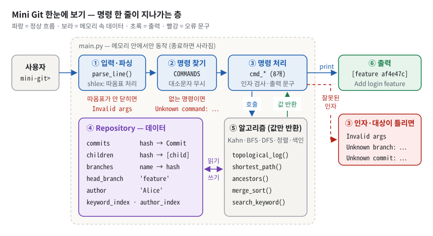
*그림 1. Mini Git 의 전체 구조 — 명령 한 줄은 ①입력·파싱 → ②명령 찾기 → ③명령 처리를 거쳐 데이터(④)와 알고리즘(⑤)을 쓰고 ⑥화면으로 나온다.*

그림 1 에서 봐야 할 것은 세 가지다.

- **파란 윗줄(①→②→③).** 파일이 `main.py` 하나뿐이라 "모듈" 대신 **층**으로 나뉜다. ① `parse_line()` 이 따옴표를 처리해 한 줄을 토큰으로 자르고(`main.py:431-436`), ② `COMMANDS` 표가 소문자 명령 이름으로 담당 함수를 찾고(`main.py:416-425`), ③ `cmd_*` 8개가 인자를 검사하고 출력 문구를 만든다(`main.py:267-413`).
- **보라 ④와 회색 ⑤의 분리.** ④ `Repository` 는 데이터(커밋·브랜치·HEAD·색인)를 들고, ⑤ 알고리즘 메서드는 **값을 반환만 하고 화면에 찍지 않는다**. 찍는 일은 ③이 한다. 이 분리 덕분에 테스트가 알고리즘을 직접 불러 검사한다(`tests/test_constraints.py:160-170` 이 알고리즘 안의 `print` 를 금지한다).
- **빨간 글씨와 빨간 점선.** 잘못된 입력은 프로그램을 죽이지 않고 **표준 문구**로 빠져나간다. ①에서 따옴표가 안 닫히면 `Invalid args`, ②에서 없는 명령이면 `Unknown command: …`, ③에서 인자가 틀리면 `Invalid args`·`Unknown branch: …`·`Unknown commit: …` 이다. `No path` 는 오류가 아니라 "두 커밋이 이어져 있지 않다"는 **정상 답**이라 여기에 없다(§3.10).
- 모든 데이터는 메모리에만 있어서 종료하면 사라진다(과제가 허용한 범위).

### 1.2 평가자는 무엇을 보나

체크리스트(`checklists_md/git_commit_graph_simulator.md`)는 4영역 20문항이다. 이 문서는 모든 문항을 §6 에 번호와 함께 옮겨 두었다.

| 영역 | 문항 수 | 평가자가 확인하는 것 | 대비하는 곳 |
|---|---|---|---|
| 1. 기능 동작 검증 | 6 | INIT·BRANCH/SWITCH/COMMIT·LOG·PATH·ANCESTORS·SEARCH/정렬을 **직접 쳐서 보여 주는가** | §5 시연, [§6.1](#61-기능-동작-검증) |
| 2. 구현 구조 설명 | 5 | 저장소/브랜치/HEAD/사용자의 분리, hash 조회와 충돌 방지, 역색인 갱신 시점, 탐색 로직 재사용, docstring 기준 | §3.3·§3.4·§3.6·§3.8·§3.14, §4, [§6.2](#62-구현-구조-설명) |
| 3. 핵심 개념 이해 | 5 | 왜 DAG 인가, 위상 정렬, BFS 와 무방향 간선, 정렬 복잡도·안정성, 역색인이 빠른 이유 | §3.5·§3.9·§3.10·§3.13·§3.14, [§6.3](#63-핵심-개념-이해) |
| 4. 확장 사고·트러블슈팅 | 4 | 10배 병목, PATH 를 부모 방향만으로 바꾸면, author 정렬 + 부모 먼저, 카운터↔난수 해시 | §3.15, §4.4, [§6.4](#64-확장-사고--트러블슈팅) |

**이 학습자가 실제 평가에서 받은 피드백**(다른 과제)을 이 과제에 옮기면 이렇게 대비한다.

| 받은 피드백 | 이 과제에서 나올 모양 | 대비하는 곳 |
|---|---|---|
| "코드 읽는 속도가 느리다", "주석을 지웠으면" | `topological_log()` 를 주석 없이 읽어 보라 | §3.9 의 코드 발췌, §6.2 Q6.2-5 |
| "인덱싱이 **왜** 인덱싱인지, 어떻게 저장되고 탐색되는지" | dict 가 키를 어떻게 칸 번호로 바꿔 저장하고, 역색인이 메모리에 어떤 모양으로 있고 `search` 가 몇 번 찾는지 | §3.3 (그림 2), §3.14 (그림 10) |
| "상황에 따라 어떤 것을 쓸지(선택 기준)" | BFS vs DFS vs Dijkstra, 머지 vs 퀵, Kahn vs DFS 위상 정렬 | §3.9~§3.13 의 "한 칸 아래", §4.3 |
| "자신감 있게" | 답의 첫 문장에 결론 | §6 의 "말로 하는 답"은 모두 결론부터 |
| "대학생이 갓 짠 코드" | 입력 내용 미검사, 예외를 한 줄로 삼킴, 실행 중 Ctrl-C 에 종료, 테스트가 실행하지 않는 줄, 코드를 되읽는 주석, `.pyc` 커밋 | §7 에서 먼저 인정하고 고칠 방법까지 |

### 1.3 30초 자기소개 스크립트

> "Git 의 커밋 그래프를 메모리 안에서 흉내 내는 Mini Git 을 만들었습니다. 커밋은 hash 를 키로 하는 딕셔너리에 두고 부모 목록을 간선으로 삼았습니다. 브랜치는 이름에서 hash 로 가는 포인터이고, HEAD 는 브랜치 **이름**을 가리켜서 실제 git 의 `.git/HEAD` 와 같은 구조입니다. 그 위에서 LOG 는 위상 정렬, PATH 는 무방향 BFS, 검색은 역색인, 정렬은 직접 짠 머지 정렬로 풀었습니다. 테스트 70개로 검증했고, 코드를 일부러 망가뜨려 테스트가 실제로 실패하는 것도 확인했습니다."

명령 8개(INIT·BRANCH·SWITCH·COMMIT·LOG·PATH·ANCESTORS·SEARCH)나 Kahn·사전순 동률 같은 세부는 평가자가 물을 때 §6 의 답으로 꺼낸다.

## 2. 명세 정독 — 무엇을 요구받았나

### 2.1 요구사항 지도

ID 는 저장소 README §0.4 가 붙인 것(R1-1 …)을 그대로 쓴다. PDF 원문에는 번호가 없다. "원문 요지" 칸은 과제 PDF 문장 그대로다. 상태는 **현재 코드를 직접 실행·확인한 결과**다.

표를 읽기 전에 세 가지만 알아 두자. **docstring** 은 함수·클래스 첫 줄에 쓰는 설명 문자열이다. "**AST** 로 검사" 는 테스트가 코드를 글자가 아니라 구조(추상 구문 트리, Abstract Syntax Tree)로 읽어서 특정 함수 호출이나 반복문이 있는지 찾는다는 뜻이다. O(1), O(N·L) 같은 표기는 §3.3 에서 풀이한다. 그 밖의 용어(DAG, BFS, 위상 정렬 …)는 §3 에서 차례로 설명하고, 부록 A 에 한 줄 뜻이 있다.

상태 칸의 표시: ✅ 충족 · "✅ ⚠️" 충족했지만 평가자가 짚을 만한 한계가 있음(§7 에서 방어) · 🔍 이 환경에서 확인할 수 없음 · ❌ 미구현.

#### R1. CLI 공통 규칙(문법 표준)

| ID | 원문 요지 (PDF 그대로) | 쉬운 말 | 왜 이런 요구를? | 내 구현 | 상태 |
|---|---|---|---|---|---|
| R1-1 | 명령어는 대소문자를 구분하지 않는다. (예: `INIT` , `init` 모두 허용) | 대문자로 치든 소문자로 치든 같은 명령 | 사람이 치는 CLI. PDF 예시는 전부 소문자 | `main.py:460` `tokens[0].lower()`, 종료어 `main.py:454` | ✅ `INIT Bob`·`COMMIT "root A"` 실측. 단 옵션 키·값은 구분(`LOG --SORT-BY=date` → `Invalid args`) |
| R1-2 | 문자열 인자(사용자명/커밋 메시지/검색 키워드)는 공백을 포함할 수 있다. | "Alice Kim" 같은 띄어쓰기 허용 | 커밋 메시지는 보통 문장이다 | `main.py:431-436` `parse_line` | ✅ `init "Alice Kim"` → `Current user: Alice Kim`. ⚠️ 파싱은 되지만 공백이 든 **검색어**는 항상 0건(`search "Add login"` → `Found 0 commits.`) — §7.3 |
| R1-3 | 공백 포함 시 따옴표로 감싼다. (예: `COMMIT "Add login feature"`) | 따옴표 안은 한 덩어리 | "공백으로 자른다"와 "공백을 품은 인자"를 동시에 만족하는 셸 규칙 | `main.py:434` `shlex.split`, 실패 시 `None`(`main.py:435-436`) → `Invalid args`(`main.py:457-459`) | ✅ `commit "unclosed` → `Invalid args` |
| R1-4 | 옵션 표기는 아래 형식으로 통일한다. `SEARCH --author=<name>` / `LOG --sort-by=date\|author` | `--이름=값` 한 가지 형식 | 파싱 규칙을 하나로 | `main.py:319-321`, `main.py:394-395` | ✅ (같은 옵션 두 번은 검사 없이 마지막 값 — §7) |
| R1-5 | 잘못된 입력에 대한 최소 에러 메시지를 표준화한다. 예: `Invalid args` , `Unknown branch: <name>` , `Unknown commit: <hash>` | 틀린 입력엔 정해진 문구 | 사용자와 채점기가 결과를 예측할 수 있고, 프로그램은 죽지 않는다 | 상수 `main.py:257`, `main.py:118`, `main.py:354` · `357` · `375` | ✅ 전부 실측 |

#### R2. 커밋 그래프(핵심 자료구조)

| ID | 원문 요지 (PDF 그대로) | 쉬운 말 | 왜 이런 요구를? | 내 구현 | 상태 |
|---|---|---|---|---|---|
| R2-1 | 커밋 노드는 최소 필드를 가진다: `hash` , `message` , `author` , `timestamp` , `parents` | 커밋 한 장에 5칸 | LOG 표시·정렬·간선에 필요한 최소 정보 | `main.py:24-29` | ✅ |
| R2-2 | 각 커밋은 0개 이상의 부모 커밋을 가질 수 있다. | 첫 커밋 0개, 보통 1개, 병합 2개 | 병합까지 표현하려면 트리가 아니라 그래프 | `main.py:29` `list(parents)`, `main.py:125` | ✅ 모델은 리스트. ⚠️ CLI 로는 최대 1개(merge 명령 없음) — 2개는 테스트가 직접 주입 |
| R2-3 | 커밋 그래프는 DAG(방향성 비순환) 구조여야 한다. | 고리 없는 한 방향 그래프 | 선후 모순 방지, 위상 정렬이 가능해짐 | `main.py:121-132` 부모 = 이미 있는 HEAD 커밋, `parents` 를 고치는 코드 없음 | ✅ 구조로 보장(사이클 검사 코드는 없음) |
| R2-4 | 커밋 저장소는 커밋 hash로 빠르게 찾을 수 있어야 한다(예: 해시맵 기반). | hash → 커밋 바로 찾기 | 탐색의 모든 단계가 조회다 | `main.py:70` `self.commits = {}` | ✅ |
| R2-5 | 커밋 hash는 세션 내 유일해야 한다(중복 금지). 구현 방식은 자유(예: 증가 카운터 기반, 난수 기반 등) 단, 중복이 발생하지 않도록 보장해야 한다. | ID 가 겹치면 안 됨 | dict 에 같은 키로 넣으면 앞 커밋이 사라진다 | `main.py:86-93` | ✅ 같은 메시지 500번 → 500개 모두 다름(`tests/test_minigit.py:448-453`). ⚠️ 겹칠 때 다시 만드는 92행은 어떤 테스트도 실행하지 않는다(§7.6) |

#### R3. 역색인(Inverted Index)

| ID | 원문 요지 (PDF 그대로) | 쉬운 말 | 왜 이런 요구를? | 내 구현 | 상태 |
|---|---|---|---|---|---|
| R3-1 | 검색 시 모든 커밋을 순회하지 않고 후보를 빠르게 가져올 수 있어야 한다. | 목록을 미리 만들어 두고 꺼내기 | O(N·L) 순회를 O(1)+O(k) 조회로 | `main.py:234-239` | ✅ 검색 함수 안 반복문 0개를 AST 로 검사(`tests/test_constraints.py:132-144`) |
| R3-2 | 키워드 추출 기준(최소 기준): 커밋 메시지를 공백 기준으로 분리(split)하고, 소문자(lower)로 정규화한 토큰을 키워드로 저장한다. | 띄어쓰기로 자르고 소문자로 | 대소문자 무관 검색 | `main.py:134-136`, 조회 `main.py:236` | ✅ `search LOGIN` → 2건. ⚠️ 구두점은 토큰에 남는다(`bug.`) |
| R3-3 | 최소 2종 인덱스를 지원한다. `keyword -> commit_hash 목록` / `author -> commit_hash 목록` | 색인 두 개 | 두 검색 모드 모두 순회 없이 | `main.py:76-77`, 갱신 `main.py:136-137` | ✅ |

#### R4. 정렬 알고리즘 직접 구현

| ID | 원문 요지 (PDF 그대로) | 쉬운 말 | 왜 이런 요구를? | 내 구현 | 상태 |
|---|---|---|---|---|---|
| R4-1 | Python 표준 정렬 API 사용 금지: `sorted()` , `list.sort()` 금지 | 정렬을 손으로 짜라 | 정렬 알고리즘을 직접 익히고 설명하게 | `main.py:38-60` | ✅ `sorted`·`.sort`·`min`·`max`·`heappush` 등 호출 0건을 AST 로 검사(`tests/test_constraints.py:112-122`) |
| R4-2 | 비교 기준을 바꿔 정렬할 수 있어야 한다. (예: 날짜 기준, 작성자 기준) | 무엇으로 줄 세울지 갈아 끼우기 | 알고리즘과 기준을 분리(key 함수) | `main.py:38` `merge_sort(items, key)`, 사용 `main.py:336`, `338`, `382` | ✅ |

#### R5. 명령어 기능 요구

| ID | 원문 요지 (PDF 그대로) | 쉬운 말 | 왜 이런 요구를? | 내 구현 | 상태 |
|---|---|---|---|---|---|
| R5-1 | `INIT <user_name>` 저장소 초기화 / `main` 브랜치 생성 및 HEAD 설정 / 현재 사용자(author) 설정 | 새 저장소 + main + 사용자 | 모든 명령의 출발점 | `main.py:99-109`, `main.py:267-274` | ✅ |
| R5-2 | `BRANCH <branch_name>` 현재 커밋(HEAD)을 가리키는 새 브랜치 생성 | 지금 커밋에 책갈피 하나 더 | 병렬 작업의 시작점 | `main.py:111-114` | ✅ ⚠️ 첫 커밋 전에도 허용(§7) |
| R5-3 | `SWITCH <branch_name>` HEAD를 지정한 브랜치로 이동 | 다른 책갈피로 손가락 옮기기 | 작업 가지 전환 | `main.py:116-119` | ✅ |
| R5-4 | `COMMIT <message>` 현재 HEAD를 부모로 하는 새 커밋 생성 / 생성 시 역색인(author/keyword)을 갱신 | 새 기록 + 색인 갱신 | 쓰기 시점에 색인을 맞춰 두기 | `main.py:121-138`, 출력 `main.py:312` | ✅ `[feature af4e47c] Add login feature` |
| R5-5 | `LOG` 학습 목적상 "최신순 나열"이 아니라, 부모 커밋이 항상 자식 커밋보다 먼저 출력되도록 출력한다(위상 정렬 성격). 출력 포맷은 자유이나, 커밋 hash / author / timestamp / message가 식별 가능해야 한다. | 부모 먼저, 네 정보가 보이게 | 위상 정렬을 익히게. `git log`(최신순)를 베끼면 틀린다 | `main.py:141-161`, `main.py:329-332`, 형식 `main.py:251` | ✅ |
| R5-6 | `LOG --sort-by=date\|author` date : timestamp 기준으로 정렬(동률 처리 규칙은 자유) / author : 작성자 이름 기준으로 정렬(동률 처리 규칙은 자유) | 날짜순·작성자순 | 직접 구현한 정렬 + 기준 교체 | `main.py:318-338` | ✅ ⚠️ CLI 로는 작성자 1명만 가능(§5.6) |
| R5-7 | `PATH <commit1> <commit2>` 최단 경로는 "커밋-부모 연결을 무방향 간선으로 간주"했을 때의 최단 경로(간선 수 최소)로 정의한다. 경로가 없으면 `No path` 를 출력한다. 최단 경로가 여러 개면, "경로를 `hash1->hash2->...` 문자열로 만들었을 때 사전순이 가장 작은 경로"를 선택한다. | 가장 적은 걸음, 없으면 No path, 동률이면 글자순 첫 번째 | BFS + 결정적인 동률 규칙 | `main.py:163-215`, `main.py:346-363` | ✅ 동률은 CLI 로 만들 수 없어 테스트로 확인(`tests/test_minigit.py:168-173`) |
| R5-8 | `ANCESTORS <commit_hash>` 해당 커밋에서 도달 가능한 모든 조상 커밋을 빠짐없이 출력한다. | 위로 닿는 모든 커밋 | 도달 가능성 + 중복 방지 | `main.py:217-231`, `main.py:366-384` | ✅ |
| R5-9 | `SEARCH <keyword>` 키워드가 포함된 커밋 메시지의 커밋들을 출력한다(역색인 기반). | 단어로 커밋 찾기 | 역색인 사용 | `main.py:398` → `main.py:234-236`, 출력 `main.py:400-413` | ✅ ⚠️ 구두점 붙은 단어·공백이 든 검색어는 못 찾음(§7.3) |
| R5-10 | `SEARCH --author=<name>` 특정 작성자의 커밋들을 출력한다(역색인 기반). | 사람으로 커밋 찾기 | 두 번째 색인 | `main.py:394-396` → `main.py:238-239` | ✅ ⚠️ 대소문자까지 정확히 같아야 함 |

#### R6. CLI 인터페이스(REPL) · R7. 구조/품질 · 제출물

| ID | 원문 요지 (PDF 그대로) | 쉬운 말 | 왜 이런 요구를? | 내 구현 | 상태 |
|---|---|---|---|---|---|
| R6-1 | `mini-git>` 프롬프트에서 명령을 반복 입력 | 프롬프트가 계속 뜬다 | REPL | `main.py:442`, `main.py:444` | ✅ |
| R6-2 | 명령 파싱 → 실행 → 결과 출력이 반복 | 읽고-처리하고-보여 주고 반복 | 한 번 틀려도 계속 쓸 수 있게 | `main.py:456-469` | ✅ INIT 전 명령·인자 수 오류·따옴표 미닫힘·모르는 옵션·없는 브랜치/커밋·모르는 명령이 섞인 12줄 세션에도 종료 코드 0(`tests/test_cli.py:138-170`). ⚠️ 종료 코드 0 은 안전망 때문에 버그가 있어도 늘 0 이라 "버그가 없다"는 증거는 아니고, 명령 실행 도중의 Ctrl-C 는 프로그램을 끝낸다(§7.4) |
| R6-3 | `exit` / `quit` 로 종료 | 종료어 | — | `main.py:454-455` | ✅ |
| R7-1 | 알고리즘 로직(탐색/정렬/인덱싱)은 독립된 함수 또는 클래스로 분리한다. | 계산과 입출력 분리 | 단위 테스트가 가능해진다 | `merge_sort`, `Repository` 메서드, `cmd_*` | ✅ 알고리즘 안 `print` 0개를 AST 로 검사 |
| R7-2 | 주요 함수/클래스에 주석 또는 docstring을 작성한다. | 설명 달기 | 유지보수 | docstring 8개 + 모듈 docstring `main.py:1-8` | ✅ (`cmd_*`·`commit()` 에는 없음 — §7) |
| D1·D2 | 필수 제출물: 엔트리 포인트(예: `main.py` ) 1개 + README.md 1개 | 실행 파일 하나와 설명서 하나 | 채점자가 바로 찾게 | `main.py`, `README.md`(601줄) | ✅ (⚠️ `__pycache__/main.cpython-314.pyc` 도 git 추적 중 — §7) |
| D3 | 실행(예): `python main.py` | 한 줄 실행 | 설치 없이 | `main.py:472-473` | 🔍 이 환경엔 `python` 이 없어 `python3 main.py` 로 ✅ |
| D4 | Python 3.10 이상 | 버전 하한 | — | `pyproject.toml` `requires-python = ">=3.10"` | 🔍 3.14.4 만 있어 3.10 실행은 미확인 |

필수 30개(R1~R7) 모두 ✅ 다. README §0.10 의 판정("충족 30 / 부분 0 / 미충족 0 / 로컬검증불가 0")과 같다. 다만 ⚠️ 가 붙은 한계는 평가자가 짚을 수 있으니 §7 의 답을 준비한다. 보너스 3개는 모두 ❌ 다(§2.4).

### 2.2 지켜야 할 제약과 그 이유

| 원문 (PDF "7. 제약 사항") | 왜 거는 제약인가 | 이 저장소에서 |
|---|---|---|
| 그래프 전용 라이브러리 사용 금지 | 그래프 탐색(위상 정렬·BFS·DFS)을 직접 짜는 것이 과제의 본체다 | import 는 `hashlib, shlex, sys, time, collections.deque, datetime` 뿐(`main.py:10-15`). 허용 목록을 테스트가 강제(`tests/test_constraints.py:25`) |
| 정렬 관련 표준 API 전부 금지: `sorted()` , `list.sort()` 등 | 정렬 알고리즘을 손으로 구현하고 설명하게 | 머지 정렬 직접 구현. `min()` 도 쓰지 않고 손 루프(`main.py:149-154`). 테스트는 `sorted, min, max, sort, most_common, cmp_to_key, insort, heappush, heappop` 호출을 금지(`tests/test_constraints.py:28-29`) |
| 기본 자료형(예: `list` , `dict` , `set` )과 문자열/파일 입출력/시간 처리는 사용 가능 | 자료구조까지 금지하면 과제가 아니라 언어 구현이 된다 | `dict`(커밋·색인), `set`(visited·인접 목록), `list`, `time.time()`, `datetime` |
| 알고리즘 로직(탐색/정렬/인덱싱)은 독립된 함수 또는 클래스로 분리한다. | 테스트·재사용·설명 가능성 | 정렬은 모듈 함수, 탐색·색인은 `Repository` 메서드, 출력은 `cmd_*` |
| 주요 함수/클래스에 주석 또는 docstring을 작성한다. | 유지보수 | docstring 8개(§6.2 Q6.2-5) |
| 파일 내용 추적은 구현하지 않는다(커밋 메타데이터 중심). | 자료구조·알고리즘에 집중시키려고 | 커밋은 메타데이터만(파일·diff 없음) |
| 네트워크 통신은 구현하지 않는다. / 데이터 영속성(파일 저장)은 구현하지 않아도 된다(메모리 상 동작으로 충분). | 범위를 좁히려고 | 메모리만. 종료하면 사라진다 |

**회색지대 세 개.** 평가자가 "이건 표준 라이브러리 아닌가요?" 하고 물을 수 있다.

- `collections.deque` — 그래프 라이브러리가 아니라 양쪽 끝에서 넣고 빼는 게 빠른 **큐 자료형**이다. "기본 자료형" 범주로 본다(README §0.10 의 비고 6번과 같은 판단).
- `shlex`, `hashlib` — 파싱·해시 도구일 뿐 그래프나 정렬 API 가 아니다.
- `heapq` — 힙(가장 작은 값을 빨리 꺼내는 자료구조, §3.15 에서 풀이)은 "정렬 관련 표준 API … 등"에 걸릴 소지가 있다. 그래서 쓰지 않았고, 테스트도 `heappush`/`heappop` 을 금지한다. 개선안에서 힙이 필요하면 **직접 구현**한다고 말한다(§6.4).

### 2.3 출력·형식 규칙

원문이 글자 그대로 요구한 문자열과 이 구현의 실제 문자열이다.

| 원문 | 이 구현 (현재 코드) | 일치 |
|---|---|---|
| 프롬프트 `mini-git>` | `input('mini-git> ')` (`main.py:444`) | ✅ 뒤에 공백 하나 |
| `exit` / `quit` 로 종료 | `line.lower() in ('exit', 'quit')` (`main.py:454`) | ✅ 대소문자 무관 |
| `Invalid args` | `INVALID = 'Invalid args'` (`main.py:257`) | ✅ |
| `Unknown branch: <name>` | `f'Unknown branch: {name}'` (`main.py:118`) | ✅ |
| `Unknown commit: <hash>` | `f'Unknown commit: {a}'` 등 (`main.py:354`) | ✅ |
| `No path` | `print('No path')` (`main.py:361`) | ✅ |
| 경로 문자열 `hash1->hash2->...` | `best[u] + '->' + v` (`main.py:209`) → `Path: …` (`main.py:363`) | ✅ 공백 없음 |

그 밖에 이 구현이 내는 문구: `Unknown command: <cmd>`(`main.py:464`), `Repository not initialized. Run: INIT <user_name>`(`main.py:262`), `Branch already exists: <name>`(`main.py:113`), `(no ancestors)`(`main.py:378`), `Found 0 commits.`(`main.py:401`), `Error: <e>`(`main.py:469`).

**PDF "8. 결과 예시"와 다른 점** (원문: "아래는 정답이 아니라 참고 예시다. 실제 문구와 디자인은 달라도 된다"). 물어볼 수 있으니 알아 둔다.

- 초기화·브랜치·커밋·검색 문구는 **글자까지 같다**: `Initialized repository.` / `Current branch: main` / `Current user: Alice` / `Created branch: feature` / `Switched to branch: feature` / `Found 1 commit:` / `- d4e5f6: Add login feature`.
- hash 길이: 원문 예시는 6자(`a1b2c3`), 이 구현은 7자.
- 경로: 원문 예시는 `Path: a1b2c3 -> g7h8i9`(화살표 양옆 공백), 이 구현은 `Path: 112f66d->955b518` 처럼 공백이 없다. 원문의 규칙 문장 `hash1->hash2->...` 에 맞춘 것이다.
- LOG 라벨: 원문 예시는 첫 커밋에도 `[main]` 을 붙였다. 이 구현은 **지금 그 커밋을 가리키는 브랜치들**만 붙인다(`main.py:95-96`, `main.py:246-250`). 실제 git 의 표시(decoration)와 같은 의미다. 그래서 CANON 의 첫 커밋 `112f66d` 에는 라벨이 없다.
- `log --sort-by=author` 는 원문 예시처럼 라벨이 없다(`main.py:343` `with_branches=(sort_by is None)`).
- 시각은 **로컬 시간대**로 찍힌다(`main.py:32` `datetime.fromtimestamp`). 이 컨테이너는 UTC 라 `09:00:00`, 한국 시간 PC 에서는 같은 커밋이 `18:00:00` 으로 보인다(실측: `TZ=Asia/Seoul` 로 돌리면 9시간 뒤로 찍힘). hash 는 시간대와 상관없다(epoch 숫자로 계산).

### 2.4 보너스 과제

| ID | 원문 | 상태 | 물으면 |
|---|---|---|---|
| B1 | `diff <file1> <file2>` 명령을 추가해 두 텍스트 파일을 줄 단위로 비교한다. 추가/삭제/공통 줄을 구분해 출력한다. | ❌ `COMMANDS`(`main.py:416-425`)에 없음 | "필수 30개에 집중했습니다. 넣는다면 두 파일의 줄 목록에 LCS(최장 공통 부분 수열) 동적 계획법을 돌려 공통 줄은 공백, 추가는 `+`, 삭제는 `-` 로 찍겠습니다." |
| B2 | `merge <branch_name>` 명령을 추가한다. 부모가 2개인 merge commit을 생성한다(현재 브랜치의 HEAD와 대상 브랜치의 HEAD를 부모로). | ❌ `commit()` 은 부모를 최대 1개만 만든다(`main.py:124-125`) | "자료구조(부모 리스트)와 세 알고리즘은 이미 부모 여러 개를 처리합니다. 다이아몬드 테스트가 증거입니다. `commit()` 이 부모 목록을 받게 하고 `merge` 가 `[현재 HEAD, 대상 HEAD]` 를 넘기면 됩니다." |
| B3 | 서로 다른 정렬 알고리즘을 2개 이상 구현하고, 입력 크기에 따른 실행 시간을 비교한다. | ❌ `merge_sort` 1종뿐 | "삽입 정렬을 하나 더 짜서 n=100/1,000/10,000 에서 `time.perf_counter()` 로 재면 O(n²) 과 O(n log n) 의 차이가 표로 보입니다." |

B2 가 없다는 사실은 뒤에서 여러 번 중요해진다. **CLI 로 만든 그래프는 항상 나무(또는 나무 여러 개인 숲) 모양(부모 ≤ 1)** 이라서, PATH 의 동률 규칙과 ANCESTORS 의 중복 방지가 CLI 에서는 실제로 발동하지 않는다. 그래서 이 둘은 테스트 데이터(다이아몬드)로 보여 준다(§3.11, §5.7).

## 3. 배경 개념 — 처음부터 차근차근

개념은 쉬운 것에서 어려운 것 순서로 쌓는다. 3.1~3.4 는 재료(커밋·REPL·딕셔너리·해시), 3.5~3.8 은 그래프의 모양(DAG·포인터·실제 git·인접 리스트), 3.9~3.12 는 그래프 위의 알고리즘(위상 정렬·BFS·사전순·DFS), 3.13~3.15 는 정렬·색인·복잡도다. 각 칸은 "비유 → 정확한 정의 → 숫자 → 내 코드 → 한 칸 아래 → 흔한 오해" 순서다. 코드 발췌 왼쪽의 숫자는 `main.py` 의 줄 번호다. 발췌에서 뺀 줄이 있으면 번호가 건너뛰고, 떨어진 곳을 이어 붙인 자리에는 `…` 를 둔다. 들여쓰기는 읽기 쉽게 한 단계 이상 당겼다.

### 3.1 버전 관리와 커밋 — 기록 한 장

**비유로 먼저.** 일기장의 한 페이지다. 누가(author), 언제(timestamp), 무엇을(message), 몇 페이지 다음인지(parents)가 적혀 있고, 페이지 번호(hash)가 붙어 있다. 한 번 쓴 페이지는 고치지 않는다. 고치고 싶으면 새 페이지를 쓴다.
비유의 한계: 실제 git 커밋은 그 순간의 **파일 전체 모습(스냅샷)** 도 담는다. 이 과제는 명세상 "파일 내용 추적은 구현하지 않는다" 이므로 **메타데이터**(내용이 아니라 내용에 대한 정보 — 누가·언제·무엇을)만 담는다. 또 일기장은 한 줄로만 이어지지만, 커밋은 한 페이지 뒤에 두 페이지가 갈라져 붙을 수 있다(그림 3 의 `112f66d` 뒤에 `af4e47c` 와 `955b518` 두 갈래).

**정확히 말하면.** **버전 관리**(version control)는 파일이 언제·누가·어떻게 바뀌었는지 기록을 남기는 일이다. **커밋**(commit)은 그 이력의 한 시점을 가리키는 **불변** 기록이다. 부모가 없는 첫 커밋을 **루트 커밋**, 부모가 2개 이상인 커밋을 **병합 커밋**(merge commit)이라고 부른다. **timestamp** 는 1970-01-01 00:00:00 UTC 부터 흐른 초를 숫자로 적은 시각이다(이 기준점을 **epoch** 라고 부른다).

**구체적인 숫자로.** CANON 에서 두 번째 커밋을 파이썬으로 들여다보면 이렇다(실측).

```text
hash      = 'af4e47c'
message   = 'Add login feature'
author    = 'Alice'
timestamp = 1705310100.0      # 2024-01-15 09:15:00 UTC 까지 흐른 초
parents   = ['112f66d']       # Initial commit 한 개
```

1705310100 에서 2024-01-15 00:00 UTC(1705276800)를 빼면 33,300초 = 9시간 15분이다. 화면에는 `time_str()` 가 `2024-01-15 09:15:00` 으로 바꿔 보여 준다.

**이 과제에서는.** 명세 R2-1 의 5필드가 그대로 `Commit` 클래스다(`main.py:21-32`).

```python
21  class Commit:
24      def __init__(self, commit_hash, message, author, timestamp, parents):
25          self.hash = commit_hash
26          self.message = message
27          self.author = author
28          self.timestamp = timestamp  # epoch float
29          self.parents = list(parents)  # 부모 hash 목록 (0개 이상)
```

- `parents` 가 **리스트**인 것이 핵심이다. 0개(루트), 1개(보통), 2개 이상(병합)을 모두 담는다(R2-2).
- `list(parents)` 는 받은 목록을 **복사**한다. 밖에서 원래 목록을 고쳐도 커밋 안의 부모가 바뀌지 않는다.
- `timestamp` 는 숫자로 저장하고, 보여 줄 때만 글자로 바꾼다(`main.py:31-32`). 숫자라서 정렬·비교가 쉽다.

**한 칸 아래.** 실제 git 커밋은 어떻게 생겼나? CANON 과 같은 모양·같은 시각으로 스크래치 git 저장소를 만들고 `git cat-file -p HEAD` 로 마지막 커밋을 열어 보면 이렇다(git 2.55 실측).

```text
tree 4b825dc642cb6eb9a060e54bf8d69288fbee4904
parent 426a67b6872bdf5838856c31d480c6e150b3fd34
author Alice <alice@example.com> 1705311900 +0000
committer Alice <alice@example.com> 1705311900 +0000

Fix login bug
```

`tree` 는 파일 스냅샷을 가리키는 ID 다(`4b825dc…` 는 파일이 하나도 없는 빈 트리 — `--allow-empty` 로 만들어서). 이 과제의 `Commit` 은 여기서 `tree` 와 `committer` 를 뺀 모양이다. `parent` 가 한 줄, `author` 뒤의 숫자가 timestamp 라는 점이 똑같다.

> [!WARNING]
> **흔한 오해.** "커밋은 바뀐 부분(diff)을 저장한다" → 일반적으로 git 은 **스냅샷**(tree)을 저장하고, diff 는 보여 줄 때 두 스냅샷을 비교해 계산한다. 이 과제는 둘 다 없고 메타데이터만 있다.

### 3.2 REPL 과 명령 파싱 — 주문 받고, 알아듣고, 처리하고, 다시 주문 받기

**비유로 먼저.** 식당 카운터다. 손님의 말(입력 한 줄)을 주문표(토큰 목록)로 옮겨 적고, 메뉴판(`COMMANDS` 표)에서 담당 요리사(`cmd_*` 함수)를 찾아 넘기고, 음식(출력)을 낸 뒤 다음 손님을 받는다. 없는 메뉴면 "그런 메뉴는 없습니다"(`Unknown command`)라고 말하고 가게 문을 닫지 않는다.
비유의 한계: 식당은 여러 주문을 동시에 받지만 이 REPL 은 한 번에 한 줄씩 처리한다.

**정확히 말하면.** **REPL** 은 Read-Eval-Print Loop(읽기-처리-출력-반복)의 줄임말이다. **파싱**(parsing)은 글자 한 줄을 의미 있는 조각으로 나누는 일이고, 그 조각을 **토큰**이라고 부른다. `shlex.split(line, posix=True)` 는 유닉스 셸과 같은 규칙으로 자른다. 공백으로 나누되 따옴표 안은 한 덩어리로 두고, 따옴표 자체는 벗긴다. **디스패치 테이블**은 "명령 이름 → 처리 함수"를 적어 둔 표다.

**구체적인 숫자로.** `parse_line()` 에 넣어 본 실측 결과다.

| 입력 | 토큰 | 결과 |
|---|---|---|
| `commit "Add login feature"` | `['commit', 'Add login feature']` | 인자 1개 → 커밋 |
| `commit Add login feature` | `['commit', 'Add', 'login', 'feature']` | 인자 3개 → `Invalid args` |
| `search --author="Alice Kim"` | `['search', '--author=Alice Kim']` | 단어 중간의 따옴표도 처리 |
| `commit "unclosed` | `shlex` 가 `ValueError: No closing quotation` → `None` | `Invalid args` |

**이 과제에서는.** REPL 루프의 뒷부분(`main.py:451-469`)이 파싱 → 디스패치 → 실행을 한다.

```python
451  line = line.strip()
452  if not line:
453      continue
454  if line.lower() in ('exit', 'quit'):
455      break
456  tokens = parse_line(line)
457  if tokens is None or not tokens:
458      print(INVALID)
459      continue
460  cmd = tokens[0].lower()  # 명령은 대소문자 무시
461  args = tokens[1:]
462  handler = COMMANDS.get(cmd)
463  if handler is None:
464      print(f'Unknown command: {cmd}')
465      continue
```

- 첫 토큰만 `lower()` 하므로 **명령 이름**만 대소문자를 무시한다(R1-1). 인자와 옵션 값은 그대로다.
- `COMMANDS.get(cmd)` 는 딕셔너리를 한 번 찾는다. if/elif 사다리 대신 표를 두면 새 명령은 표에 한 줄만 더하면 된다.
- 핸들러 실행은 `try … except Exception`(`main.py:466-469`)으로 감싸서, 예상 못 한 예외가 나도 `Error: …` 한 줄을 찍고 루프가 계속된다.

**한 칸 아래.**
- **shlex 의 속.** 한 글자씩 읽으며 "평소 / 따옴표 안 / **이스케이프**(`\"` 처럼 다음 글자를 특수 기호가 아닌 보통 글자로 취급)" 상태를 바꾸는 작은 **상태 기계**다. 따옴표 안의 공백은 구분자로 보지 않는다. 끝까지 읽었는데 따옴표가 열려 있으면 `ValueError`(**예외** — 실행 중 문제가 생겼음을 알리는 신호, `try/except` 로 받는다)를 던지고, `parse_line` 이 이를 받아 `None` 을 돌려준다(`main.py:433-436`).
- **입력 끝과 Ctrl-C.** 입력이 끝나면(Ctrl-D, EOF) 줄을 바꾸고 종료한다(`main.py:445-447`). Ctrl-C 는 **프롬프트에서 입력을 기다릴 때만** 그 줄을 버리고 계속한다(`main.py:448-450`). 명령이 실행되는 **도중**의 Ctrl-C 는 핸들러를 감싼 `except Exception`(`main.py:468`)이 잡지 못한다. Ctrl-C 가 만드는 `KeyboardInterrupt` 는 `Exception` 의 자식이 아니라 그보다 위인 `BaseException` 의 자식이기 때문이다. 그래서 traceback(예외가 난 위치를 줄 번호로 찍은 기록)과 함께 프로그램이 끝나고 메모리의 저장소도 사라진다(복사본 실측, §7.4).
- **안전망의 대가.** `except Exception` 은 **진짜 버그도 한 줄 문구로 묻을 수 있다**(§7.4).

> [!WARNING]
> **흔한 오해.** "`str.split()` 이면 충분하다" → `commit "Add login feature"` 가 `['commit', '"Add', 'login', 'feature"']` 네 조각이 되어 따옴표가 글자로 남고 인자 수도 틀린다. 따옴표 규칙이 필요해서 `shlex` 를 썼다.

### 3.3 해시맵(dict)과 평균 O(1) — 사물함 번호로 바로 찾기

**비유로 먼저.** 번호가 적힌 사물함이다. 이름표(키)를 정해진 규칙(해시 함수)으로 번호로 바꾸면 그 칸을 바로 연다. 처음부터 한 칸씩 열어 볼 필요가 없다.
비유의 한계: 두 이름이 같은 번호로 바뀌면(충돌) 옆 칸을 찾아가야 한다. 그래서 "항상" 한 번이 아니라 "평균" 한 번이다.

**정확히 말하면.** **해시맵**(파이썬 `dict`)은 키 → 해시값 → 배열의 칸 번호로 값을 바로 찾는 자료구조다. 여기서 **빅오(Big-O)** 표기를 처음 쓴다. 빅오는 입력 크기 n 이 커질 때 일의 양이 늘어나는 **모양**을 적는 표기다. O(1) 은 n 과 상관없이 거의 일정, O(n) 은 n 에 비례, O(n²) 은 n 의 제곱에 비례한다. **O(log n)** 은 "n 을 반으로 몇 번 나눠야 1 이 되나"를 센 값이다. n = 8 이면 3번, 1,000 이면 약 10번, 10,000 이면 약 14번이다. n 이 10배가 돼도 3~4번만 늘어난다. **O(n log n)** 은 n 과 log n 을 곱한 것이다(§3.13 의 머지 정렬). dict 조회는 **평균 O(1)**, 모든 키가 한 칸에 몰리는 **최악은 O(n)** 이다.

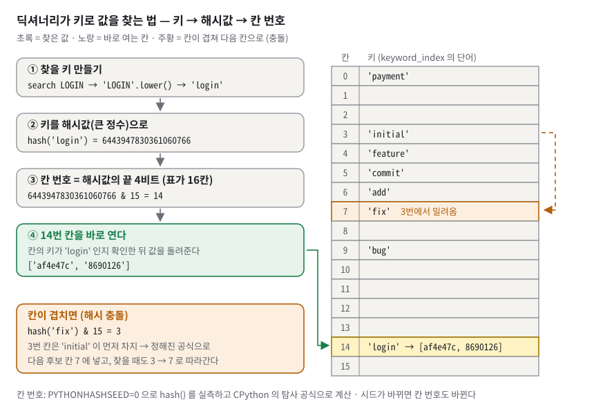
*그림 2. 딕셔너리가 키로 값을 찾는 법 — 키를 해시값으로 바꾸고 그 끝자리로 칸 번호를 정해 그 칸을 바로 연다. 칸이 겹치면(fix) 정해진 공식으로 다음 칸을 찾는다.*

그림 2 는 이 과제의 dict 하나, `keyword_index`("단어 → 그 단어가 든 커밋 목록", §3.14 에서 자세히 본다)에 CANON 의 단어 8개가 들어간 모습이다. 위에서 아래로 네 단계만 따라가자.

- **①→② 키를 큰 정수로.** `search LOGIN` 은 먼저 `'login'` 이 되고, `hash('login')` 은 6443947830361060766 이라는 큰 정수가 된다.
- **③ 칸 번호.** 표가 16칸이면 이 수의 끝 4비트(`& 15`, 16 으로 나눈 나머지와 같다)인 **14** 가 칸 번호다. 0번 칸부터 하나씩 열어 보는 대신 14번 칸을 **바로** 연다. 이것이 "인덱싱이 빠른 이유"다.
- **④ 확인하고 값 꺼내기.** 칸에는 키도 함께 적혀 있어서, 연 칸의 키가 정말 `'login'` 인지 비교한 뒤 값 `['af4e47c', '8690126']` 을 돌려준다.
- **주황 — 충돌.** `'fix'` 의 칸 번호도 3 인데 `'initial'` 이 먼저 차지했다. 그러면 정해진 공식으로 다음 후보 칸(7)을 계산해 넣는다. 찾을 때도 같은 공식으로 3 → 7 을 따라간다.

(값의 출처: `PYTHONHASHSEED=0` 으로 시드를 고정하고 `hash()` 를 실측한 뒤, CPython 의 탐사 공식으로 칸을 계산했다. 표가 16칸인 것은 단어를 하나씩 넣으며 `sys.getsizeof` 를 재서 6번째 키와 11번째 키에서 dict 가 커지는 것으로 확인했다. 시드를 1 로 바꾸면 `'login'` 은 8번 칸이 된다.)

**구체적인 숫자로.** 커밋 10,000개를 만든 뒤 한 단어를 찾는 시간을 쟀다(이 학습 문서를 준비하며 복사본에서 실측, 기계마다 다름). µs 는 백만분의 1초, ms 는 천분의 1초다(1ms = 1,000µs).

| 방법 | 10,000개에서 `word7`(100건 일치) 찾기 |
|---|---|
| 역색인 dict 한 번 조회 | 9.6µs |
| 모든 커밋 메시지를 훑기 | 3.61ms (약 376배 느림) |

다시 돌렸을 때는 12.4µs 와 3.81ms 가 나왔다. 숫자는 흔들리지만 "수백 배" 차이는 그대로다.

**이 과제에서는.** 커밋 저장소와 두 역색인이 전부 dict 다(`main.py:70`, `main.py:76-77`). PATH·ANCESTORS 가 한 걸음 갈 때마다 `self.commits[h]` 로 커밋을 찾으므로, 이 조회가 O(1) 이어야 탐색 전체가 빨라진다. 명세 R2-4 가 "해시맵 기반"을 예로 든 이유다.

**한 칸 아래.** 일반적으로 CPython 의 dict 는 **개방 주소법**을 쓴다. 충돌하면 정해진 순서로 표 안의 다른 빈칸을 찾아간다(그림 2 의 `'fix'`). 표가 약 2/3 쯤 차면 더 큰 표로 옮겨서 평균 O(1) 을 지킨다. 또 일반적으로 CPython 은 칸에 "몇 번째로 넣은 항목인지" 번호만 두고, 키와 값은 넣은 순서대로 별도 배열에 둔다. 그래서 파이썬 3.7 부터 dict 는 넣은 순서를 기억한다(LOG 라벨이 `[main, feature]` 순인 이유, Q6.5-16). 파이썬 문자열의 해시에는 **프로세스마다 무작위 시드**가 섞인다. 그래서 `set` 을 그대로 찍으면 순서가 실행마다 바뀐다. 같은 조상 집합을 `PYTHONHASHSEED` 1·2·3·4 로 찍어 본 실측이다.

```text
seed 1: {'bbbbbb2', 'ccccc03', 'aaaaaa1'}
seed 2: {'ccccc03', 'aaaaaa1', 'bbbbbb2'}
seed 3: {'aaaaaa1', 'ccccc03', 'bbbbbb2'}
seed 4: {'bbbbbb2', 'ccccc03', 'aaaaaa1'}
```

그래서 ANCESTORS 는 결과 집합을 출력하기 전에 `(timestamp, hash)` 로 정렬한다(`main.py:380-382`).

> [!WARNING]
> **흔한 오해 둘.** ① "dict 는 항상 O(1)" → 평균일 뿐이다. ② "커밋 hash(SHA-1)와 dict 가 쓰는 해시는 같은 것" → **다르다**. 커밋 hash 는 사람이 보는 ID 를 만드는 데 쓰고(§3.4), dict 의 해시는 칸 번호를 정하는 내부 계산이다. 커밋 hash 문자열이 dict 의 **키**로 들어가서 한 번 더 해시된다.

### 3.4 해시 함수와 커밋 ID — 내용을 넣으면 지문이 나오는 기계

**비유로 먼저.** 지문이다. 같은 사람이면 항상 같은 지문이 나오고, 조금만 달라도 완전히 다른 지문이 나온다. 지문만 보고 사람을 되살릴 수는 없다.
비유의 한계: 지문(7자리)은 개수가 유한해서 언젠가는 겹칠 수 있다(충돌).

**정확히 말하면.** **해시 함수**는 임의 길이 입력을 고정 길이 값으로 바꾸는 함수다. **SHA-1** 은 결과가 160비트, 16진수 40자다. 이 구현은 `카운터|작성자|메시지|시각` 문자열을 SHA-1 에 넣고 앞 7자리만 커밋 ID 로 쓴다. 서로 다른 입력이 같은 값을 내는 일을 **해시 충돌**이라고 한다.

**구체적인 숫자로.** CANON 네 커밋의 실제 입력과 결과다(파이썬 `hashlib` 로 재계산해 일치 확인).

| 순번 | 입력 문자열 | SHA-1 (40자) | 앞 7자리 |
|---|---|---|---|
| 1 | `1\|Alice\|Initial commit\|1705309200.0` | `112f66d41e3ad7aba6dc8bdae95b77640e650408` | `112f66d` |
| 2 | `2\|Alice\|Add login feature\|1705310100.0` | `af4e47c71474e57714486e0ab34ec705818aa691` | `af4e47c` |
| 3 | `3\|Alice\|Add payment feature\|1705311000.0` | `955b518e3830ce100edfaf9299efd0f5f087b9bf` | `955b518` |
| 4 | `4\|Alice\|Fix login bug\|1705311900.0` | `8690126c0777f96969e8e5b019df8d6eacb08505` | `8690126` |

7자리 16진수는 16⁷ = **268,435,456** 가지다. 많아 보이지만 **생일 문제**(칸이 N 개일 때 √N 개쯤만 넣어도 어딘가 겹칠 확률이 커지는 현상)로 계산하면 약 **19,291개** 커밋에서 겹칠 확률이 50% 다(√(2·ln2·2²⁸) 실측 계산). 그래서 검사 루프가 필요하다.

**이 과제에서는.** `_new_hash`(`main.py:86-93`)가 ID 를 만든다.

```python
86  def _new_hash(self, message, author, ts):
87      """세션 내 유일한 해시를 만든다. 충돌 시 카운터를 늘려 재시도."""
88      while True:
89          self._counter += 1
90          raw = f'{self._counter}|{author}|{message}|{ts}'.encode('utf-8')
91          h = hashlib.sha1(raw).hexdigest()[:7]
92          if h not in self.commits:
93              return h
```

- **중복 방지 1단**: 부를 때마다 `_counter` 를 1 올려 입력에 섞는다(89행). 같은 사람이 같은 메시지를 같은 시각에 써도 입력이 달라진다. 실측: 작성자 `Alice`, 시각을 1700000000.0 으로 고정하고 `same` 을 두 번 커밋하면 `8f69033`, `c53763c` 로 다르다.
- **중복 방지 2단**: 만든 7자리가 이미 `commits` 에 있으면(92행) 카운터를 올려 다시 만든다. 카운터가 바뀌면 입력이 바뀌므로 다음 시도는 다른 값이 나온다. 단, 이 재시도 경로를 실제로 돌려 보는 테스트는 없다. 복사본에서 92행을 `if True:` 로 바꿔도 테스트 70개가 모두 통과했다(§7.6).
- 시각 `ts` 는 `commit()` 이 **딱 한 번** 읽어서(`main.py:122`) hash 재료와 커밋의 timestamp 에 같이 쓴다. 코드 품질 가이드가 "한 논리적 연산이 시계를 한 번만 읽는다"고 칭찬한 부분이다.

**한 칸 아래.** 시각이 재료에 들어가서 **실행할 때마다 hash 가 다르다**. 같은 두 줄 `init "Alice"` → `commit "Initial commit"` 이 진짜 시계로는 `c9695fb`, 1초 뒤에는 `b797806`, CANON 에서는 `112f66d` 였다(실측). 재현하려면 시계를 고정해야 한다(§5.0). 실제 git 은 40자 전체를 저장하고, 화면에는 짧게 보여 주되 모호하지 않을 만큼만 자른다(작은 저장소에서 `git rev-parse --short HEAD` → `739ca9a`, 실측). 또 git 의 SHA-1 재료에는 **부모 커밋 ID** 가 들어간다. 이 차이는 §3.7 에서 다룬다.

> [!WARNING]
> **흔한 오해.** "SHA-1 을 썼으니 절대 안 겹친다" → 7자리로 자르면 2억 6천만 칸짜리 공간이고, 2만 개쯤이면 겹칠 확률이 절반이다. 겹침 검사(`main.py:92`)가 있어야 유일성이 **보장**된다(그 줄이 도는지 검사하는 테스트가 없다는 점은 §7.6). SHA-1 을 쓴 이유는 보안이 아니라 git 처럼 보이는 16진 ID 를 만들기 위해서다.

### 3.5 그래프와 DAG — 화살표로 이어진 점들, 되돌아오는 고리 없음

**비유로 먼저.** 족보다. 사람(점)마다 "내 부모는 누구"라는 화살표가 있다. 화살표를 따라 올라가면 조상이 나오고, 아무리 올라가도 자기 자신으로 돌아오지 않는다. "내가 내 할아버지의 할아버지"인 족보는 있을 수 없다.
비유의 한계: 사람은 부모가 정확히 2명이지만 커밋은 0개, 1개, 2개 이상 모두 가능하다.

**정확히 말하면.** **그래프**는 **노드**(정점, 점)와 **간선**(두 점을 잇는 선)으로 관계를 나타낸 것이다. 간선에 화살표가 있으면 **방향 그래프**, 양쪽으로 다닐 수 있으면 **무방향 그래프**다. 화살표를 따라가다 제자리로 돌아오는 길을 **사이클**이라고 한다. **DAG**(Directed Acyclic Graph)는 방향이 있고 사이클이 없는 그래프다. 사이클이 없고 모든 노드의 부모가 하나 이하이며 루트가 하나(전부 이어져 있음)이면 **트리**(나무), 그런 트리가 여러 개 모여 루트가 여럿이면 **숲**(forest)이라고 부른다.

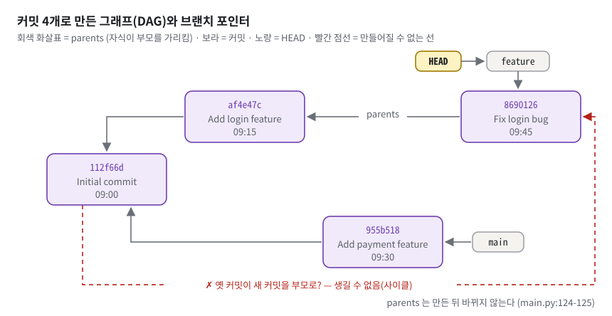
*그림 3. 커밋 4개로 만든 실제 그래프 — 부모를 가리키는 화살표는 늘 새 커밋에서 옛 커밋으로만 향하므로 되돌아오는 고리(사이클)가 생길 수 없다.*

그림 3 은 CANON 네 커밋의 실제 모양이다. 볼 것은 세 가지다.

- **회색 화살표의 방향.** `af4e47c→112f66d`, `955b518→112f66d`, `8690126→af4e47c`. 셋 다 오른쪽(나중 시각)에서 왼쪽(이전 시각)으로 향한다. 09:15→09:00, 09:30→09:00, 09:45→09:15.
- **루트와 가지.** 부모가 없는 루트는 `112f66d` 하나다. 거기서 두 갈래(login 쪽, payment 쪽)가 나뉜다.
- **빨간 점선.** "옛 커밋 `112f66d` 가 새 커밋 `8690126` 을 부모로 가리킨다"는 선이다. 이 선이 있으면 부모 화살표를 따라 `112f66d → 8690126 → af4e47c → 112f66d` 로 한 바퀴 돌아 제자리로 오는 고리가 생긴다. 이 구현에서는 이런 선을 만드는 코드가 없다.

**구체적인 숫자로.** 노드 4개, 간선 3개, 루트 1개. 커밋을 만든 순서대로 1, 2, 3, 4 번호를 붙이면 모든 간선이 "큰 번호 → 작은 번호"다(2→1, 3→1, 4→2). 큰 번호에서 작은 번호로만 갈 수 있으면 출발한 번호로 돌아올 수 없다. 이것이 사이클이 없는 이유의 전부다.

**이 과제에서는.** 간선은 `commit()` 에서만, 그리고 **이미 존재하는** HEAD 커밋을 부모로만 생긴다(`main.py:124-125`).

```python
124  parent = self.head_commit()
125  parents = [parent] if parent is not None else []
126  node = Commit(h, message, self.author, ts, parents)
```

만들어진 커밋의 `parents` 를 고치는 코드는 파일 어디에도 없다. 그래서 "새 → 옛" 방향의 간선만 쌓이고, DAG 가 **구조적으로** 보장된다(R2-3). 별도의 사이클 검사 코드는 없다. 테스트는 "위상 정렬 출력 수 == 커밋 수"로 간접 확인한다(`tests/test_minigit.py:66-71`).

**한 칸 아래.** 사이클이 있으면 무엇이 깨지나? 복사본에서 `x←y←z` 사슬을 만든 뒤 억지로 `x` 의 부모에 `z` 를 넣고, 따로 떨어진 `w` 를 하나 더 둔 실험 결과다(실측).

```text
topological_log: ['wwwwww4'] (commits: 4 )
ancestors(xxxxxx1): ['xxxxxx1', 'yyyyyy2', 'zzzzzz3']
```

- LOG 는 4개 중 **1개만** 낸다. 사이클 안의 세 커밋은 "먼저 나와야 할 부모"가 영원히 남아 있어서 후보에 오르지 못한다. **에러 없이 조용히 빠진다.**
- ANCESTORS 는 **자기 자신을 자기 조상**으로 낸다. visited 덕분에 무한 루프는 없다(§3.12).

실제 git 에서는 한 칸 더 강하다. 커밋 ID 가 부모 ID 를 재료로 계산되므로, 사이클을 만들려면 "아직 만들지 않은 자식의 ID"를 부모 칸에 미리 적어야 한다. 해시를 거꾸로 풀어야 하는 일이라 일반적으로 사실상 불가능하다(§3.7).

> [!WARNING]
> **흔한 오해.** "커밋 이력은 트리다" → 병합 커밋(부모 2개)이 있으면 한 노드로 들어오는 선이 둘이라 트리가 아니다. 이 구현의 CLI 는 merge 명령이 없어서 실제로는 **숲**만 만들어지지만, 자료구조(부모 리스트)와 알고리즘은 DAG 전체를 처리한다. 병합이 있는 다이아몬드는 테스트가 직접 만들어 검사한다(`tests/test_minigit.py:160-166`).

### 3.6 브랜치와 HEAD = 포인터 — 책갈피와, 지금 쓰는 책갈피를 가리키는 손가락

**비유로 먼저.** 브랜치는 특정 페이지에 꽂힌 **책갈피**다. HEAD 는 "지금 내가 쓰고 있는 책갈피가 어느 것인지" 가리키는 **손가락**이다. 새 페이지를 쓰면 손가락이 가리키는 책갈피만 새 페이지로 옮긴다. 다른 책갈피는 제자리다.
비유의 한계: 실제 책갈피는 한 페이지에 하나지만 여기서는 한 커밋에 여러 브랜치가 붙을 수 있다(`[main, feature]`).

**정확히 말하면.** **포인터**는 "무엇이 어디 있는지"를 적은 값이다. **브랜치**는 이름 → 커밋 hash 한 칸이다. **HEAD** 는 브랜치 **이름**이다. HEAD 가 커밋을 직접 가리키지 않고 브랜치를 거쳐 가리키는 방식을 **심볼릭 참조**(간접 참조)라고 한다. INIT 직후의 `main` 처럼 이름만 있고 가리킬 커밋이 없는 브랜치를 git 에서는 **unborn branch**(아직 태어나지 않은 브랜치)라고 부른다.

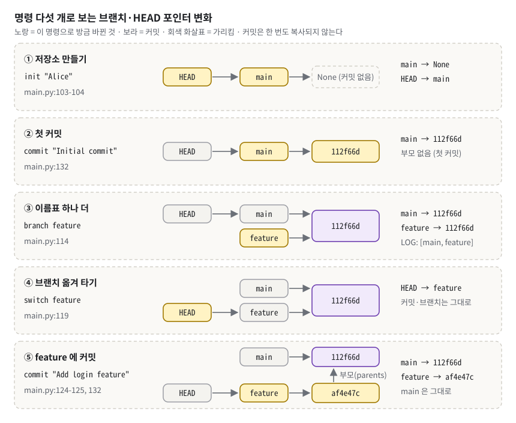
*그림 4. 명령 다섯 개가 포인터를 바꾸는 모습 — 노란 칸이 방금 바뀐 곳이다. 커밋은 한 번도 복사되지 않고 이름표(브랜치)와 손가락(HEAD)만 움직인다.*

그림 4 를 위에서 아래로 따라가며 노란 칸만 보자. ① INIT 은 `HEAD → main → None` 을 만든다. ② 첫 COMMIT 은 `main` 을 새 커밋으로 채운다. ③ BRANCH 는 **이름표 하나**(`feature`)를 같은 커밋에 붙인다. ④ SWITCH 는 **손가락만** `main` 에서 `feature` 로 옮긴다. 커밋과 브랜치는 그대로다. ⑤ COMMIT 은 새 커밋을 만들고 **손가락이 가리키는 이름표(`feature`)만** 옮긴다. `main` 은 `112f66d` 에 남는다.

**구체적인 숫자로.** CANON 을 한 명령씩 실행하며 `branches` 와 `head_branch` 를 찍은 실측이다.

| 명령 | `branches` | `head_branch` |
|---|---|---|
| `init "Alice"` | `{'main': None}` | `main` |
| `commit "Initial commit"` | `{'main': '112f66d'}` | `main` |
| `branch feature` | `{'main': '112f66d', 'feature': '112f66d'}` | `main` |
| `switch feature` | (그대로) | `feature` |
| `commit "Add login feature"` | `{'main': '112f66d', 'feature': 'af4e47c'}` | `feature` |
| … 4커밋을 모두 만든 뒤 | `{'main': '955b518', 'feature': '8690126'}` | `feature` |

**이 과제에서는.** 네 곳만 보면 된다.

```python
 81  def head_commit(self):
 82      if self.head_branch is None:
 83          return None
 84      return self.branches.get(self.head_branch)  # HEAD → 브랜치 → hash
 …
114  self.branches[name] = self.head_commit()    # BRANCH: hash 한 개 복사
 …
119  self.head_branch = name                     # SWITCH: 이름 하나 바꾸기
 …
132  self.branches[self.head_branch] = h         # COMMIT: 현재 브랜치만 전진
```

(서로 다른 네 곳을 모은 발췌다. 왼쪽 숫자는 `main.py` 의 줄 번호, 오른쪽 `#` 설명은 이 문서가 붙인 것이고 실제 코드에는 없다.)

HEAD 를 이름으로 두었기 때문에 COMMIT 은 132행 한 줄로 "현재 브랜치 끝 옮기기"가 끝난다. HEAD 를 hash 로 두었다면 HEAD 와 브랜치를 둘 다 고쳐야 하고, 둘이 어긋날 위험이 생긴다.

**한 칸 아래.**
- **브랜치는 싸다.** 브랜치를 만드는 비용은 O(1) 이다. 커밋을 복사하지 않고 hash 문자열 하나만 복사한다.
- **실제 git 도 같다.** 브랜치는 `.git/refs/heads/<이름>` 파일에 40자 hash 한 줄이다(실측: `.git/refs/heads/feature` 의 내용 = `739ca9a47e079f970a33e978993d4aafaa257bd2`). 그래서 "git 브랜치는 가볍다"고 한다.
- **없는 것 둘.** 이 구현에는 **detached HEAD**(HEAD 가 브랜치가 아니라 커밋을 직접 가리키는 상태, git 의 `git checkout <hash>`)가 없다. `head_branch` 가 항상 이름이기 때문이다. HEAD 를 직접 보여 주는 `status` 명령도 없어서 INIT 출력의 `Current branch:`, 커밋 출력의 `[feature af4e47c]` 로 간접 확인한다.

> [!WARNING]
> **흔한 오해 셋.** ① "브랜치를 만들면 커밋이 복사된다" → hash 하나만 복사된다(`main.py:114`). ② "SWITCH 하면 커밋이 바뀐다" → 문자열 하나(`main.py:119`)만 바뀐다. ③ "HEAD = 최신 커밋" → HEAD 는 **브랜치 이름**이다. LOG 의 `[main]` 라벨도 HEAD 표시가 아니라 "그 커밋을 가리키는 브랜치들"이다.

### 3.7 실제 git 은 어떻게 저장하나 — 시뮬레이터와 1:1 대응

**비유로 먼저.** 도서관이다. 책(오브젝트)은 내용으로 만든 번호(해시)로 서가에 꽂힌다. 브랜치는 "이 번호의 책"이라고 적힌 안내 카드, HEAD 는 "지금 보고 있는 안내 카드는 feature" 라고 적힌 메모다.
비유의 한계: 도서관 책 번호는 사서가 붙이지만, git 의 번호는 **내용 자체**에서 계산된다.

**정확히 말하면.** git 의 저장 단위를 **오브젝트**(커밋·트리·블롭 등)라고 하고, 브랜치·태그 이름이 적힌 파일들을 **refs** 라고 부른다. 실제 git 과 Mini Git 은 다음처럼 짝이 맞는다. 왼쪽은 CANON 과 같은 모양·같은 시각(이름 Alice, 메일 alice@example.com)으로 만든 스크래치 git 저장소 실측, 오른쪽은 CANON 실측이다.

| 실제 git | 값 (git 2.55 실측) | Mini Git | 값 (CANON 실측) |
|---|---|---|---|
| `.git/HEAD` 파일 | `ref: refs/heads/feature` | `head_branch` | `'feature'` |
| `.git/refs/heads/feature` 파일 | `739ca9a47e079f970a33e978993d4aafaa257bd2` | `branches['feature']` | `'8690126'` |
| `.git/refs/heads/main` 파일 | `05c535f8dd1cad3da643a5a4ba703b69b3f3c76e` | `branches['main']` | `'955b518'` |
| 커밋 오브젝트 | tree / parent / author / committer / 메시지 | `commits[h]` | hash / message / author / timestamp / parents |
| 두 브랜치의 공통 조상 `git merge-base main feature` | `9e86194` (Initial commit) | PATH 가 꺾이는 꼭짓점 | `112f66d` |
| `git init -b main` 직후 | HEAD 는 `ref: refs/heads/main`, `refs/heads/` 안 파일 0개 (설정 없이 `git init` 만 하면 기본 이름은 `master` — 실측 `ref: refs/heads/master`) | `init` 직후 | `{'main': None}` |
| 첫 커밋 전 `git branch feature` | `fatal: not a valid object name: 'main'` (기본 브랜치가 main 일 때) | 첫 커밋 전 `branch feature` | 허용(`None` 복사) — §7 |

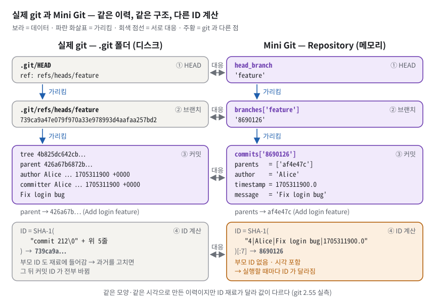
*그림 5. 같은 모양의 이력을 실제 git 과 Mini Git 에 만들어 나란히 놓은 것 — HEAD → 브랜치 → 커밋 → 부모로 이어지는 구조는 같고, ID 를 계산하는 재료(부모 포함 여부)만 다르다.*

그림 5 에서 위의 세 행(① HEAD · ② 브랜치 · ③ 커밋)은 모양이 같다는 것을 보여 준다. HEAD 가 브랜치 이름을 가리키고, 브랜치가 hash 를 가리키고, 커밋이 부모를 가리킨다. 파란 세로 화살표 "가리킴" 이 양쪽 열에 똑같이 있다. 차이는 맨 아래 ④ ID 계산 행에 모여 있다. 오른쪽 주황 상자가 "부모 ID 없음 · 시각 포함" 을 강조한다.

**구체적인 숫자로.** git 의 커밋 ID 는 `"commit " + 본문 길이 + 널 문자(\0) + 본문` 을 SHA-1 한 값이다. 위 `Fix login bug` 커밋의 본문은 212바이트이고, `sha1("commit 212\0" + 본문)` 을 파이썬으로 계산하면 `739ca9a47e079f970a33e978993d4aafaa257bd2` — 실제 커밋 ID 와 **글자까지 같다**(실측). 본문에 `parent 426a67b…` 줄이 들어 있다는 점이 중요하다. Mini Git 의 재료 `4|Alice|Fix login bug|1705311900.0` 에는 부모가 없다.

**이 과제에서는.** 구조는 `Repository` 필드(`main.py:69-78`)가 git 과 같게 잡았고, ID 계산(`main.py:90`)만 다르다. 평가자가 "실제 git 이랑 뭐가 같고 뭐가 달라요?" 하고 물으면, 같은 점은 이 표의 위 다섯 줄(HEAD · 브랜치 두 개 · 커밋 오브젝트 · 공통 조상)로, 다른 점은 그림 5 의 ④ ID 계산(부모 포함 여부)과 표 마지막 줄(첫 커밋 전 BRANCH 허용)로 말하면 된다.

**한 칸 아래.** 부모 ID 가 재료에 들어가는 구조를 **머클(Merkle) 구조**라고 한다. 과거 커밋 하나의 메시지를 고치면 그 ID 가 바뀌고, 그걸 부모로 적은 자식의 본문도 바뀌어 자식 ID 도 바뀌고, 끝까지 전부 바뀐다. 그래서 이력을 몰래 고치면 드러난다. 일반적으로 `rebase`·`cherry-pick` 이 "같은 변경을 새 ID 의 새 커밋으로" 만드는 이유도 이것이다. 부모가 달라지면 ID 가 달라질 수밖에 없다. Mini Git 의 hash 에는 부모가 없어 이 성질이 없다(§7). 또 기본 `git log --all` 은 최신순(`739ca9a Fix login bug` → `05c535f` → `426a67b` → `9e86194`)이지만, 이 과제의 LOG 는 부모 먼저다(§3.9).

> [!WARNING]
> **흔한 오해 둘.** ① "git 은 브랜치마다 파일 복사본을 둔다" → 브랜치는 hash 한 줄짜리 파일이다. ② "Mini Git 의 hash 도 git 처럼 내용 주소(content-addressable)다" → 재료에 부모와 파일 트리가 없고 카운터가 있어서 같은 성질이 아니다. "git 처럼 **보이는** 16진 ID" 라고 말하는 것이 정확하다.

### 3.8 인접 리스트와 역방향 간선 — 각자 자기 이웃 명단을 들고 있기

**비유로 먼저.** 반 학생마다 "내 부모님 연락처"(parents)만 적혀 있다고 하자. "이 부모님의 자녀는 누구?"를 알려면 반 전체 명단을 다 훑어야 한다. 그래서 부모 쪽에도 "내 자녀 명단"(children)을 따로 적어 둔다.
비유의 한계: 실제 명단은 사람이 고쳐 쓰지만, 여기서 자녀 명단은 커밋할 때 프로그램이 자동으로 한 줄 더한다.

**정확히 말하면.** **인접 리스트**는 노드마다 이웃 목록을 들고 있는 그래프 저장 방식이다. **인접 행렬**은 노드×노드 표에 연결 여부를 적는 방식이다. 간선이 노드 수와 비슷할 정도로 적은 그래프를 **희소 그래프**라고 한다. 이 구현은 인접 리스트 세 가지를 쓴다.

| 이름 | 방향 | 언제 만드나 | 누가 쓰나 |
|---|---|---|---|
| `Commit.parents` | 자식 → 부모 | 커밋 생성 때 | ANCESTORS (§3.12) |
| `Repository.children` | 부모 → 자식 | 커밋 생성 때 같이 (`main.py:128-130`) | LOG 의 Kahn (§3.9) |
| `adj` (지역 변수) | 양방향 | PATH 호출 때마다 새로 (`main.py:174-178`) | PATH 의 BFS (§3.10) |

**구체적인 숫자로.** CANON 4커밋 뒤의 실제 값이다(실측).

```text
children = {'112f66d': ['af4e47c', '955b518'], 'af4e47c': ['8690126'], '955b518': [], '8690126': []}
adj      = {'112f66d': {'955b518', 'af4e47c'}, 'af4e47c': {'112f66d', '8690126'},
            '955b518': {'112f66d'}, '8690126': {'af4e47c'}}
```

`children` 은 `parents` 를 뒤집은 것이다. `112f66d` 의 자식 두 개가 한 목록에 있다. `adj` 는 두 방향을 합친 것이라 간선 3개가 6칸에 적혀 있다.

**이 과제에서는.** `commit()` 이 새 커밋을 넣는 **같은 자리에서** `children` 도 갱신한다(`main.py:127-130`).

```python
127  self.commits[h] = node
128  self.children.setdefault(h, [])
129  for p in parents:
130      self.children.setdefault(p, []).append(h)
```

`setdefault(p, [])` 는 "p 칸이 없으면 빈 목록을 만들고, 그 목록을 돌려줘"라는 뜻이다. 새 커밋 자신의 빈 자녀 목록도 만들어 둔다(128행). 그래야 나중에 Kahn 이 `self.children.get(h, [])` 로 찾을 때 모든 커밋에 칸이 있다.

**한 칸 아래.** 인접 행렬은 V² 칸이 필요하다. 커밋 10,000개면 1억 칸이다. 커밋 그래프는 간선 수 E 가 노드 수 V 와 비슷한 희소 그래프라서 인접 리스트(메모리 O(V+E))가 맞다. `children` 은 `parents` 에서 계산할 수 있는 **파생 데이터**다. 매번 계산하면 커밋 전체를 훑어야 하므로(O(V+E)) 저장해 두었다. 대가는 "같은 사실이 두 벌" 이라는 점이다. 그래서 둘을 바꾸는 곳을 `commit()` 한 함수로 제한해 어긋나지 않게 했다. PATH 의 `adj` 는 반대로 저장하지 않고 호출마다 만든다. 단순하지만 매번 O(V+E) 가 들고, 커밋이 많아지면 병목 후보가 된다(§3.15).

> [!WARNING]
> **흔한 오해.** "`parents` 만 있으면 된다" → 자식을 찾을 때마다 전체 순회가 필요하다. LOG 는 커밋을 하나 낼 때마다 자식을 찾으므로 `children` 이 없으면 O(V²) 이 된다.

### 3.9 위상 정렬(Kahn 알고리즘) — 선수과목 순서대로 수강 계획 짜기

**비유로 먼저.** 선수과목이 있는 수강 계획이다. "선수과목을 다 들은 과목"만 신청할 수 있다. 한 과목을 끝낼 때마다, 그 과목을 선수로 둔 과목들의 "남은 선수과목 수"를 하나씩 줄인다. 0 이 된 과목이 새로 신청 가능해진다. 신청 가능한 과목이 여럿이면 정해진 규칙(여기서는 가장 이른 시각, 그다음 hash)으로 하나를 고른다.
비유의 한계: 실제 수강은 한 학기에 여러 과목을 동시에 듣지만, LOG 는 한 줄에 한 커밋씩 낸다.

**정확히 말하면.** **위상 정렬**(topological sort)은 모든 간선 u→v 에 대해 u 가 v 보다 앞에 오도록 노드를 한 줄로 세우는 일이다. 사이클이 없는 그래프(DAG)에서만 가능하고, 답이 여러 개일 수 있다. **진입차수**(in-degree)는 한 노드로 들어오는 간선 수다. 여기서는 "아직 출력되지 않은 부모 수"로 읽으면 된다. **Kahn 알고리즘**은 진입차수가 0 인 노드부터 꺼내는 위상 정렬이다. 지금 꺼낼 수 있는 후보 목록을 코드에서는 `ready` 라고 부른다.

**화살표 방향 주의.** §3.5·그림 3 의 화살표(`parents`)는 **자식 → 부모** 방향이었다. 위상 정렬에서는 이 화살표를 **뒤집어** 부모 → 자식(`children`, 그림 6 의 화살표)으로 본다. 그래야 "화살표의 출발점(부모)이 도착점(자식)보다 앞"이 LOG 의 "부모 먼저"가 되고, 한 커밋으로 들어오는 화살표 수(진입차수)가 그 커밋의 **부모 수**가 된다. 코드도 그렇다. 진입차수를 `len(c.parents)` 로 세고(`main.py:143`), 한 커밋을 낸 뒤 줄여 주는 대상은 `children` 이다(`main.py:157`).

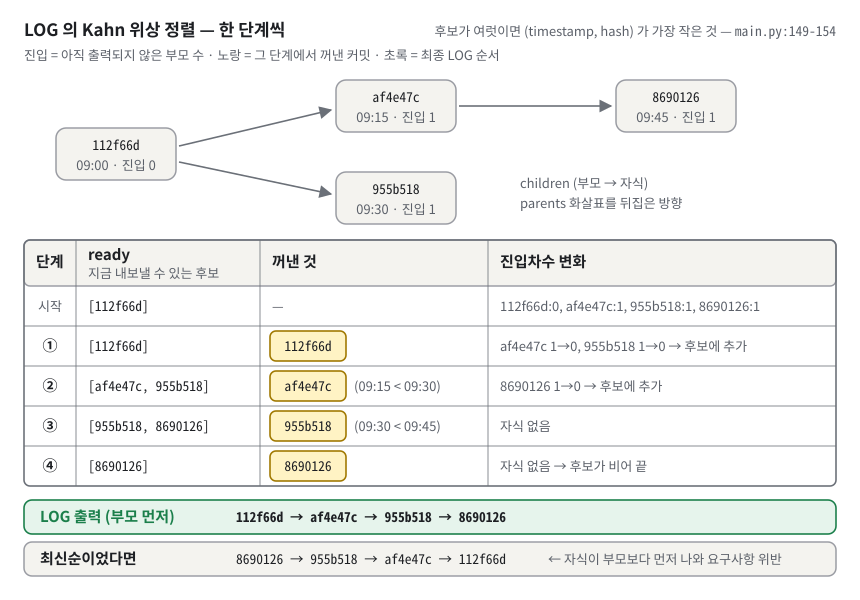
*그림 6. LOG 가 쓰는 Kahn 위상 정렬 — 부모를 모두 내보낸 커밋만 후보(ready)에 오르고, 후보가 여럿이면 시각이 가장 이른 것을 꺼낸다. 그래서 부모가 항상 먼저 나온다. (화살표는 그림 3 과 반대인 부모 → 자식 방향이다.)*

**구체적인 숫자로.** 그림 6 의 표를 말로 따라가자(CANON 실측과 같다).

| 단계 | ready (지금 낼 수 있는 후보) | 꺼낸 것 | 진입차수 변화 |
|---|---|---|---|
| 시작 | `[112f66d]` | — | `112f66d:0`, `af4e47c:1`, `955b518:1`, `8690126:1` |
| ① | `[112f66d]` | `112f66d` | `af4e47c` 1→0, `955b518` 1→0 → 후보에 추가 |
| ② | `[af4e47c, 955b518]` | `af4e47c` (09:15 < 09:30) | `8690126` 1→0 → 후보에 추가 |
| ③ | `[955b518, 8690126]` | `955b518` (09:30 < 09:45) | 자식 없음 |
| ④ | `[8690126]` | `8690126` | 자식 없음 → 후보가 비어 끝 |

결과 `112f66d → af4e47c → 955b518 → 8690126` 이 LOG 출력 순서와 같다. 그림 6 아래 회색 띠가 보여 주듯, 최신순이었다면 `8690126` 이 맨 앞에 와서 "자식이 부모보다 먼저" 나오므로 요구사항 위반이다.

**시간순 정렬과 무엇이 다른가.** CLI 로 차례로 커밋하면 자식의 시각이 항상 부모보다 늦어서, 위상 순서와 날짜순이 **우연히 같아 보인다**(5,000개 연속 커밋에서 `topological_log()` == 생성 순서, 실측). 차이는 시계가 틀렸을 때 드러난다. 부모 `p000001` 의 시각을 200초, 자식 `c000002` 의 시각을 100초로(자식 쪽 시계가 뒤처진 상황) 직접 넣고 두 LOG 를 비교한 실측이다.

```text
(LOG — 위상 정렬)
commit p000001 (alice, 1970-01-01 00:03:20)
parent (clock ahead)
commit c000002 (bob, 1970-01-01 00:01:40)
child (clock behind)

(LOG --sort-by=date)
commit c000002 (bob, 1970-01-01 00:01:40)
child (clock behind)
commit p000001 (alice, 1970-01-01 00:03:20)
parent (clock ahead)
```

LOG 는 시계를 믿지 않고 **부모 관계만** 믿어서 부모가 먼저다. 날짜순은 자식이 먼저 나온다. 이것이 과제가 "최신순 나열이 아니라 위상 정렬 성격"을 요구한 이유다.

**이 과제에서는.** `topological_log()`(`main.py:141-161`)를 두 덩어리로 나눠 **주석 없이** 읽어 보자. 평가자가 "주석 지우고 읽어 보세요" 할 때 이대로 말하면 된다.

```python
143  indeg = {h: len(c.parents) for h, c in self.commits.items()}
145  ready = [h for h, d in indeg.items() if d == 0]
146  order = []
```

- 143행: 커밋마다 "부모 수"를 진입차수로 적는다.
- 145행: 진입차수 0(루트)만 후보에 넣는다. 146행: 결과를 담을 빈 목록.

```python
147  while ready:
149      pick = 0
150      for i in range(1, len(ready)):
151          a = self.commits[ready[i]]
152          b = self.commits[ready[pick]]
153          if (a.timestamp, a.hash) < (b.timestamp, b.hash):
154              pick = i
155      h = ready.pop(pick)
156      order.append(h)
157      for child in self.children.get(h, []):
158          indeg[child] -= 1
159          if indeg[child] == 0:
160              ready.append(child)
161  return order
```

(원본의 144행·148행 주석 두 줄은 뺐다. 주석 없이 읽는 연습이기 때문이다.)

- 149-154행: 후보 중 `(timestamp, hash)` 가 가장 작은 칸 번호 `pick` 을 **손 루프로** 찾는다. `min()` 은 정렬 API 우회로 보일 수 있어 쓰지 않았다.
- 155-156행: 그 커밋을 후보에서 빼서 결과에 붙인다.
- 157-160행: 그 커밋의 자식마다 진입차수를 1 줄이고, 0 이 되면 후보에 넣는다. **부모가 모두 나와야 0 이 되므로** 부모 먼저가 구조적으로 보장된다.
- 튜플 비교 `(a, b) < (c, d)` 는 첫 칸을 먼저 비교하고, 같으면 둘째 칸을 비교한다. 그래서 시각이 같으면 hash 가 작은 쪽이 먼저다.

**한 칸 아래.**
- **복잡도.** **큐**(먼저 넣은 것을 먼저 꺼내는 줄, §3.10)를 쓰는 표준 Kahn 은 모든 노드와 간선을 한 번씩 보므로 O(V+E) 다(V = 노드 수, E = 간선 수). 이 구현은 매번 후보 전체를 훑어 최소를 고르고(149-154행), `ready.pop(pick)` 도 뒤 원소를 당겨야 해서(155행), 후보 수를 R 이라 하면 O(V·R) 이다.
- **언제 느려지나.** R 은 "동시에 낼 수 있는 커밋 수", 즉 그래프의 **폭**이다. 루트가 많거나, 한 커밋에서 브랜치가 많이 갈라진 모양이면 R 이 V 에 가까워져 O(V²) 이 된다. 실측: 루트만 1,000개 60.4ms → 10,000개 11,696.8ms(약 194배, n 이 10배일 때 100배 이상이면 제곱 모양). 루트가 **하나**여도 main 에서 브랜치 10,000개를 따서 하나씩 커밋한 모양(BRANCH → SWITCH → COMMIT → SWITCH main 반복, CLI 로 만들 수 있다)이면 LOG 가 약 16초 걸렸다(두 번 재서 16.5초·16.4초). 단, 이 모양은 브랜치도 10,001개라 16초가 모두 폭 탓은 아니다. 출력 줄마다 `_branches_pointing_to`(`main.py:95-96`)가 브랜치 전체를 훑는 라벨 조회 O(V·B)가 약 4초이고, 위상 정렬 `topological_log()` 만 따로 재면 약 9~11초였다(다시 잰 실측: 위상 정렬 9.3초·11.4초, 라벨 조회만 4.0초, LOG 전체 15.8초·15.3초).
- **보통의 이력.** 차례로 커밋한 일렬 이력은 후보가 1~2개라 거의 O(V) 다(일렬 1,000개 0.4ms → 10,000개 4.5ms).
- **사이클 감지.** "끝났는데 출력 수 < 노드 수"면 사이클이다. 이 구현은 검사하지 않는다(§3.5 의 실험처럼 조용히 빠진다).
- **다른 방법.** **DFS**(한 갈래를 끝까지 먼저 가는 탐색, §3.12)에서 "자식을 다 본 뒤에 자신을 적는 순서"(**후위순회**)를 거꾸로 뒤집어도 위상 순서가 나온다. Kahn 을 고른 이유는 "지금 낼 수 있는 후보"가 눈에 보여서 동률 규칙(가장 이른 시각)을 끼우기 쉽기 때문이다.
- **위상 순서는 하나가 아니다.** 같은 모양의 실제 git 에서 `git log --topo-order --reverse main feature` 는 `Initial → Add payment feature → Add login feature → Fix login bug` 를 냈다(실측). 이것도 올바른 위상 순서다. 동률을 깨는 규칙이 다를 뿐이다.

> [!WARNING]
> **흔한 오해 둘.** ① "위상 정렬 = 시간순 정렬" → CLI 에서 우연히 같을 뿐 원리가 다르다. 시계가 어긋나면 달라진다(위 실측). ② "위상 정렬도 비교 정렬이다" → 크기 비교가 아니라 **의존 관계**(누가 누구 다음인가)로 줄 세운다. 비교는 동률을 깰 때만 쓴다.

### 3.10 BFS 와 최단 경로, 무방향 간선 — 물결이 퍼지듯 한 칸씩

**비유로 먼저.** 연못에 돌을 던지면 물결이 가까운 곳부터 한 겹씩 퍼진다. 목적지에 물결이 **처음** 닿은 겹의 번호가 최소 걸음 수다.
비유의 한계: 물결은 모든 방향으로 동시에 퍼지지만, BFS 는 큐에서 하나씩 꺼내 처리한다. 순서만 같다.

**정확히 말하면.** **BFS**(Breadth-First Search, 너비 우선 탐색)는 **큐**(먼저 넣은 것을 먼저 꺼내는 줄, FIFO)로 가까운 노드부터 방문하는 탐색이다. 간선 길이가 모두 1 이면 어떤 노드를 처음 방문할 때의 거리가 곧 **최단 거리**다. **무방향**으로 본다는 것은 간선을 양쪽으로 다닐 수 있다고 보는 것이다. 파이썬의 `collections.deque` 는 양쪽 끝에서 넣고 빼는 것이 O(1) 인 큐다.

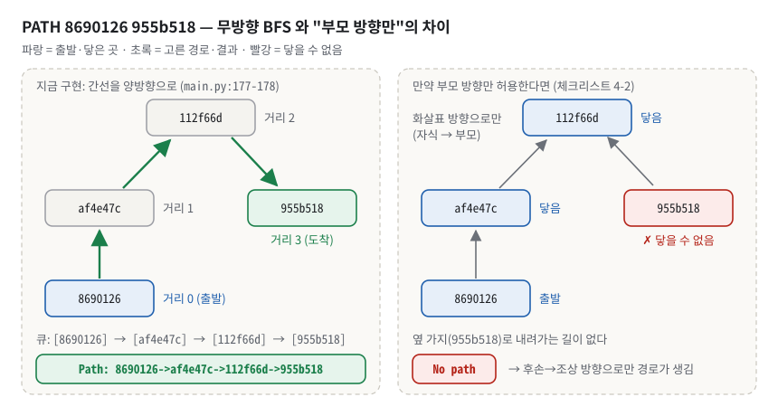
*그림 7. PATH 8690126 955b518 — 간선을 양방향으로 보면 공통 조상 112f66d 를 거쳐 3걸음에 닿지만(왼쪽), 부모 방향만 허용하면 옆 가지로 내려갈 수 없어 No path 가 된다(오른쪽). 이때 경로는 후손 → 조상 방향으로만 생긴다.*

**구체적인 숫자로.** 그림 7 왼쪽, `PATH 8690126 955b518` 을 손으로 돌려 보자(CANON 실측).

1. 양방향 이웃: `8690126:{af4e47c}`, `af4e47c:{112f66d, 8690126}`, `112f66d:{af4e47c, 955b518}`, `955b518:{112f66d}`.
2. 큐 `[8690126]` → 꺼내서 이웃 `af4e47c` 에 거리 1 → 큐 `[af4e47c]` → 꺼내서 `112f66d` 에 거리 2 → 큐 `[112f66d]` → 꺼내서 `955b518` 에 거리 3.
3. 결과 `Path: 8690126->af4e47c->112f66d->955b518`. 위로 두 칸(부모, 할아버지) 올라갔다가 아래로 한 칸 내려온다.

그림 7 오른쪽은 체크리스트 4-2 의 가정이다. 부모 방향만 허용하면 `8690126` 에서 `af4e47c`, `112f66d` 까지만 올라가고, 옆 가지 `955b518` 로 내려가는 길이 없어 `No path` 다(변형 구현 실측).

**이 과제에서는.** `shortest_path()` 의 앞부분(`main.py:174-188`)이 무방향 인접 목록을 만들고 BFS 로 거리를 잰다.

```python
174  adj = {h: set() for h in self.commits}
175  for h, c in self.commits.items():
176      for p in c.parents:
177          adj[h].add(p)
178          adj[p].add(h)

180  # BFS로 거리 산출
181  dist = {src: 0}
182  queue = deque([src])
183  while queue:
184      u = queue.popleft()
185      for v in adj[u]:
186          if v not in dist:
187              dist[v] = dist[u] + 1
188              queue.append(v)
```

- 177행이 "자식 → 부모", 178행이 "부모 → 자식" 방향을 넣는다. 두 줄이 있어서 무방향이다.
- `dist` 는 거리표이자 방문 표시다. `v not in dist` 이면 처음 방문이므로 거리를 적고 큐에 넣는다.
- 그 뒤 `dst` 가 거리표에 없으면 `None` 을 돌려주고(`main.py:190-191`), `cmd_path` 가 `No path` 를 찍는다(`main.py:360-361`).
- 없는 hash 는 BFS 까지 가지 않는다. `cmd_path` 가 먼저 걸러 `Unknown commit: <hash>` 를 찍는다(`main.py:353-358`).

**한 칸 아래.**
- **왜 처음 닿은 거리가 최단인가.** 큐는 거리 d 인 노드를 전부 꺼낸 뒤에야 거리 d+1 인 노드를 꺼낸다. 만약 더 짧은 길이 있었다면 그 길의 앞 노드가 먼저 처리되어 더 일찍 방문했어야 하므로 모순이다.
- **다른 탐색과 비교.** **DFS**(한 갈래를 끝까지 먼저 가는 탐색)는 먼 길로 먼저 도착할 수 있어 최단을 보장하지 않는다. 간선 길이가 제각각이면 **Dijkstra** 가 필요하다. Dijkstra 는 **우선순위 큐**(들어온 순서가 아니라 값이 가장 작은 것부터 꺼내는 큐, 보통 §3.15 의 힙으로 만든다)로 "지금까지 가장 가까운 노드"부터 확정한다. 길이가 모두 1 이면 BFS 가 Dijkstra 의 특수한 경우다.
- **큐 자료형.** `deque.popleft()` 는 O(1) 이지만 `list.pop(0)` 은 뒤 원소를 전부 당겨 O(n) 이라 BFS 전체가 O(V²) 이 된다.
- **CLI 그래프에서 경로 모양.** CLI 그래프는 숲(부모 ≤ 1)이라서 같은 나무 안의 두 커밋 사이 경로가 **하나뿐**이고, 그 경로는 두 커밋의 가장 가까운 공통 조상(**LCA**, git 의 merge-base)을 지난다. 실제 git 에서 같은 모양으로 `git merge-base main feature` 를 치면 `Initial commit`(`9e86194`)이 나온다(실측). 서로 다른 나무에 있으면 경로가 없다(`No path`).
- **멈추지 않는 BFS.** 이 구현의 BFS 는 도착점에 닿아도 멈추지 않고 연결된 전체를 다 돈다(`main.py:183-188`). 도착하면 멈추게 바꿀 수 있다.

> [!WARNING]
> **흔한 오해 둘.** ① "무방향으로 보면 DAG 가 깨진다" → 데이터는 그대로 DAG 다. PATH 를 계산할 때만 지역 변수 `adj` 에서 양방향으로 본다. ② "없는 hash 를 주면 `No path`" → 이 구현은 `Unknown commit: <hash>` 다. 예전 체크리스트 답변 문서(`docs/b3-2-…`)에 `No path` 라고 잘못 적혀 있으니 옮기지 말 것.

### 3.11 사전순 동률 규칙과 결정성 — 같은 길이면 사전에서 먼저 나오는 쪽

**비유로 먼저.** 거리가 같은 두 길 중 하나를 골라야 한다. 규칙은 "길 이름을 이어 쓴 문자열이 사전에서 먼저 나오는 쪽"이다. 누가 언제 골라도 같은 길을 고른다.
비유의 한계: 사전순은 사람에게 의미 있는 "좋은 길"이 아니라 그저 **정해진** 길이다.

**정확히 말하면.** **사전순**은 첫 글자부터 비교해 처음 다른 글자에서 크기를 정하는 순서다. **결정적**(deterministic)이라는 것은 같은 입력이면 언제나 같은 출력이 나온다는 뜻이다. 결정적이어야 테스트에 기댓값을 적을 수 있다. **동적 계획법**(DP)은 작은 문제의 답을 저장해 두고 큰 문제에 재사용하는 방법이다. 이 구현은 "각 노드까지의 사전순 최소 경로"를 거리 순서대로 저장해 쓴다.

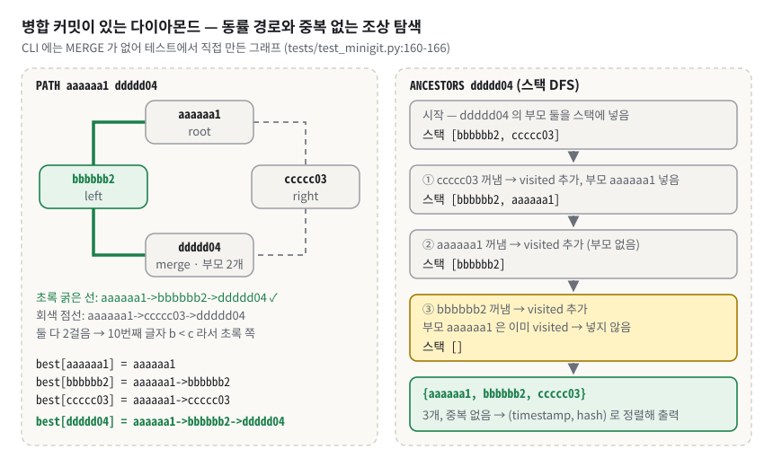
*그림 8. 병합 커밋이 있는 다이아몬드(테스트 데이터) — 길이가 같은 두 경로 중 문자열이 사전순으로 앞선 쪽을 고르고(왼쪽), 조상 탐색은 두 길로 닿는 aaaaaa1 을 visited 로 한 번만 센다(오른쪽).*

**구체적인 숫자로.** CLI 에는 merge 가 없어 동률이 생기지 않는다. 그래서 테스트 데이터의 다이아몬드(`tests/test_minigit.py:160-166`)를 쓴다. `ddddd04` 는 부모가 `bbbbbb2`, `ccccc03` 두 개인 병합 커밋이다. 그림 8 왼쪽처럼 `aaaaaa1` 에서 `ddddd04` 까지 2걸음 경로가 두 개다.

```text
best[aaaaaa1] = aaaaaa1
best[bbbbbb2] = aaaaaa1->bbbbbb2
best[ccccc03] = aaaaaa1->ccccc03
best[ddddd04] = 더 작은 것( aaaaaa1->bbbbbb2->ddddd04 , aaaaaa1->ccccc03->ddddd04 )
              = aaaaaa1->bbbbbb2->ddddd04      ← 10번째 글자 b < c
```

실측 출력도 `Path: aaaaaa1->bbbbbb2->ddddd04` 다. 단, **간선 수가 먼저**다. `'aaaaaa1->aaaaaa2->ddddd04' < 'aaaaaa1->ddddd04'`(사전순으로는 앞)이지만 답은 1걸음짜리 `aaaaaa1->ddddd04` 다(`tests/test_minigit.py:207-219`).

**이 과제에서는.** BFS 로 거리를 구한 뒤, 거리 순서대로 한 층씩 `best` 를 채운다. 흐름은 이렇다. `best = {src: src}`, `level = [src]` 로 시작해서(`main.py:195-196`), `while level:` 마다 빈 `nxt`·`seen_in_next` 를 만들고(197-199행) 아래 발췌를 한 뒤, 마지막에 `level = nxt` 로 한 층 내려간다(213행).

```python
200  for u in level:
201      for v in adj[u]:
202          if dist.get(v) == dist[u] + 1 and v not in seen_in_next:
203              nxt.append(v)
204              seen_in_next.add(v)
205  for v in nxt:
206      candidate = None
207      for u in adj[v]:
208          if dist.get(u) == dist[v] - 1:
209              s = best[u] + '->' + v
210              if candidate is None or s < candidate:
211                  candidate = s
212      best[v] = candidate
```

- 200-204행: 지금 층(`level`)의 이웃 중 거리가 1 큰 노드를 다음 층(`nxt`)으로 모은다. `seen_in_next` 는 같은 노드를 두 번 넣지 않게 한다.
- 205-212행(여덟 줄): 다음 층의 각 노드 v 에 대해, 거리가 1 작은 이웃 u 들의 `best[u] + '->' + v` 중 가장 작은 문자열을 `best[v]` 로 정한다.
- LOG 도 같은 정신이다. 후보가 여럿이면 `(timestamp, hash)` 최소를 고른다(`main.py:153`). 테스트는 일부러 `c000002` 를 먼저 등록해 "처음 것"이 오답이 되게 만들었다(`tests/test_minigit.py:132-143`).

**한 칸 아래.**
- **왜 노드마다 "최소 문자열 하나"만 기억해도 되나.** 같은 거리의 경로 문자열은 hash 가 모두 7자라 **길이가 같다**(`main.py:194` 주석). 길이가 같은 `P1 + '->' + v` 와 `P2 + '->' + v` 의 비교는 앞부분 `P1` 과 `P2` 의 비교와 같다. 그러니 앞부분이 최소인 것만 이어 붙이면 된다.
- **순서가 흔들려도 결과는 같다.** `adj` 가 `set` 이라 순회 순서가 실행마다 달라도, 최소를 고르므로 결과는 같다.
- **대가는 메모리.** 노드마다 **경로 문자열 전체**를 들고 다녀서, 일렬 커밋 10,000개의 끝↔끝 PATH 에 357.8ms, 메모리 최고치 453.6MB 가 들었다(실측, 파이썬 표준 메모리 측정 도구 `tracemalloc`).
- **개선안.** 도착점에서 BFS 로 거리표를 만든 뒤, 출발점에서 "거리가 1 줄어드는 이웃 중 hash 가 가장 작은 것"을 골라 걸어간다. hash 길이가 같아서 한 칸씩 최소를 고르면 전체 문자열도 사전순 최소다. 이 방식을 복사본에서 구현해 무작위 그래프 150개·31,888쌍에서 기존 결과와 불일치 0, 10,000개 체인에서 11.4ms 를 확인했다.

> [!WARNING]
> **흔한 오해.** "BFS 로 처음 찾은 경로를 내면 된다" → 이웃을 방문하는 순서에 따라 다른 경로가 나온다. 테스트는 `zzzzzz9` 를 먼저 등록해 "처음 찾은 경로"가 `aaaaaa1->zzzzzz9->ddddd04` 로 오답이 되게 만들었다(`tests/test_minigit.py:190-205`). 정답은 `aaaaaa1->mmmmmm5->ddddd04` 다.

### 3.12 DFS·도달 가능성·visited — ANCESTORS

**비유로 먼저.** 족보를 따라 위로 올라가며 조상 명단을 만든다. 할아버지를 아빠 쪽으로도 만나고 엄마 쪽으로도 만날 수 있으니 "이미 적은 사람" 표시를 해 둔다.
비유의 한계: 족보는 부모가 2명으로 고정이지만 커밋은 0~여러 명이다.

**정확히 말하면.** **도달 가능성**은 화살표를 따라 한 노드에서 다른 노드에 갈 수 있는가다. **DFS**(Depth-First Search, 깊이 우선 탐색)는 **스택**(나중에 넣은 것을 먼저 꺼내는 더미, LIFO)으로 한 갈래를 끝까지 먼저 가는 탐색이다. **visited** 는 이미 방문한 노드를 적어 두는 집합이다.

**구체적인 숫자로.** 그림 8 오른쪽이 `ANCESTORS ddddd04` 의 실제 추적이다(스택 순서는 `main.py:222-230` 그대로).

| 단계 | 한 일 | 스택 |
|---|---|---|
| 시작 | `ddddd04` 의 부모 두 개를 넣음 | `[bbbbbb2, ccccc03]` |
| ① | `ccccc03` 꺼냄 → visited 추가, 부모 `aaaaaa1` 넣음 | `[bbbbbb2, aaaaaa1]` |
| ② | `aaaaaa1` 꺼냄 → visited 추가 (부모 없음) | `[bbbbbb2]` |
| ③ | `bbbbbb2` 꺼냄 → visited 추가, 부모 `aaaaaa1` 은 **이미 visited → 넣지 않음** | `[]` |

결과 `{aaaaaa1, bbbbbb2, ccccc03}` 3개, 중복 없음. CLI 로 만든 CANON 에서는 `ancestors 8690126` → `112f66d`, `af4e47c` 두 줄이다(실측).

**이 과제에서는.** `ancestors()` 전체가 15줄이다(`main.py:217-231`).

```python
217  def ancestors(self, h):
218      """h에서 부모 방향으로 도달 가능한 모든 조상 hash 집합."""
219      if h not in self.commits:
220          return None
221      visited = set()
222      stack = list(self.commits[h].parents)
223      while stack:
224          node = stack.pop()
225          if node in visited:
226              continue
227          visited.add(node)
228          for p in self.commits[node].parents:
229              if p not in visited:
230                  stack.append(p)
231      return visited
```

- 222행: **자기 자신이 아니라 부모부터** 시작한다. 그래서 결과에 자기 자신은 없다.
- 225-226행: 이미 방문했으면 건너뛴다. 두 길로 닿는 조상을 두 번 처리하지 않는 곳이 여기다.
- 229행: 넣기 전에도 한 번 거른다. 스택이 불필요하게 커지는 것을 줄인다.
- 결과는 `set` 이라 순서가 없다. `cmd_ancestors` 가 `(timestamp, hash)` 로 머지 정렬해서 찍는다(`main.py:380-384`). 루트면 `(no ancestors)`(`main.py:377-379`), 없는 hash 면 `Unknown commit: <hash>`(`main.py:374-376`).

**한 칸 아래.** 복잡도는 O(조상 수 + 그 사이 간선 수)다. visited 가 없으면 다이아몬드가 n 층 쌓였을 때 같은 조상을 경로 수(최대 2ⁿ)만큼 방문한다. 재귀 대신 **명시적 스택**을 쓴 이유는 파이썬의 기본 재귀 한도가 1000 이기 때문이다(`sys.getrecursionlimit()` 실측 1000). 일렬 커밋이 1,000개를 넘으면 재귀 DFS 는 `RecursionError` 가 난다. 명시적 스택은 한도가 없다(10,000개 체인에서 `ancestors` 2.7ms, 조상 9,999개 수집, 실측). "모두 모으기"가 목적이라 BFS 로 해도 결과 집합은 같다. 순서만 다르다.

> [!WARNING]
> **흔한 오해 둘.** ① "ANCESTORS 는 자기 자신도 포함한다" → 부모부터 시작한다(`main.py:222`). ② "결과가 set 이니 출력 순서도 정해져 있다" → set 순서는 실행마다 바뀐다(§3.3 실측). 그래서 출력 전에 정렬한다.

### 3.13 정렬 알고리즘 — 머지 정렬, 복잡도, 안정성

**비유로 먼저.** 카드 더미를 반으로 나누고, 또 반으로 나눠 한 장씩 될 때까지 쪼갠다. 그다음 두 더미의 맨 위 카드를 비교해 작은 것부터 내려놓으며 합친다. 숫자가 같은 두 카드가 만나면 **원래 앞에 있던 더미의 카드**를 먼저 내려놓는다. 이것이 안정 정렬이다.
비유의 한계: 손으로는 카드를 제자리에서 섞지만, 머지 정렬은 합칠 때 새 더미(추가 메모리)가 필요하다.

**정확히 말하면.** **머지 정렬**은 **분할 정복**(문제를 작게 나눠 풀고 합치는 전략) 정렬이다. 평균과 최악 모두 O(n log n), 추가 메모리 O(n) 이다. **안정 정렬**(stable sort)은 비교 기준(key)이 같은 원소들의 원래 앞뒤 순서를 지키는 정렬이다. **key 함수**는 "무엇으로 비교할지"를 돌려주는 함수다. 여기서 "머지(merge, 합치기)"는 정렬된 두 줄을 합친다는 뜻이다. git 의 merge 명령(두 브랜치를 합치는 병합 커밋, 보너스 B2)과는 이름만 같은 다른 개념이다.

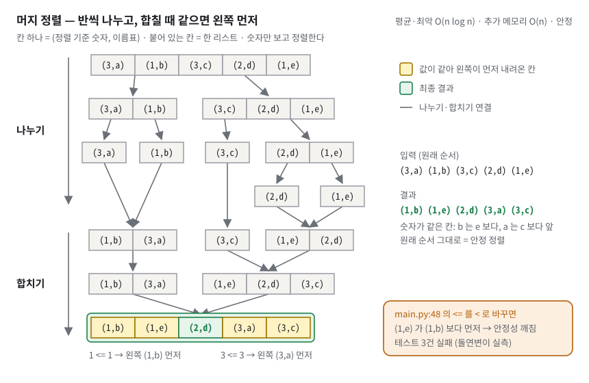
*그림 9. 머지 정렬이 5개를 정렬하는 과정 — 마지막 합치기에서 값이 같으면 <= 비교 때문에 왼쪽(원래 앞에 있던 것)이 먼저 내려온다. 이것이 안정 정렬이다.*

**구체적인 숫자로.** 입력 `[(3,a), (1,b), (3,c), (2,d), (1,e)]` 를 숫자만 key 로 정렬한다(그림 9, 실측 추적).

1. 나누기: `[(3,a),(1,b)]` | `[(3,c),(2,d),(1,e)]` → `[(3,a)]` `[(1,b)]` `[(3,c)]` `[(2,d),(1,e)]` → `[(2,d)]` `[(1,e)]`
2. 합치기: `[(3,a)]+[(1,b)]` → `[(1,b),(3,a)]` / `[(2,d)]+[(1,e)]` → `[(1,e),(2,d)]` / `[(3,c)]+[(1,e),(2,d)]` → `[(1,e),(2,d),(3,c)]`
3. 마지막: `[(1,b),(3,a)] + [(1,e),(2,d),(3,c)]` → `[(1,b),(1,e),(2,d),(3,a),(3,c)]`

마지막 합치기에서 동률이 두 번 나온다. `(1,b)` 와 `(1,e)` 는 `1 <= 1` 이 참이라 왼쪽 `(1,b)` 가 먼저, `(3,a)` 와 `(3,c)` 도 왼쪽 `(3,a)` 가 먼저다. 입력에서 b 가 e 보다, a 가 c 보다 앞에 있었으므로 순서가 지켜졌다. 그림 9 맨 아래 초록 줄의 노란 칸 네 개가 이 두 쌍이고, 오른쪽 아래 주황 상자가 `<` 로 바꿨을 때 무엇이 깨지는지 보여 준다.

**이 과제에서는.** `merge_sort(items, key)`(`main.py:38-60`)의 앞부분이다.

```python
40  if len(items) <= 1:
41      return list(items)
42  mid = len(items) // 2
43  left = merge_sort(items[:mid], key)
44  right = merge_sort(items[mid:], key)
45  merged = []
46  i = j = 0
47  while i < len(left) and j < len(right):
48      if key(left[i]) <= key(right[j]):  # '<='로 안정성 유지
49          merged.append(left[i])
50          i += 1
51      else:
52          merged.append(right[j])
53          j += 1
```

- 40-41행: 0개나 1개면 이미 정렬된 것이다(재귀의 바닥). 새 리스트로 돌려줘 입력을 건드리지 않는다.
- 42-44행: 반으로 나눠 각각 정렬한다.
- 47-53행: 두 줄의 앞에서부터 비교하며 작은 것을 붙인다. **48행의 `<=`** 가 안정성의 전부다. 같으면 왼쪽을 먼저 낸다.
- 54-59행(발췌 밖): 한쪽이 먼저 떨어지면 남은 쪽을 그대로 붙인다.
- key 를 바꿔 끼워 세 곳에서 쓴다: 날짜순 `(timestamp, hash)`(`main.py:336`), 작성자순 `(author, timestamp, hash)`(`main.py:338`), ANCESTORS 출력 순서(`main.py:382`).

**한 칸 아래.** 항상 절반으로 나누므로 1개가 될 때까지 ⌈log₂n⌉ 번 나뉜다(log₂n 은 §3.3 의 "반으로 몇 번 나누나", ⌈ ⌉ 는 올림). 그림 9 의 5개는 3번 나뉜다(⌈log₂5⌉ = 3). 층마다 합치기가 n 번 비교·복사이므로 모두 합치면 n × log n, 즉 입력이 어떻든 O(n log n) 이다. 슬라이스 `items[:mid]` 가 복사본을 만들어 메모리와 복사 비용이 든다. key 함수는 비교마다 두 번 불린다(48행). 일반적으로 파이썬 `sorted()` 는 key 를 원소당 한 번만 계산해 두고 Timsort(이미 정렬된 구간을 찾아 머지하는 안정 정렬)를 쓴다. 비교 대상과의 차이:

| 정렬 | 평균 | 최악 | 안정 | 추가 메모리 |
|---|---|---|---|---|
| 머지 정렬 (이 구현) | O(n log n) | O(n log n) | ✅ | O(n) |
| 퀵 정렬 | O(n log n) | O(n²) (피벗이 나쁠 때) | 보통 ❌ | O(log n) |
| 삽입 정렬 | O(n²) | O(n²) | ✅ | O(1) |
| 힙 정렬 | O(n log n) | O(n log n) | ❌ | O(1) |

실측: 1,000개 1.9ms, 10,000개 36.2ms. 돌연변이 실측: 48행 `<=` 를 `<` 로 바꾸면 안정성 테스트 3건이 실패한다(`test_duplicate_keys_preserve_relative_order`, `test_stability_on_many_duplicates`, `test_two_equal_keys_keep_input_order`). 정직하게 말할 점도 있다. CLI 의 key 는 모두 hash 로 끝나고 hash 는 유일하므로 **동률 자체가 없다**. 이 저장소의 CLI 출력에서 안정성은 결과를 바꾸지 않는다. 안정성은 key 를 작성자 하나로만 줄 때처럼 동률이 생길 때 의미가 있고, 함수는 어떤 key 로 불려도 안전해야 한다.

> [!WARNING]
> **흔한 오해 둘.** ① "key 에 hash 까지 넣었으니 안정성은 필요 없다" → CLI 결과에는 영향이 없는 게 맞지만, `merge_sort` 는 범용 함수라 동률 key 로도 불릴 수 있다. ② "`min()` 을 반복해서 뽑으면 정렬을 직접 구현한 것" → 그건 O(n²) 선택 정렬이고, `min()` 자체가 금지 API 우회로 보일 수 있다. 테스트는 `min` 호출도 금지한다(`tests/test_constraints.py:28`).

### 3.14 역색인 — 책 뒤의 찾아보기

**비유로 먼저.** 책 맨 뒤의 "찾아보기"다. 단어 옆에 그 단어가 나오는 쪽 번호가 적혀 있다. 단어를 찾으려고 책 전체를 넘기지 않는다.
비유의 한계: 찾아보기에 없는 표현(단어의 일부, 마침표가 붙은 단어)은 못 찾는다.

**정확히 말하면.** **정방향 색인**은 "문서 → 그 문서의 단어들"이다. 이것을 뒤집은 "단어 → 그 단어가 든 문서 목록"이 **역색인**(inverted index)이다. 한 단어에 딸린 문서 목록을 검색 엔진에서는 **포스팅 리스트**라고 부른다. 문장을 단어로 자르는 것을 **토큰화**, 비교 전에 형태를 통일하는 것을 **정규화**라고 한다. 이 과제의 최소 기준은 "공백으로 자르고(split), 소문자로(lower)"다. 색인할 때와 찾을 때 **같은 정규화**를 해야 찾힌다.

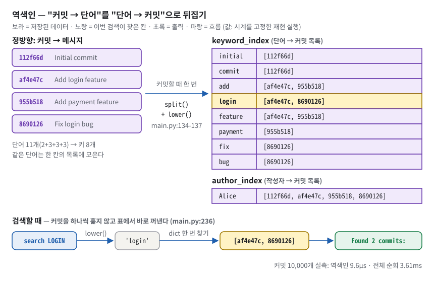
*그림 10. 역색인 — 커밋할 때 메시지를 단어로 쪼개 "단어 → 커밋 목록"을 미리 만들어 두면, 검색은 커밋 수와 상관없이 표를 한 번 찾아보는 일이 된다.*

**구체적인 숫자로.** CANON 4커밋 뒤 색인의 실제 내용이다(상태 덤프 실측). 메시지 토큰은 2+3+3+3 = 11개, 서로 다른 키는 8개다.

```text
keyword_index = {'initial': ['112f66d'], 'commit': ['112f66d'],
                 'add': ['af4e47c', '955b518'], 'login': ['af4e47c', '8690126'],
                 'feature': ['af4e47c', '955b518'], 'payment': ['955b518'],
                 'fix': ['8690126'], 'bug': ['8690126']}
author_index  = {'Alice': ['112f66d', 'af4e47c', '955b518', '8690126']}
```

그림 10 맨 아래 흐름이 `search LOGIN` 이다. `'LOGIN'.lower()` → `'login'` → dict 를 **한 번** 찾아 `['af4e47c', '8690126']` → `Found 2 commits:`. 커밋이 4개든 10,000개든 찾는 횟수는 한 번이다(10,000개에서 9.6µs vs 전체 순회 3.61ms, 실측).

**이 과제에서는.** 갱신은 `commit()` 안에서(`main.py:133-137`), 조회는 두 메서드가(`main.py:234-239`) 한다.

```python
133  # 역색인 갱신
134  for token in message.split():  # 공백 분리 후
135      key = token.lower()          # 소문자로 정규화
136      self.keyword_index.setdefault(key, []).append(h)
137  self.author_index.setdefault(self.author, []).append(h)
 …
234  def search_keyword(self, keyword):
235      # 역색인이므로 O(1)에 후보를 얻는다. (전체 순회 X)
236      return list(self.keyword_index.get(keyword.lower(), []))
```

- **시점**: 커밋을 `commits` 에 넣고 브랜치를 옮긴 **직후, 같은 함수 안에서** 갱신한다. 커밋 생성과 색인 갱신이 한 함수라서 한쪽만 되는 경로가 없다.
- **방식**: 공백으로 자르고 소문자로 바꾼 토큰마다 목록에 hash 를 붙인다. 작성자는 원문 그대로 붙인다.
- **조회**: `keyword.lower()` 로 같은 정규화를 한 뒤 `get` 한 번. `list(...)` 로 **복사본**을 돌려줘서 밖에서 결과를 고쳐도 색인이 망가지지 않는다(`tests/test_minigit.py:402-408`). 그래서 235행 주석의 "O(1)에 후보를 얻는다"는 정확히는 "조회 O(1) + 복사 O(k)"다(§7.7).
- 작성자 조회 `search_author` 는 `lower()` 없이 원문 그대로 찾는다(`main.py:239`). 그래서 `search --author=alice` 는 `Alice` 를 못 찾는다(§7).

**한 칸 아래.**
- **비용 공식.** 전체 순회는 커밋 N 개 × 메시지 단어 L 개를 매번 본다 → O(N·L). 역색인 조회는 dict 한 번(평균 O(1)) + 결과 k 개 복사 O(k) + 중복 제거 O(k) 다. **N 과 무관하고 결과 수 k 에만 비례**한다.
- **비용을 옮긴 것.** 비용을 없앤 것이 아니라 **검색 때 할 일을 커밋 때로 옮긴 것**이다. 커밋마다 O(L) 이 들고, 메모리는 전체 토큰 수만큼 든다.
- **중복.** 한 메시지에 같은 단어가 여러 번 있으면 같은 hash 가 목록에 여러 번 들어간다. `cmd_search` 가 출력 전에 걸러 낸다(`main.py:403-409`). 실측: `commit "refactor LOGIN login Login"` 뒤 `search login` → `Found 1 commit:`.
- **여러 단어 AND 검색.** 두 포스팅 리스트의 교집합으로 확장할 수 있다. 짧은 목록을 `set` 으로 만들고 긴 목록을 한 번 훑으면 O(k₁+k₂) 다. 두 목록을 앞에서부터 같이 훑는 병합 방식은 원소끼리 "누가 먼저인지" 비교할 기준이 있어야 하는데, 목록에 든 것은 순서 의미가 없는 hash 문자열뿐이고 커밋에 생성 순번도 저장되지 않는다(`_counter` 는 `Repository` 에만 있다). 그 방식을 쓰려면 커밋마다 순번을 저장해야 한다.
- **부분 문자열.** "log" 로 "login" 을 찾는 것은 역색인으로 안 된다. 일반적으로 n-gram 색인(글자 몇 개씩 잘라 색인)이나 트라이(접두사 나무)가 필요하다.

> [!WARNING]
> **흔한 오해 둘.** ① "역색인은 공짜로 빠르다" → 비용을 쓰기 시점과 메모리로 옮긴 것이다. ② "`search bug` 로 `fix: bug.` 가 찾힌다" → 토큰이 마침표까지 포함한 `bug.` 이라 못 찾는다. 실측: `search bug` → `Found 0 commits.`, `search bug.` → 1건. 명세의 최소 기준(split + lower)은 지켰지만 구두점 제거는 하지 않았다(§7).

### 3.15 복잡도와 확장 — 10배가 되면 어디부터 무너지나

**비유로 먼저.** 줄 서기다. 손님이 10배가 되면, 한 명씩 확인하는 창구(O(n))는 10배 느려지고, 손님끼리 서로 다 비교하는 창구(O(n²))는 100배 느려진다. 번호표로 바로 부르는 창구(O(1))는 그대로다.
비유의 한계: 실제 창구는 사람이 늘면 창구를 더 열 수 있지만, 이 프로그램은 한 줄로 처리한다.

**정확히 말하면.** 흔한 복잡도의 크기 순서는 O(1) < O(log n) < O(n) < O(n log n) < O(n²) 이다. **평균 시간복잡도**는 보통 입력에서의 비용, **최악 시간복잡도**는 가장 나쁜 입력에서의 비용이다. **공간복잡도**는 추가로 필요한 메모리 양이다.

**구체적인 숫자로.** 복사본에서 커밋 1,000개와 10,000개로 잰 실측이다(Python 3.14.4, 이 컨테이너 — 기계마다 다름).

| 연산 | 1,000개 | 10,000개 | 증가 | 원인 (코드) |
|---|---|---|---|---|
| LOG 위상 정렬 — 루트가 많은 최악 | 60.4ms | 11,696.8ms | 약 194배 | 후보 전체 최소 탐색 + `ready.pop(pick)` (`main.py:149-155`) → O(V²) |
| PATH 끝↔끝 (일렬 체인) | 5.8ms | 357.8ms (메모리 453.6MB) | 약 62배 | 노드마다 경로 문자열 전체 저장(`main.py:209-212`), `adj` 매번 재생성(`main.py:174-178`) |
| LOG --sort-by (머지 정렬) | 1.9ms | 36.2ms | 약 19배 | O(n log n) + 슬라이스 복사 |
| LOG 위상 정렬 — 일렬 체인 | 0.4ms | 4.5ms | 약 11배 | 후보가 1개라 O(V) |
| ANCESTORS (체인 끝) | 0.3ms | 2.7ms | 약 9배 | O(V+E) |
| SEARCH 역색인 (`word7`) | 6.2µs | 9.6µs | 결과 수 k 에만 비례 | O(1)+O(k) |

같은 스크립트를 이 문서를 쓰며 다시 돌렸을 때도 60.4→65.2ms, 11,696.8→12,466.0ms, 357.8→362.0ms 처럼 순위는 그대로였다. LOG 의 최악은 "루트가 많은" 모양만이 아니다. 루트가 하나여도 한 커밋에서 브랜치 10,000개가 갈라지면 약 16초가 걸렸다(§3.9, 실측). 이 중 약 4초는 브랜치가 1만 개로 늘어서 생긴 라벨 조회 O(V·B)이고, 위상 정렬만 재면 약 9~11초다.

**명령별 복잡도** (코드 읽기 기준. V = 커밋 수, E = 간선 수, L = 메시지 단어 수, R = 후보 수, D = 경로 길이, B = 브랜치 수, A = 조상 수, k = 검색 결과 수)

| 명령 | 시간 | 핵심 줄 |
|---|---|---|
| INIT / BRANCH / SWITCH | O(1) | `main.py:99-119` |
| COMMIT | O(L) + 해시 계산 | `main.py:121-138` |
| LOG | O(V·R), 최악 O(V²) + 라벨 붙이기 O(V·B) | `main.py:141-161`, `main.py:95-96` |
| LOG --sort-by | O(V log V) | `main.py:38-60` |
| PATH | 인접·BFS O(V+E) + 문자열 비교 O((V+E)·D), 메모리 O(V·D) | `main.py:163-215` |
| ANCESTORS | O(A + 간선) + 출력 정렬 O(A log A) | `main.py:217-231`, `main.py:380-382` |
| SEARCH | 평균 O(1) + O(k) | `main.py:234-239`, `main.py:403-409` |

**이 과제에서는.** 체크리스트 4-1(10배 병목)의 답이 이 표다. 1순위는 LOG 의 최소 선택, 2순위는 PATH 의 문자열 누적이다. 커밋 조회(dict), SEARCH(역색인), ANCESTORS(선형)는 문제없다. 단, 순위는 이력의 **모양**에 따라 바뀐다. 폭이 넓은 이력(루트가 많거나 브랜치가 많이 갈라짐)이면 LOG 가 먼저 무너지고, 일렬 이력이면 LOG 는 0.4→4.5ms 로 멀쩡하고 PATH(5.8→357.8ms)가 먼저 무너진다.

**힙이란.** 개선안의 핵심 단어라 먼저 풀이한다. **힙**(heap)은 "가장 작은 것 꺼내기"에 특화된 자료구조다. 응급실 대기열을 떠올리자. 새 환자가 와도 줄 전체를 다시 세우지 않고, 몇 번의 자리바꿈만으로 가장 급한 사람이 맨 앞에 오게 한다. 배열로 만들면 i 번 칸의 부모는 (i-1)//2 번 칸이고, 부모가 늘 자식보다 작거나 같게 유지한다. 그러면 맨 앞(0번 칸)이 항상 최소다. 넣기와 꺼내기는 부모 쪽으로 또는 자식 쪽으로 한 층씩 자리바꿈하는 일이라 O(log n) 이다(1,000개여도 자리바꿈 약 10번). 그래서 LOG 가 후보 R 개를 매번 전부 훑는 O(R) 대신 O(log R) 로 최소를 얻는다. 이렇게 "값이 가장 작은 것부터 꺼내는 큐"를 **우선순위 큐**라고 부르고, 보통 힙으로 만든다.

**한 칸 아래.** 개선 방향은 셋이다.
- ① **LOG**: 후보 목록을 **직접 구현한 이진 힙**으로 두면 O((V+E) log V). `heapq` 는 금지 API 로 볼 소지가 있고 테스트도 막는다.
- ② **PATH**: 인접 목록을 `children` 처럼 커밋 때 유지하고, 경로 문자열 대신 도착점 BFS + 한 칸씩 최소 이웃 고르기로 바꾸면 O(V+E), 메모리 O(V)(§3.11 에서 실측 확인).
- ③ **LOG 라벨**: 줄마다 `_branches_pointing_to` 가 브랜치 전체를 훑으므로(`main.py:95-96`) "hash → 브랜치 목록" 역맵을 둔다. 출력이 길어지면 `LOG -n 20` 같은 **페이징**(결과를 한 번에 몇 개씩 끊어 보여 주기)을 둔다.

> [!WARNING]
> **흔한 오해.** "O(n log n) 머지 정렬이 가장 느린 부분일 것" → 실측에서는 LOG 의 최소 선택(O(n²) 모양)과 PATH 의 문자열 누적이 먼저 무너진다. 추측이 아니라 **측정으로** 순위를 매겨야 한다.

## 4. 내 코드 투어

### 4.1 폴더·파일 지도

git 이 추적하는 파일은 9개다(`git ls-files` 실측).

| 파일 | 줄 수 | 책임 한 줄 |
|---|---|---|
| `main.py` | 473 | 프로그램 전체. 자료구조·정렬·저장소·출력·명령·REPL 을 배너 주석으로 6구역에 나눴다 |
| `README.md` | 601 | §0 과제 명세 원문·해설·학습 지도·함정·수행 점검(0.10) + 실행·테스트·명령·자료구조 설명 |
| `pyproject.toml` | 39 | `requires-python = ">=3.10"`, 의존성 0, ruff·pytest 설정 (2026-09-21 추가) |
| `.gitignore` | 10 | `__pycache__/`, `*.py[cod]` 등 (2026-09-21 추가) |
| `tests/test_minigit.py` | 485 | 알고리즘 불변식 33개: 위상 순서·최단 경로·정렬 안정성·역색인==순회·조상·hash 유일성·브랜치 |
| `tests/test_cli.py` | 269 | `main.py` 를 실제 인터프리터로 띄우는 REPL 검사 + 명령 출력 문구, 20개 |
| `tests/test_constraints.py` | 204 | AST 로 금지 API·import 허용 목록·검색 반복문 없음·알고리즘 print 없음·docstring·명령표 검사, 11개 |
| `tests/test_readme_refs.py` | 140 | README 0.10 이 인용한 `main.py` 줄 번호가 아직 맞는지, 6개 |
| `__pycache__/main.cpython-314.pyc` | (바이너리) | 컴파일 산출물. **추적되면 안 되는 파일**이다(§7) |

`main.py` 는 첫 커밋(`1fbc361`) 이후 한 번도 바뀌지 않았다(`git log --oneline -- main.py` → 한 줄). 최근 커밋 `18c58f3` 은 테스트·`pyproject.toml`·`.gitignore`·README 를 더했고, 추적 중인 `.pyc` 도 바이너리가 바뀐 채로 함께 커밋됐다(`git show --stat 18c58f3` 실측: `__pycache__/main.cpython-314.pyc | Bin 21233 -> 21230 bytes`, §7.7).

**`main.py` 의 6구역.** 배너 주석(`# ---- #` 세 줄)으로 나뉜다. 위에서 아래로 "재료 → 계산 → 출력 → 입력" 순서다.

| 구역 | 줄 | 들어 있는 것 |
|---|---|---|
| 자료구조 | `main.py:18-32` | `Commit` (노드) |
| 정렬 | `main.py:35-60` | `merge_sort(items, key)` |
| 저장소 | `main.py:63-239` | `Repository` — 필드, 헬퍼, 명령 구현, 그래프 알고리즘, 검색 |
| 출력 헬퍼 | `main.py:242-251` | `format_commit_line` — LOG 한 항목 2줄 |
| 명령 디스패치 | `main.py:254-425` | `INVALID`, `require_init`, `cmd_*` 8개, `COMMANDS` 표 |
| REPL | `main.py:428-473` | `parse_line`, `main()` |

**핵심 함수 지도.**

| 이름 | 줄 | 한 줄 설명 |
|---|---|---|
| `Commit` | `main.py:21-32` | 5필드 노드 + `time_str()` |
| `merge_sort` | `main.py:38-60` | 안정 머지 정렬, 비교는 48행 `<=` |
| `Repository.__init__` | `main.py:69-78` | 필드 9개 |
| `head_commit` | `main.py:81-84` | HEAD → 브랜치 → hash (없으면 None) |
| `_new_hash` | `main.py:86-93` | SHA-1(카운터\|작성자\|메시지\|시각) 앞 7자리, 겹치면 재시도 |
| `_branches_pointing_to` | `main.py:95-96` | 이 hash 를 가리키는 브랜치 이름들 (LOG 라벨) |
| `init` / `make_branch` / `switch` | `main.py:99-119` | 초기화 / 브랜치 생성 / HEAD 이동 |
| `commit` | `main.py:121-138` | 커밋 생성 + children + 브랜치 전진 + 역색인 |
| `topological_log` | `main.py:141-161` | Kahn 위상 정렬 |
| `shortest_path` | `main.py:163-215` | 무방향 BFS + 층별 사전순 최소 |
| `ancestors` | `main.py:217-231` | 스택 DFS + visited |
| `search_keyword` / `search_author` | `main.py:234-239` | 역색인 조회 (복사본 반환) |
| `cmd_*` 8개 | `main.py:267-413` | init 267, branch 277, switch 291, commit 305, log 315, path 346, ancestors 366, search 387 |
| `COMMANDS` | `main.py:416-425` | 소문자 명령 → 함수 표 |
| `parse_line` / `main` | `main.py:431-436` / `main.py:439-469` | shlex 파싱 / REPL 루프 |

`Repository` 의 필드 9개가 체크리스트 2-1 의 "저장소/브랜치/HEAD/사용자 정보 분리"의 답이다(`main.py:69-78`).

| 필드 | 모양 | 책임 |
|---|---|---|
| `commits` | dict: hash → `Commit` | 커밋 저장소, 평균 O(1) 조회 |
| `children` | dict: hash → [자식 hash] | 역방향 간선 (Kahn 이 자식을 찾을 때) |
| `branches` | dict: 이름 → hash 또는 `None` | 브랜치 = 포인터 |
| `head_branch` | str | HEAD = 지금 브랜치의 **이름** |
| `author` | str | INIT 때 정한 현재 사용자 |
| `_counter` | int | hash 유일성용 증가 카운터 |
| `keyword_index` | dict: 소문자 단어 → [hash] | 메시지 역색인 |
| `author_index` | dict: 작성자 → [hash] | 작성자 역색인 |
| `initialized` | bool | INIT 전 명령 차단 (`require_init`, `main.py:260-264`) |

### 4.2 핵심 시나리오 따라가기

가장 중요한 시나리오는 **`commit "Add login feature"` 한 줄**이다. 이 한 줄이 파싱·디스패치·hash·그래프·브랜치·색인을 모두 건드린다.

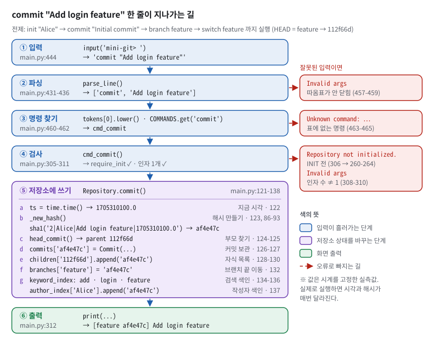
*그림 11. commit "Add login feature" 한 줄이 지나가는 함수 순서 — 번호를 따라 main.py 의 줄 번호를 짚으면 된다. 빨간 점선은 잘못된 입력이 표준 문구로 빠져나가는 곳이다.*

**전제**: `init "Alice"` → `commit "Initial commit"` → `branch feature` → `switch feature` 까지 실행한 상태(HEAD = `feature` → `112f66d`). 값은 CANON 실측이다. 그림 11 의 번호와 아래 번호가 같다.

1. **입력.** `input('mini-git> ')` 가 한 줄을 받는다(`main.py:444`). 앞뒤 공백을 떼고, 빈 줄이나 종료어인지 본다(`main.py:451-455`).
2. **파싱.** `parse_line(line)`(`main.py:456` → `main.py:431-436`) → `shlex.split` → `['commit', 'Add login feature']`.
3. **명령 찾기.** `cmd = tokens[0].lower()` → `'commit'`(`main.py:460`), `args = ['Add login feature']`(`main.py:461`), `COMMANDS.get('commit')` → `cmd_commit`(`main.py:462`), 호출(`main.py:467`).
4. **검사.** `cmd_commit`(`main.py:305-311`) 이 `require_init` 을 통과하고(306행), 인자가 정확히 1개인지 본 뒤(308행), `repo.commit('Add login feature')` 를 부른다(311행).
5. **저장소 쓰기.** `Repository.commit`(`main.py:121-138`) 안에서 일곱 가지가 차례로 일어난다.
   - a. `ts = time.time()` → `1705310100.0` (122행, 시계는 여기서 한 번만 읽는다)
   - b. `_new_hash(...)` (123행 → 86-93행): `_counter` 1→2, 재료 `'2|Alice|Add login feature|1705310100.0'` → `af4e47c`
   - c. `head_commit()` → `branches['feature']` = `'112f66d'`, 그래서 `parents = ['112f66d']` (124-125행)
   - d. `Commit(...)` 생성, `commits['af4e47c'] = node` (126-127행)
   - e. `children['af4e47c'] = []`, `children['112f66d']` 에 `'af4e47c'` 추가 (128-130행)
   - f. `branches['feature'] = 'af4e47c'` (132행) — `main` 은 그대로
   - g. `keyword_index` 의 `add`·`login`·`feature` 목록에 추가, `author_index['Alice']` 에 추가 (134-137행)
6. **출력.** `print(f'[{repo.head_branch} {node.hash}] {node.message}')`(`main.py:312`) → **`[feature af4e47c] Add login feature`** (실측).

**오류 갈래** (그림 11 오른쪽 빨간 상자). ② 따옴표가 안 닫혔으면 `parse_line` 이 `None` → `Invalid args`(`main.py:457-459`). ③ 표에 없는 명령이면 `Unknown command: <cmd>`(`main.py:463-465`). ④ INIT 전이면 `Repository not initialized. Run: INIT <user_name>`(`main.py:260-264`), 인자 수가 1이 아니면 `Invalid args`(`main.py:308-310`).

나머지 세 시나리오는 짧게 따라간다. 파싱·디스패치(1~3)는 같다.

- **`log`** → `cmd_log(repo, [])`(`main.py:315`). 옵션이 없으니 `sort_by is None`(329행) → `repo.topological_log()`(331행) → `['112f66d', 'af4e47c', '955b518', '8690126']` → 커밋 객체로 바꾸고(332행) → 커밋마다 `format_commit_line(..., with_branches=True)`(343행) → `_branches_pointing_to` 로 라벨 `[main]`, `[feature]` 를 붙인다.
- **`path 8690126 955b518`** → `cmd_path`(`main.py:346`). 인자 2개 확인(349행), 둘 다 있는 커밋인지 확인(353-358행) → `shortest_path`(359행): 같지 않음(170행) → 무방향 `adj`(174-178행) → BFS 거리 `{8690126:0, af4e47c:1, 112f66d:2, 955b518:3}`(181-188행) → 층별 `best`(195-213행) → `Path: 8690126->af4e47c->112f66d->955b518`(363행).
- **`search LOGIN`** → `cmd_search`(`main.py:387`). `--author=` 로 시작하지 않으므로(394행) `search_keyword('LOGIN')`(398행) → `'login'` → `['af4e47c', '8690126']` → 중복 제거(403-409행) → `Found 2 commits:`(410행) + 두 줄(411-413행).

### 4.3 설계 결정과 이유

| 결정 | 대안 | 왜 이걸 골랐나 | 대가(트레이드오프) |
|---|---|---|---|
| 파일 하나 `main.py` | 모듈 여러 개 | 제출물이 "엔트리 포인트 1개", 실행이 `python main.py` 한 줄 | 473줄 한 파일. 배너 주석으로 구역 표시 |
| `commits` = dict(hash → Commit) | 리스트에서 찾기 | 평균 O(1) 조회(R2-4). 탐색의 매 걸음이 조회다 | 해시 테이블 메모리 |
| `parents` 를 리스트로 | 부모 하나(단일 값) | "0개 이상의 부모"(R2-2), 병합 대비 | CLI 에선 항상 0~1개라 다중 부모 경로는 테스트로만 검증 |
| `children` 역방향 간선을 따로 유지 | 필요할 때마다 뒤집기 | Kahn 에서 자식 조회 O(1) | 같은 사실이 두 벌 → `commit()` 한 곳에서만 같이 갱신 |
| HEAD = 브랜치 **이름** | HEAD = 커밋 hash | COMMIT 이 132행 한 줄. git 의 `ref: refs/heads/…` 와 같은 구조 | detached HEAD(특정 커밋으로 이동) 불가 |
| hash = SHA-1(카운터\|작성자\|메시지\|시각) 앞 7자리 + 겹침 재시도 | 순수 카운터 / uuid 난수 / 부모 포함 내용 해시 | 카운터로 유일성 보장, git 처럼 보이는 7자리 | 실행마다 다름(재현 어려움), 부모 미포함(변조 감지 없음) |
| LOG = Kahn + `(timestamp, hash)` 최소를 손 루프로 | DFS 후위순회 / 힙 / `min()` | 부모 먼저를 구조로 보장, 결정적 출력, 금지 API 회피 | 후보가 많으면 O(V²) |
| PATH = 호출마다 무방향 `adj` + BFS + 층별 사전순 DP | 영속 인접 목록 / 도착점 BFS 후 한 칸씩 최소 | 명세 문장을 그대로 코드로, 한 함수로 완결 | 매 호출 O(V+E) 재생성, 경로 문자열 누적 메모리 O(V·D) |
| ANCESTORS = 명시적 스택 DFS + visited | 재귀 DFS / BFS | 재귀 한도(1000) 회피, 다이아몬드 중복 방지 | 결과가 set → 출력 전 정렬 필요 |
| `merge_sort(items, key)` key 주입 | 기준별 정렬 함수 / 비교 함수(cmp) | 한 함수로 date·author·ancestors 3곳 재사용, 최악 O(n log n), 안정 | O(n) 추가 메모리, 슬라이스 복사 |
| 역색인 = 커밋 시점 갱신, dict of list | 검색 때 순회 / dict of set | 검색 O(1)+O(k), 커밋 순서 유지 | 같은 단어 반복 시 중복 → 읽을 때 제거. 삭제 경로 없음 |
| `shlex.split(posix=True)` | `str.split` / 직접 짠 상태 기계 | 따옴표·이스케이프를 셸 표준 규칙대로 | 표준 라이브러리 의존(허용 범위) |
| `COMMANDS` 표로 디스패치 | if/elif 사다리 | 명령 추가 = 표에 한 줄. 키가 소문자인지 테스트가 검사 | — |
| REPL 의 `except Exception` 안전망 | 예외를 그대로 터뜨림 | 어떤 입력에도 루프 유지(R6-2) | 진짜 버그가 `Error: …` 한 줄로 묻힐 수 있음 |
| 알고리즘은 값 반환, 출력은 `cmd_*` | 알고리즘 안에서 print | 단위 테스트 가능. AST 검사로 강제 | 함수 수가 늘어남 |

### 4.4 어떻게 검증했나

**테스트 70개, 전부 통과.** 복사본에서 실행한 실측이다.

```console
$ PYTHONDONTWRITEBYTECODE=1 python3 -m unittest discover -s tests
......................................................................
----------------------------------------------------------------------
Ran 70 tests in 0.350s

OK
```

파일별로 따로 돌리면 `tests/test_cli.py` 20 · `tests/test_constraints.py` 11 · `tests/test_minigit.py` 33 · `tests/test_readme_refs.py` 6 = 70 이다. pytest·ruff 는 이 환경에 없고, 표준 `unittest` 로 충분하다.

`PYTHONDONTWRITEBYTECODE=1`(또는 `python3 -B`)을 붙이는 이유: `__pycache__/main.cpython-314.pyc` 가 git 추적 파일이라, 원본 저장소에서 그냥 돌리면 다시 쓰여 작업 트리가 더러워질 수 있다.

**테스트가 지키는 것.**

| 검사 | 위치 | 무엇을 고정하나 |
|---|---|---|
| 부모가 자식보다 먼저, 누락·중복 없음 | `tests/test_minigit.py:66-143` | 분기·다이아몬드·분리 루트·노드 60개짜리 무작위 DAG·동률에서 LOG |
| 사전순 최소, 간선 수 우선, 처음 찾은 것 ≠ 답 | `tests/test_minigit.py:168-219` | PATH |
| 안정성 최소 반례, 중복 key 200개, 입력 불변, key 교체 | `tests/test_minigit.py:241-315` | `merge_sort` |
| 역색인 결과 == 전체 순회 결과 | `tests/test_minigit.py:374-392` | SEARCH |
| 다이아몬드에서 조상 3개 중복 없이 | `tests/test_minigit.py:424-431` | ANCESTORS |
| 같은 메시지 500번 → hash 500개 | `tests/test_minigit.py:448-453` | hash 유일성 — 카운터(1단)만. 92행 재시도(2단)는 검사 없음 |
| 잘못된 입력 10종이 섞인 12줄 세션에도 종료 코드 0, 표준 문구 | `tests/test_cli.py:138-170` | REPL 안전성 — 단, 종료 코드 0 은 안전망 때문에 늘 참(§7.4) |
| `sorted`/`min`/`max`/`.sort`/`heappush` 등 호출 0 | `tests/test_constraints.py:112-122` | 정렬 API 금지 |
| 검색 함수에 반복문·컴프리헨션 0 | `tests/test_constraints.py:132-144` | 역색인 요구 |
| 알고리즘 함수 안 `print` 0, docstring 8개 존재 | `tests/test_constraints.py:160-179` | 계층 분리, R7-2 |

**테스트가 정말 깨지는지 — 일부러 결함 넣기(돌연변이).** 복사본의 `main.py` 를 한 곳씩 망가뜨리고 테스트를 돌린 실측이다. 줄 수가 바뀌면 README 줄 번호 검사까지 같이 실패하므로 줄 수를 유지한 채 바꿨다.

| 넣은 결함 | 실패한 테스트 |
|---|---|
| 48행 `<=` → `<` (안정성 파괴) | 3건: `test_duplicate_keys_preserve_relative_order`, `test_stability_on_many_duplicates`, `test_two_equal_keys_keep_input_order` |
| 178행 `adj[p].add(h)` → `pass` (부모 방향만) | 6건: `test_path_prints_lexicographically_smallest`(test_cli), `test_diamond_is_undirected`, `test_diamond_picks_lexicographically_smallest`, `test_edge_count_beats_lexicographic_order`, `test_sibling_branches_go_through_common_parent`, `test_smallest_is_not_merely_the_first_one_found` |
| 153행 `<` → `>` (LOG 동률 규칙 뒤집기) | 3건: `test_log_orders_parents_before_children`(test_cli), `test_diamond_with_merge_commit`, `test_tie_break_is_deterministic_and_lexicographic` |
| 92행 `if h not in self.commits:` → `if True:` (충돌 재시도 끄기) | **0건** — 70개 모두 통과. 재시도 경로를 실행하는 테스트가 없다(§7.6) |
| 375행 `print(f'Unknown commit: {h}')` → `raise RuntimeError('boom')` | `ErrorPathTest` 3건은 **모두 통과**, `test_ancestors_output` 1건만 실패(예외가 그대로 올라와 ERROR). REPL 은 `Error: boom` 을 찍고 종료 코드 0(§7.4) |

README 「검사가 정말 깨지는지 확인한 기록」 절에는 이런 드릴 10가지가 저장소 기록으로 남아 있다(예: 역색인의 `token.lower()` → `token` 이면 14건 실패). 위 표의 첫 줄과 셋째 줄은 README 의 숫자(각 3건)와 같다. 넷째·다섯째 줄은 이 문서를 준비하며 새로 해 본 것으로, 테스트가 **닿지 않는 곳**을 보여 준다.

**교차 검증과 측정** (이 문서를 준비하며 복사본에서 실측).

- 개선안 PATH(도착점 BFS + 한 칸씩 최소)와 현재 `shortest_path` 를 무작위 그래프 150개, 31,888쌍에서 비교 → 불일치 0.
- 5,000개 연속 커밋 → 서로 다른 hash 5,000개, `topological_log()` == 생성 순서.
- 벤치마크는 §3.15 의 표. 저장소 안에는 벤치마크 스크립트가 없다(보너스 B3 미구현).
- 저장소 밖 과거 검수 기록(`review/review_all.md` B3-2 절): 무작위 병합 DAG 에서 PATH 10,920쌍 / ANCESTORS 840건을 모든 경로를 나열하는 방식과 대조해 불일치 0, `merge_sort` 를 `sorted()` 와 무작위 300~500회 대조해 안정성까지 일치, 4,002줄 무작위 REPL 입력에서 traceback 0. (검수자 기록이며 이번에 다시 돌리지는 않았다.)

## 5. 시연 리허설 — 평가장에서 그대로

체크리스트 1절 순서대로다. 각 항목은 **명령 → 실제 출력 → 말할 문장**이다. §5.1~§5.6 의 출력 블록은 모두 **CANON 실측**(§5.0 스크립트로 한 세션을 처음부터 끝까지 돌린 결과에서 잘라 온 것)이라 그림·§3 의 hash 와 같다. 평가장에서 직접 치면 hash 와 시각이 다르게 나오니, 앞 출력의 hash 를 **복사해** 다음 명령에 붙여 넣는다.

### 5.0 준비

```bash
cd /home/coder/volume/codyssey_B3-2
python3 --version        # 이 환경: Python 3.14.4
python3 -B main.py       # -B: .pyc 를 쓰지 않는다. 평가장에 python 이 있으면 python main.py
```

처음 뜨는 줄은 `Mini Git. Type "exit" or "quit" to leave.` 다(`main.py:441`).

**문서·그림과 똑같은 hash 로 보여 주고 싶으면** 저장소 루트에서 아래를 그대로 붙여 넣는다. `time.time` 을 "15분씩 늘어나는 가짜 시계"로 바꿔 끼우고, `input` 을 미리 적은 명령 목록으로 바꿔 끼워 진짜 `main()` 을 돌린다. 명령 목록은 §5.1~§5.6 의 명령을 순서대로 모은 것이다(줄 끝 `#` 은 해당 절).

```bash
python3 -B - <<'PY'
import builtins, datetime, main
t = [datetime.datetime(2024, 1, 15, 9, 0, tzinfo=datetime.timezone.utc).timestamp() - 900]
def tick():
    t[0] += 900
    return t[0]
main.time.time = tick
cmds = iter([
    'log', 'init "Alice"', 'log',                                                  # 5.1
    'commit "Initial commit"', 'branch feature', 'log', 'switch feature',
    'commit "Add login feature"', 'log', 'branch feature', 'switch nope',          # 5.2
    'switch main', 'commit "Add payment feature"',
    'switch feature', 'commit "Fix login bug"', 'log',                             # 5.3
    'path af4e47c 955b518', 'path 8690126 955b518',
    'path 112f66d 112f66d', 'path 112f66d deadbee',                                # 5.4
    'ancestors 8690126', 'ancestors 955b518',
    'ancestors 112f66d', 'ancestors deadbee',                                      # 5.5
    'search login', 'search LOGIN', 'search --author=Alice', 'search --author=Nobody',
    'log --sort-by=date', 'log --sort-by=xyz',                                     # 5.6
    'init Bob', 'branch orphan', 'commit "root A"', 'switch orphan',
    'commit "root B"', 'path 7f8bf0b db847da',                                     # 5.4 No path
    'exit'])
def feed(prompt=''):
    line = next(cmds)
    print(prompt + line)
    return line
builtins.input = feed
main.main()
PY
```

§5.1~§5.6 의 출력 블록은 이 스크립트의 출력을 순서대로 자른 것이다(실측). §5.4 뒤쪽의 `No path` 시연은 `init` 이 저장소를 지우므로 스크립트에서도 맨 끝에 있다. 시각은 로컬 시간대로 찍히므로 한국 시간 PC 에서는 `18:00:00` 부터 나온다(hash 는 같다, `TZ=Asia/Seoul` 로 실측).

### 5.1 INIT → main/HEAD/사용자 — 체크리스트 1-1

명령: `log` → `init "Alice"` → `log`

```text
mini-git> log
Repository not initialized. Run: INIT <user_name>
mini-git> init "Alice"
Initialized repository.
Current branch: main
Current user: Alice
mini-git> log
```

INIT 전에는 표준 문구로 막히고, INIT 직후 `log` 는 아무것도 찍지 않고 다음 프롬프트로 넘어간다. 커밋이 없어서다(`main.py:340-341`). 이름에 공백이 있으면(R1-2) 따옴표로 감싼다. 대화형 실측: `init "Alice Kim"` → `Current user: Alice Kim`.

말할 것: "INIT 전에는 모든 명령이 막혀 있습니다. INIT 이 커밋·브랜치·색인·카운터를 모두 새로 만들고, `main` 브랜치를 만들어 HEAD 를 `main` 이라는 **이름**에 둡니다. 아직 커밋이 없어서 main 은 None 을 가리키고, 그래서 LOG 가 비어 있습니다. 코드는 `main.py` 99행부터 109행입니다."

### 5.2 BRANCH → SWITCH → COMMIT — 체크리스트 1-2

명령: `commit "Initial commit"` → `branch feature` → `log` → `switch feature` → `commit "Add login feature"` → `log`

```text
mini-git> commit "Initial commit"
[main 112f66d] Initial commit
mini-git> branch feature
Created branch: feature
mini-git> log
commit 112f66d (Alice, 2024-01-15 09:00:00) [main, feature]
Initial commit
mini-git> switch feature
Switched to branch: feature
mini-git> commit "Add login feature"
[feature af4e47c] Add login feature
mini-git> log
commit 112f66d (Alice, 2024-01-15 09:00:00) [main]
Initial commit
commit af4e47c (Alice, 2024-01-15 09:15:00) [feature]
Add login feature
```

말할 것: "브랜치를 만든 직후엔 두 이름이 같은 커밋을 가리킵니다. `[main, feature]` 가 그 증거입니다. feature 로 옮겨 커밋하니 feature 만 앞으로 갔고 main 은 제자리입니다. COMMIT 은 현재 브랜치 포인터 하나만 옮기기 때문입니다. `main.py` 132행입니다."

오류도 한 번 보여 준다.

```text
mini-git> branch feature
Branch already exists: feature
mini-git> switch nope
Unknown branch: nope
```

### 5.3 LOG 부모 먼저 — 체크리스트 1-3

명령(이어서): `switch main` → `commit "Add payment feature"` → `switch feature` → `commit "Fix login bug"` → `log`

```text
mini-git> switch main
Switched to branch: main
mini-git> commit "Add payment feature"
[main 955b518] Add payment feature
mini-git> switch feature
Switched to branch: feature
mini-git> commit "Fix login bug"
[feature 8690126] Fix login bug
mini-git> log
commit 112f66d (Alice, 2024-01-15 09:00:00)
Initial commit
commit af4e47c (Alice, 2024-01-15 09:15:00)
Add login feature
commit 955b518 (Alice, 2024-01-15 09:30:00) [main]
Add payment feature
commit 8690126 (Alice, 2024-01-15 09:45:00) [feature]
Fix login bug
```

말할 것: "두 갈래로 갈라진 그래프인데도 공통 부모인 Initial commit 이 맨 앞이고, 각 갈래 안에서도 부모가 먼저입니다. Kahn 위상 정렬이라 부모가 모두 출력돼야 자식이 후보에 오릅니다. `main.py` 157행부터 160행입니다. 최신순이었다면 Fix login bug 가 맨 앞이었을 겁니다."

평가자가 "그냥 시간순이랑 같지 않나요?" 하면 시계가 어긋난 커밋 두 개를 직접 넣는 스니펫을 붙여 넣는다.

```bash
python3 -B - <<'PY'
import main
r = main.Repository(); r.init('alice')
for h, msg, who, ts, ps in [('p000001', 'parent (clock ahead)', 'alice', 200.0, []),
                            ('c000002', 'child (clock behind)', 'bob', 100.0, ['p000001'])]:
    r.commits[h] = main.Commit(h, msg, who, ts, ps)
    r.children.setdefault(h, [])
    for p in ps:
        r.children.setdefault(p, []).append(h)
main.cmd_log(r, [])
print('---')
main.cmd_log(r, ['--sort-by=date'])
PY
```

```text
commit p000001 (alice, 1970-01-01 00:03:20)
parent (clock ahead)
commit c000002 (bob, 1970-01-01 00:01:40)
child (clock behind)
---
commit c000002 (bob, 1970-01-01 00:01:40)
child (clock behind)
commit p000001 (alice, 1970-01-01 00:03:20)
parent (clock ahead)
```

말할 것: "자식의 시계가 부모보다 뒤처진 경우입니다. 날짜순은 자식을 먼저 내지만 LOG 는 부모 관계만 믿어서 부모가 먼저입니다."

### 5.4 PATH 최단 경로 / No path — 체크리스트 1-4

```text
mini-git> path af4e47c 955b518
Path: af4e47c->112f66d->955b518
mini-git> path 8690126 955b518
Path: 8690126->af4e47c->112f66d->955b518
mini-git> path 112f66d 112f66d
Path: 112f66d
mini-git> path 112f66d deadbee
Unknown commit: deadbee
```

`No path` 는 서로 닿지 않는 두 루트가 있어야 나온다. CLI 로는 첫 커밋 전에 브랜치를 만들면 된다. `init` 이 저장소를 지우므로 이 부분은 시연의 **맨 끝**에 한다(§5.0 스크립트도 맨 끝에 돌린다).

```text
mini-git> init Bob
Initialized repository.
Current branch: main
Current user: Bob
mini-git> branch orphan
Created branch: orphan
mini-git> commit "root A"
[main 7f8bf0b] root A
mini-git> switch orphan
Switched to branch: orphan
mini-git> commit "root B"
[orphan db847da] root B
mini-git> path 7f8bf0b db847da
No path
```

말할 것: "형제 커밋은 서로의 조상이 아니라서, 간선을 양방향으로 봐야 공통 조상을 거쳐 닿습니다. `main.py` 177, 178행이 양쪽 방향을 넣습니다. BFS 라 처음 닿은 거리가 최단입니다. 연결되지 않은 두 루트 사이는 No path 입니다. 참고로 첫 커밋 전 BRANCH 가 에러 없이 빈 브랜치를 만드는 건 git(이 경우 fatal 로 거부)과 다른 점이라 약점으로 알고 있습니다. 루트가 여럿인 이력 자체는 git 에서도 `git switch --orphan` 으로 만들 수 있습니다." 동률(최단 경로 여러 개)은 CLI 로 만들 수 없어 5.7 의 스니펫으로 보여 준다.

### 5.5 ANCESTORS — 체크리스트 1-5

```text
mini-git> ancestors 8690126
112f66d (Alice, 2024-01-15 09:00:00) Initial commit
af4e47c (Alice, 2024-01-15 09:15:00) Add login feature
mini-git> ancestors 955b518
112f66d (Alice, 2024-01-15 09:00:00) Initial commit
mini-git> ancestors 112f66d
(no ancestors)
mini-git> ancestors deadbee
Unknown commit: deadbee
```

말할 것: "부모 방향으로만 스택 DFS 를 하고, visited 로 같은 조상을 두 번 넣지 않습니다. `main.py` 221행부터 230행입니다. 결과가 집합이라 출력 전에 시각과 hash 순으로 정렬합니다. 380행부터 382행입니다."

### 5.6 SEARCH / LOG --sort-by — 체크리스트 1-6

```text
mini-git> search login
Found 2 commits:
- af4e47c: Add login feature
- 8690126: Fix login bug
mini-git> search LOGIN
Found 2 commits:
- af4e47c: Add login feature
- 8690126: Fix login bug
mini-git> search --author=Alice
Found 4 commits:
- 112f66d: Initial commit
- af4e47c: Add login feature
- 955b518: Add payment feature
- 8690126: Fix login bug
mini-git> search --author=Nobody
Found 0 commits.
mini-git> log --sort-by=date
commit 112f66d (Alice, 2024-01-15 09:00:00)
Initial commit
commit af4e47c (Alice, 2024-01-15 09:15:00)
Add login feature
commit 955b518 (Alice, 2024-01-15 09:30:00)
Add payment feature
commit 8690126 (Alice, 2024-01-15 09:45:00)
Fix login bug
mini-git> log --sort-by=xyz
Invalid args
```

`log --sort-by=author` 는 작성자가 한 명이라 date 와 같은 순서로 나온다. 작성자 이름에 공백이 있으면 `"--author=Alice Kim"` 처럼 옵션 전체를 따옴표로 감싼다(대화형 실측: `init "Alice Kim"` 뒤 커밋 하나 → `search "--author=Alice Kim"` → `Found 1 commit:`). 공백이 든 **검색어**는 파싱은 되지만 항상 0건이다. 같은 세션에서 `commit "Add login feature"` 뒤 `search "Add login"` → `Found 0 commits.`, `search login` → 1건이었다(대화형 실측). 색인의 키가 단어 하나씩이기 때문이다(§7.3).

**작성자가 여럿인 정렬**은 CLI 로 만들 수 없다. 사용자를 바꾸는 유일한 명령 INIT 이 저장소를 지우기 때문이다. 그래서 `r.author` 를 바꿔 가며 커밋한 뒤, REPL 이 부르는 것과 **같은** `cmd_log` 를 직접 부른다(시계 고정 실측).

```bash
python3 -B - <<'PY'
import datetime, main
t = [datetime.datetime(2024, 1, 15, 9, 0, tzinfo=datetime.timezone.utc).timestamp() - 900]
def tick():
    t[0] += 900
    return t[0]
main.time.time = tick
r = main.Repository(); r.init('Carol')
r.commit('Initial commit')
r.make_branch('feature'); r.switch('feature')
r.author = 'Bob';   r.commit('Add login feature')
r.switch('main')
r.author = 'Alice'; r.commit('Add payment feature')
r.switch('feature')
r.author = 'Alice'; r.commit('Fix login bug')
main.cmd_log(r, ['--sort-by=author'])
print('---')
main.cmd_search(r, ['--author=Alice'])
PY
```

```text
commit 955b518 (Alice, 2024-01-15 09:30:00)
Add payment feature
commit 8690126 (Alice, 2024-01-15 09:45:00)
Fix login bug
commit 033fc04 (Bob, 2024-01-15 09:15:00)
Add login feature
commit f07086b (Carol, 2024-01-15 09:00:00)
Initial commit
---
Found 2 commits:
- 955b518: Add payment feature
- 8690126: Fix login bug
```

말할 것: "키워드 검색은 색인할 때와 찾을 때 모두 소문자로 바꿔서 LOGIN 으로도 찾힙니다. 작성자 정렬은 Alice, Bob, Carol 순이고 같은 작성자 안에서는 시각순입니다. 이 결과에서 부모인 Initial commit 이 맨 뒤라는 점이 체크리스트 4-3 의 문제의식입니다."

### 5.7 병합이 있는 다이아몬드 — 1-4·1-5 보강 스니펫

CLI 에 merge 가 없어서 동률 경로와 "두 길로 닿는 조상"은 커밋을 직접 넣어 보여 준다. 테스트 데이터와 같은 그래프다(`tests/test_minigit.py:160-166`).

```bash
python3 -B - <<'PY'
import main
r = main.Repository(); r.init('alice')
for h, msg, who, ts, ps in [('aaaaaa1', 'root', 'alice', 100.0, []),
                            ('bbbbbb2', 'left', 'alice', 101.0, ['aaaaaa1']),
                            ('ccccc03', 'right', 'bob', 102.0, ['aaaaaa1']),
                            ('ddddd04', 'merge', 'alice', 103.0, ['bbbbbb2', 'ccccc03'])]:
    r.commits[h] = main.Commit(h, msg, who, ts, ps)
    r.children.setdefault(h, [])
    for p in ps:
        r.children.setdefault(p, []).append(h)
main.cmd_log(r, [])
main.cmd_path(r, ['aaaaaa1', 'ddddd04'])
main.cmd_path(r, ['bbbbbb2', 'ccccc03'])
main.cmd_ancestors(r, ['ddddd04'])
PY
```

```text
commit aaaaaa1 (alice, 1970-01-01 00:01:40)
root
commit bbbbbb2 (alice, 1970-01-01 00:01:41)
left
commit ccccc03 (bob, 1970-01-01 00:01:42)
right
commit ddddd04 (alice, 1970-01-01 00:01:43)
merge
Path: aaaaaa1->bbbbbb2->ddddd04
Path: bbbbbb2->aaaaaa1->ccccc03
aaaaaa1 (alice, 1970-01-01 00:01:40) root
bbbbbb2 (alice, 1970-01-01 00:01:41) left
ccccc03 (bob, 1970-01-01 00:01:42) right
```

말할 것: "최단 경로가 b 경유와 c 경유 두 개인데, 문자열 사전순으로 b 쪽을 고릅니다. 조상은 aaaaaa1 이 두 길로 닿지만 한 번만 나옵니다. 같은 검사가 테스트에 있습니다."

### 5.8 테스트 한 번에

```bash
PYTHONDONTWRITEBYTECODE=1 python3 -m unittest discover -s tests
```

실측: `Ran 70 tests in 0.350s` / `OK`.

### 5.9 실행할 수 없는 것과 대신 보여 줄 것

- `python main.py` 그대로 — 이 환경엔 `python` 이 없다. `python3 main.py` 와, 인터프리터를 `sys.executable` 로 띄우는 `tests/test_cli.py:23-34` 를 보여 준다.
- MERGE·DIFF·정렬 성능 비교(보너스) — 미구현. 대신 5.7 의 다이아몬드로 알고리즘이 부모 여러 개를 처리함을 보인다.
- Python 3.10 실행 — 이 환경엔 3.14.4 뿐이다. `pyproject.toml` 의 `requires-python = ">=3.10"` 선언을 보여 준다.

## 6. 구술 문답 — 체크리스트 전 문항 + 꼬리 질문

질문만 보고 먼저 소리 내어 답한 뒤 펼친다. 답은 모두 "결론 → 근거 → 코드 위치" 순서다. 체크리스트 20문항은 `<sub>체크리스트 N-M</sub>` 으로 표시했다.

### 6.1 기능 동작 검증

<details>
<summary><b>Q6.1-1</b> `INIT <user_name>` 실행 후 `main` 브랜치/HEAD/현재 사용자 설정이 정상적으로 초기화되어 있나요? <sub>체크리스트 1-1</sub></summary>

**핵심 한 줄.** `Repository.init()` 이 필드 9개를 전부 새로 만들고, `main` 브랜치는 아직 커밋이 없어 `None` 을, HEAD 는 커밋이 아니라 브랜치 **이름** `'main'` 을 가리킨다.

**말로 하는 답 (30초).**
> "네, 정상입니다. INIT 은 커밋, 자녀 목록, 색인, 카운터를 모두 비우고, 브랜치 표를 `{'main': None}` 으로, HEAD 를 `'main'` 이라는 이름으로, 사용자를 입력한 이름으로 설정합니다. main 이 None 인 것은 아직 커밋이 없기 때문이고, 실제 git 에서도 `git init -b main` 직후엔 HEAD 가 `refs/heads/main` 을 가리키지만(설정이 없으면 기본 이름은 master) 그 브랜치 파일은 첫 커밋 때 생깁니다. 코드는 `main.py` 99행부터 109행, 출력 세 줄은 272행부터 274행입니다."

**보여 줄 것.** `main.py:99-109` — 9개 필드 재설정 / `main.py:272-274` — `Initialized repository.` · `Current branch: main` · `Current user: …` / `main.py:260-264` — INIT 전 가드 / §5.1 시연.

**꼬리 질문.**
- **Q.** 첫 커밋 전 `main` 은 무엇을 가리키나요? → **A.** `None` 입니다. 이름만 있고 커밋이 없는, git 에서 말하는 unborn branch 입니다. 첫 COMMIT 이 `main.py` 132행 `self.branches[self.head_branch] = h` 로 처음 채웁니다.
- **Q.** HEAD 가 지금 어디인지 어떻게 확인하나요? → **A.** 전용 status 명령은 없습니다. INIT 출력의 `Current branch:`, 커밋 출력의 `[feature af4e47c]` 앞부분으로 확인합니다. LOG 의 `[main]` 라벨은 그 커밋을 가리키는 브랜치들이지 HEAD 표시는 아닙니다. HEAD 표시를 붙이는 건 개선 과제로 알고 있습니다.
- **Q.** `init` 을 두 번 하면요? → **A.** 이전 커밋·브랜치·색인·카운터가 전부 사라집니다. 색인까지 비우지 않으면 지워진 커밋이 검색되는 "유령 커밋"이 생기는데, 그걸 `tests/test_minigit.py:410-415` 가 막습니다.

</details>

<details>
<summary><b>Q6.1-2</b> `BRANCH <name>` 생성 후 `SWITCH <name>`로 전환되며, 이후 `COMMIT`이 해당 브랜치에 반영되나요? <sub>체크리스트 1-2</sub></summary>

**핵심 한 줄.** BRANCH 는 현재 커밋 hash 하나를 복사하고, SWITCH 는 HEAD 이름 하나를 바꾸고, COMMIT 은 **현재 브랜치 포인터만** 새 커밋으로 옮긴다.

**말로 하는 답 (30초).**
> "네, 반영됩니다. 브랜치는 이름에서 hash 로 가는 한 칸이라, BRANCH 는 지금 HEAD 가 가리키는 hash 를 새 이름에 복사할 뿐 커밋을 복사하지 않습니다. SWITCH 는 `head_branch` 문자열만 바꿉니다. COMMIT 은 현재 브랜치가 가리키던 커밋을 부모로 잡고, 마지막에 현재 브랜치만 새 커밋으로 옮깁니다. 시연에서 feature 로 옮겨 커밋하니 `[feature af4e47c]` 가 나오고 main 은 제자리였습니다. 코드는 114행, 119행, 132행입니다."

**보여 줄 것.** `main.py:111-114`, `main.py:116-119`, `main.py:124-125`, `main.py:132` / §5.2 의 `[main, feature]` → `[main]`·`[feature]` 로 갈라지는 LOG / 그림 4 / 테스트 `tests/test_minigit.py:455-467`(main 이 따라 움직이지 않음을 단언).

**꼬리 질문.**
- **Q.** 같은 이름으로 또 만들면요? → **A.** `Branch already exists: feature` 입니다(`main.py:112-113`). 없는 브랜치로 SWITCH 하면 명세 표준 문구 `Unknown branch: nope` 입니다(`main.py:117-118`).
- **Q.** 첫 커밋 전에 BRANCH 하면요? → **A.** `None` 이 복사돼 빈 브랜치가 생기고, 거기서 커밋하면 부모 없는 두 번째 루트가 생깁니다. 실제 git 은 `fatal: not a valid object name: 'main'`(기본 브랜치가 main 일 때)으로 거부합니다. 루트가 여럿인 이력 자체는 git 도 `--orphan` 으로 만들 수 있으니, 다른 점은 "에러 없이 조용히 허용한다"는 것입니다. 약점으로 인정하고, 막으려면 114행 앞에서 HEAD 가 None 이면 에러를 내면 됩니다. 대신 이걸로 No path 를 시연할 수 있습니다.
- **Q.** HEAD 를 hash 가 아니라 이름으로 둔 이유는요? → **A.** 그래야 COMMIT 이 "현재 브랜치 끝 옮기기" 한 줄로 끝나고 HEAD 와 브랜치가 어긋날 일이 없습니다. 실제 git 의 `.git/HEAD` 도 `ref: refs/heads/feature` 처럼 이름을 가리킵니다. 대가는 특정 커밋으로 이동하는 detached HEAD 를 지원하지 않는다는 것입니다.

</details>

<details>
<summary><b>Q6.1-3</b> `LOG`가 "부모 커밋이 자식 커밋보다 먼저" 출력되도록 동작하나요? <sub>체크리스트 1-3</sub></summary>

**핵심 한 줄.** 인자 없는 LOG 는 Kahn 위상 정렬 순서로 출력하므로, 부모가 모두 출력된 뒤에야 자식이 후보에 오른다.

**말로 하는 답 (30초).**
> "네, 부모가 항상 먼저입니다. LOG 는 Kahn 위상 정렬을 씁니다. 커밋마다 아직 안 나온 부모 수를 세고, 0 인 것만 후보에 올리고, 하나를 낼 때마다 그 자식의 수를 하나 줄입니다. 부모가 다 나와야 0 이 되니 구조적으로 부모가 먼저입니다. 후보가 여럿이면 시각과 hash 가 가장 작은 것을 골라 출력이 늘 같습니다. 코드는 `main.py` 141행부터 161행입니다."

**보여 줄 것.** `main.py:141-161`, 호출 `main.py:329-332`, 한 줄 형식 `main.py:251`(hash·author·timestamp·message 모두 표시) / §5.3 의 분기 그래프 LOG / 그림 6.

**꼬리 질문.**
- **Q.** 그냥 시간순 정렬이랑 뭐가 다르죠? → **A.** CLI 에서는 커밋을 차례로 만들어 결과가 같아 보이지만, 시각은 컴퓨터 시계에 달려 있어 틀릴 수 있습니다. 부모 시각을 200초, 자식 시각을 100초로 넣으면 날짜순은 자식을 먼저 내고 LOG 는 부모를 먼저 냅니다. §5.3 의 스니펫이 증거입니다.
- **Q.** 형제 커밋 `af4e47c` 와 `955b518` 는 누가 먼저죠? → **A.** 둘 다 부모가 나온 뒤 같이 후보에 있습니다. `(timestamp, hash)` 최소라서 09:15 인 `af4e47c` 가 먼저입니다(`main.py:149-154`). 위상 순서는 하나가 아니라서, 실제 git 의 `--topo-order --reverse` 는 같은 모양에서 payment 쪽을 먼저 냈습니다.
- **Q.** 사이클이 있으면요? → **A.** 사이클 안의 커밋은 남은 부모 수가 0 이 되지 않아서 에러 없이 빠집니다. 직접 넣어 본 실험에서 4개 중 1개만 출력됐습니다. 이 구현에서는 사이클이 생길 수 없지만, 넣는다면 끝났을 때 출력 수가 커밋 수보다 작은지 검사하겠습니다.

</details>

<details>
<summary><b>Q6.1-4</b> `PATH <a> <b>`가 경로가 있으면 최단 경로를, 없으면 `No path`를 출력하나요? <sub>체크리스트 1-4</sub></summary>

**핵심 한 줄.** 부모 간선을 양방향으로 넣은 인접 목록에서 BFS 로 거리를 구하고, 도착점이 거리표에 없으면 `No path`, 있으면 층별 사전순 최소 경로를 `Path: a->…->b` 로 찍는다.

**말로 하는 답 (30초).**
> "네, 둘 다 됩니다. `shortest_path` 가 커밋과 부모 사이 간선을 양쪽 방향으로 넣은 인접 목록을 만들고, BFS 로 출발점에서의 거리를 잽니다. BFS 는 가까운 곳부터 방문해서 처음 닿은 거리가 최단입니다. 도착점이 거리표에 없으면 None 을 돌려주고, `cmd_path` 가 No path 를 찍습니다. 최단 경로가 여러 개면 경로 문자열이 사전순으로 가장 작은 것을 고릅니다. 코드는 163행부터 215행입니다."

**보여 줄 것.** `main.py:174-178`(양방향), `main.py:181-188`(BFS), `main.py:190-191`(None), `main.py:360-363`(출력) / §5.4 시연: 형제 경로·자기 자신·`Unknown commit`·`No path` / 그림 7.

**꼬리 질문.**
- **Q.** 최단 경로가 여러 개인 경우를 시연해 보세요. → **A.** CLI 에는 merge 가 없어 그래프가 나무(여러 개면 숲) 모양이고, 같은 나무 안의 두 커밋 사이 경로는 하나뿐이라 동률이 생기지 않습니다. 그래서 병합 커밋이 있는 다이아몬드를 직접 넣은 스니펫으로 보여 드리겠습니다. `aaaaaa1->bbbbbb2->ddddd04` 가 선택됩니다(§5.7).
- **Q.** 없는 hash 를 넣으면 No path 인가요? → **A.** 아닙니다. `cmd_path` 가 먼저 걸러서 `Unknown commit: deadbee` 를 찍습니다(`main.py:353-358`). No path 는 두 커밋이 모두 있는데 이어져 있지 않을 때만입니다.
- **Q.** 경로가 왜 위로 올라갔다 내려오죠? → **A.** 형제 브랜치는 서로의 조상이 아니라서 공통 조상을 거쳐야 닿습니다. 간선을 무방향으로 정의했기 때문에 가능한 경로입니다.

</details>

<details>
<summary><b>Q6.1-5</b> `ANCESTORS <hash>`가 모든 조상을 빠짐없이 출력하나요? <sub>체크리스트 1-5</sub></summary>

**핵심 한 줄.** 명시적 스택 DFS 로 부모 방향을 끝까지 따라가며 visited 집합에 모으므로, 도달 가능한 조상이 **빠짐없이, 중복 없이** 모인다.

**말로 하는 답 (30초).**
> "네, 빠짐없이 나옵니다. 시작 커밋의 부모들을 스택에 넣고, 하나 꺼낼 때마다 이미 방문했으면 건너뛰고, 아니면 방문 표시를 한 뒤 그 부모들을 다시 스택에 넣습니다. 스택이 빌 때까지 반복하니 부모 방향으로 닿는 모든 커밋이 모입니다. 병합으로 두 길에서 같은 조상을 만나도 visited 때문에 한 번만 셉니다. 결과가 집합이라 출력 전에 시각과 hash 로 정렬합니다. 코드는 217행부터 231행, 출력은 380행부터 384행입니다."

**보여 줄 것.** `main.py:217-231`, `main.py:380-384` / §5.5 시연 / §5.7 다이아몬드에서 3개 중복 없이 / 그림 8 오른쪽 / 테스트 `tests/test_minigit.py:424-431`.

**꼬리 질문.**
- **Q.** visited 를 빼면요? → **A.** 다이아몬드에서 `aaaaaa1` 을 두 번 처리합니다. 병합이 층층이 쌓이면 같은 조상을 경로 수만큼 방문해서 최악에는 지수적으로 늘어납니다. 결과 set 이 출력 중복은 막아도 탐색 중복을 막는 건 225-226행입니다.
- **Q.** 왜 재귀가 아니라 스택인가요? → **A.** 파이썬 기본 재귀 한도가 1000 이라서 일렬 커밋이 1,000개를 넘으면 재귀는 RecursionError 가 납니다. 명시적 스택은 한도가 없고, 10,000개 체인에서도 2.7ms 에 9,999개를 모았습니다.
- **Q.** 출력 전에 왜 또 정렬하죠? → **A.** set 의 순회 순서는 파이썬 문자열 해시의 무작위 시드에 따라 실행마다 달라집니다. 같은 조상 집합을 시드 1~4 로 찍어 보니 순서가 바뀌었습니다. 정렬해야 출력이 매번 같습니다.

</details>

<details>
<summary><b>Q6.1-6</b> `SEARCH <keyword>` / `SEARCH --author=<name>` / `LOG --sort-by=date|author`가 요구사항대로 동작하나요? <sub>체크리스트 1-6</sub></summary>

**핵심 한 줄.** SEARCH 는 두 역색인 중 하나를 한 번 조회하고(키워드는 소문자로 정규화), `--sort-by` 는 key 만 바꿔 직접 구현한 머지 정렬을 부른다.

**말로 하는 답 (30초).**
> "네, 동작합니다. SEARCH 는 인자가 `--author=` 로 시작하면 작성자 색인을, 아니면 키워드 색인을 딕셔너리로 한 번 찾습니다. 키워드는 색인할 때와 찾을 때 모두 소문자로 바꿔서 LOGIN 으로도 찾힙니다. LOG 의 sort-by 는 date 면 시각과 hash, author 면 작성자·시각·hash 를 key 로 머지 정렬을 부릅니다. 허용값이 아니면 Invalid args 입니다. 코드는 SEARCH 가 387행부터 413행, 정렬이 318행부터 338행입니다."

**보여 줄 것.** `main.py:393-398`(모드 분기), `main.py:234-239`(조회), `main.py:403-413`(중복 제거·출력), `main.py:325-327`(허용값), `main.py:334-338`(정렬 key) / §5.6 시연 + 여러 작성자 스니펫.

**꼬리 질문.**
- **Q.** `search --author=alice` 는 왜 0건이죠? → **A.** 작성자 색인은 원문 그대로 찾습니다(`main.py:239`). 명세가 소문자 정규화를 요구한 건 키워드뿐이라 작성자는 정확히 일치로 뒀는데, 같은 SEARCH 안에서 규칙이 달라 헷갈릴 수 있다는 점은 인정합니다.
- **Q.** 두 단어로 검색하면요? → **A.** `search login feature` 는 인자가 2개라 Invalid args, `search "login feature"` 는 공백을 품은 토큰이 색인에 없어 `Found 0 commits.` 입니다. AND 검색은 두 목록의 교집합으로 확장할 수 있습니다.
- **Q.** 명세에 검색어도 공백을 넣을 수 있다고 했는데, 메시지 전체로 찾아도 0건이네요? → **A.** 맞습니다. 색인은 명세 R3-2 대로 단어 단위라서 공백을 품은 검색어는 키에 없습니다. 파싱은 명세대로 되지만 검색 의미로는 부족합니다. 고친다면 검색어도 같은 규칙(split + lower)으로 쪼개 단어마다 목록을 가져와 교집합을 구하고, 구문 순서까지 맞추려면 남은 후보 k 개의 원문만 확인하겠습니다. 그래도 전체 순회는 없습니다(§7.3).
- **Q.** 정렬 모드에서 브랜치 라벨이 왜 없죠? → **A.** `main.py` 343행이 `with_branches=(sort_by is None)` 로 정렬 모드에선 라벨을 끕니다. 과제 PDF 의 `log --sort-by=author` 예시도 라벨이 없습니다.

</details>

### 6.2 구현 구조 설명

<details>
<summary><b>Q6.2-1</b> 커밋 저장소/브랜치/HEAD/사용자 정보를 어떤 구조로 분리했고, 각 책임을 설명할 수 있나요? <sub>체크리스트 2-1</sub></summary>

**핵심 한 줄.** 네 정보는 `Repository` 의 필드 네 개로 나뉜다 — `commits`(dict hash → Commit, 저장소), `branches`(dict 이름 → hash, 포인터 표), `head_branch`(str, 지금 브랜치 이름), `author`(str, 현재 사용자). 화면 출력은 `cmd_*` 가 따로 맡는다(`main.py:69-78`).

**말로 하는 답 (30초).**
> "`Repository` 한 객체 안에서 필드별로 책임을 나눴습니다. `commits` 는 hash 에서 커밋으로 가는 저장소, `branches` 는 이름에서 hash 로 가는 포인터 표, `head_branch` 는 지금 브랜치의 이름, `author` 는 현재 사용자입니다. 거기에 역방향 간선 `children` 과 역색인 두 개가 붙습니다. 커밋 한 장은 `Commit` 클래스로 5필드만 갖고, 화면 출력은 `cmd_*` 함수들이 맡아서 알고리즘은 값만 반환합니다. 필드 정의는 `main.py` 69행부터 78행입니다."

**보여 줄 것.** `main.py:69-78` 필드 9개(§4.1 표) / `main.py:21-32` Commit / `main.py:416-425` COMMANDS / 그림 1 의 ④와 ⑤ / `tests/test_constraints.py:160-170`(알고리즘 안 print 금지).

**꼬리 질문.**
- **Q.** `children` 은 `parents` 를 뒤집으면 되는데 왜 따로 두죠? → **A.** 매번 뒤집으면 커밋 전체를 훑어야 합니다. 커밋할 때 한 번 적어 두면 Kahn 에서 자식 조회가 O(1) 입니다. 대가는 같은 사실이 두 벌이라는 것이라, 둘을 바꾸는 곳을 `commit()` 한 함수(128-130행)로 제한했습니다.
- **Q.** 사용자 정보를 커밋마다 따로 저장하는 이유는요? → **A.** `Repository.author` 는 지금 사용자이고, 커밋에는 만든 순간의 작성자를 복사해 둡니다(126행). 나중에 사용자가 바뀌어도 과거 기록은 그대로여야 하기 때문입니다.
- **Q.** 이걸 클래스 여러 개로 더 나눈다면요? → **A.** 브랜치·HEAD 를 `Refs`, 색인을 `Index` 클래스로 떼고 `Repository` 가 조합하게 할 수 있습니다. 지금 규모(473줄)에선 한 클래스가 읽기 쉽다고 판단했습니다.

</details>

<details>
<summary><b>Q6.2-2</b> 커밋 hash로 빠르게 조회하기 위해 어떤 키-값 구조를 사용했고, 중복/충돌을 어떻게 방지했는지 설명할 수 있나요? <sub>체크리스트 2-2</sub></summary>

**핵심 한 줄.** 파이썬 dict `commits`(hash → Commit)로 평균 O(1) 조회를 하고, hash 는 증가 카운터를 재료에 섞은 SHA-1 앞 7자리에 "이미 있으면 다시 만들기" 검사를 더해 유일성을 보장한다.

**말로 하는 답 (30초).**
> "키-값 구조는 딕셔너리입니다. hash 를 키로 커밋 객체를 값으로 두어 평균 O(1) 에 찾습니다. hash 는 카운터, 작성자, 메시지, 시각을 이은 문자열을 SHA-1 해서 앞 7자리를 씁니다. 중복은 두 겹으로 막습니다. 첫째, 부를 때마다 카운터를 올려 재료에 섞으니 같은 메시지를 같은 시각에 써도 재료가 다릅니다. 둘째, 7자리로 잘랐으니 우연히 겹칠 수 있어서, 이미 있으면 카운터를 올려 다시 만듭니다. 코드는 86행부터 93행입니다."

**보여 줄 것.** `main.py:70`, `main.py:86-93` / §3.4 의 재료 → hash 표 / 테스트 `tests/test_minigit.py:448-453`(같은 메시지 500번 → 500개).

**꼬리 질문.**
- **Q.** 7자리면 얼마나 자주 겹치나요? → **A.** 16의 7제곱, 약 2억 6천8백만 칸입니다. 생일 문제로 계산하면 약 1만 9천 개 커밋에서 겹칠 확률이 50% 입니다. 그래서 92행의 검사가 꼭 필요합니다.
- **Q.** 92행 재시도가 실제로 도는지 테스트했나요? → **A.** 아닙니다. 테스트는 같은 메시지 500번으로 카운터만 확인하는데, 500개로는 7자리가 겹칠 확률이 약 0.05%(500×499÷2 ÷ 2억 6천8백만)라 그 줄까지 가지 않습니다. 복사본에서 92행을 `if True:` 로 바꿔도 70개가 모두 통과했습니다. 고친다면 `hashlib.sha1` 을 첫 호출에 이미 있는 hash 를 내도록 바꿔 끼워 충돌을 강제하는 테스트를 넣거나, hash 함수를 주입받게 하겠습니다.
- **Q.** SHA-1 이 꼭 필요했나요? → **A.** 명세는 세션 내 유일만 요구해서 카운터만으로도 충분합니다. SHA-1 은 git 처럼 보이는 16진 ID 를 만들려는 선택이고 보안 목적은 아닙니다.
- **Q.** 실제 git 과 무엇이 다른가요? → **A.** git 은 `commit 길이\0` 과 tree, **부모 ID**, author, committer, 메시지 전체를 SHA-1 해서 40자를 씁니다. 스크래치 저장소에서 직접 계산해 실제 ID 와 같음을 확인했습니다. 우리 재료에는 부모가 없어서, 과거를 고치면 뒤 ID 가 다 바뀌는 성질이 없습니다.

</details>

<details>
<summary><b>Q6.2-3</b> 커밋이 추가될 때 역색인(author/keyword)을 어떤 시점에, 어떤 방식으로 갱신하도록 설계했는지 설명할 수 있나요? <sub>체크리스트 2-3</sub></summary>

**핵심 한 줄.** 시점은 `Repository.commit()` 안, 커밋을 저장하고 브랜치를 옮긴 **직후 같은 함수에서 동기적으로**. 방식은 메시지를 공백으로 자르고 소문자로 바꾼 토큰마다 `setdefault(key, []).append(hash)`.

**말로 하는 답 (30초).**
> "커밋을 만드는 함수 안에서 바로 갱신합니다. 커밋을 저장소에 넣고 브랜치를 옮긴 다음, 메시지를 공백으로 자르고 소문자로 바꾼 토큰마다 키워드 색인 목록에 hash 를 붙이고, 작성자 색인에도 붙입니다. 커밋 생성과 색인 갱신이 한 함수라 한쪽만 되는 경로가 없습니다. 찾을 때도 같은 소문자 규칙을 써야 찾히기 때문에 `search_keyword` 도 `lower()` 합니다. 코드는 133행부터 137행, 조회는 236행입니다."

**보여 줄 것.** `main.py:133-137`, `main.py:236` / §3.14 의 색인 덤프와 그림 10 / 테스트 `tests/test_minigit.py:374-392`(역색인 == 전체 순회), `tests/test_minigit.py:394-400`(모든 토큰이 색인됨).

**꼬리 질문.**
- **Q.** 쓰기 때 갱신과 검색 때 계산, 장단점은요? → **A.** 쓰기 때 갱신은 커밋마다 단어 수만큼 비용이 들고 메모리를 더 쓰지만, 검색은 O(1)+O(k) 입니다. 검색 때 계산은 쓰기가 공짜지만 검색마다 전체 순회 O(N·L) 입니다. 이 도구는 커밋 한 번에 검색 여러 번이라 쓰기 때 갱신이 유리합니다.
- **Q.** 커밋 삭제나 메시지 수정이 생기면요? → **A.** 지금은 추가만 있어서 문제가 없습니다. 수정이 생기면 옛 토큰 목록에서 hash 를 빼는 경로가 필요합니다. 목록이면 O(k), 집합으로 바꾸면 O(1) 입니다.
- **Q.** 한 메시지에 같은 단어가 여러 번이면요? → **A.** 같은 hash 가 목록에 여러 번 들어갑니다. 출력 전에 `cmd_search` 가 걸러 냅니다(403-409행). 쓸 때 막으려면 토큰을 먼저 집합으로 만들면 됩니다.

</details>

<details>
<summary><b>Q6.2-4</b> `LOG`, `PATH`, `ANCESTORS`에서 사용하는 그래프 탐색 로직을 어떻게 재사용 가능하게 구성했는지 설명할 수 있나요? <sub>체크리스트 2-4</sub></summary>

**핵심 한 줄.** 재사용의 실체는 셋이다 — ① 세 알고리즘이 **같은 그래프 표현**(`commits` + `parents` + `children`)만 읽는다, ② **계산은 값만 돌려주고 출력은 `cmd_*`** 가 맡는다, ③ `merge_sort` 하나를 key 만 바꿔 세 곳에서 쓴다. 순회 자체를 하나의 범용 함수로 합치지는 않았다.

**말로 하는 답 (30초).**
> "세 탐색은 같은 그래프 표현(commits·parents·children)을 공유하고, 계산은 값만 돌려주고 출력은 `cmd_*` 가 맡도록 나눠서 재사용성을 확보했습니다. 그래서 테스트가 알고리즘을 직접 불러 검사할 수 있습니다. 정렬은 `merge_sort` 하나를 key 만 바꿔 날짜순·작성자순·조상 출력 세 곳에서 씁니다. 순회 자체를 한 함수로 합치지는 않았는데, LOG 는 부모→자식, PATH 는 무방향, ANCESTORS 는 자식→부모로 방향이 셋 다 달라서입니다."

**보여 줄 것.** `main.py:140` 그래프 알고리즘 구역, `main.py:141`, `main.py:163`, `main.py:217` / 출력 `main.py:245-251`, `main.py:363`, `main.py:384` / `merge_sort` 사용 `main.py:336`, `338`, `382` / `tests/test_constraints.py:32-40` 알고리즘 함수 목록.

**꼬리 질문.**
- **Q.** 더 재사용하게 만든다면요? → **A.** `neighbors(h, direction)` 한 함수로 부모·자식·양쪽 이웃을 돌려주고, `bfs(start, neighbors)` 와 `dfs(start, neighbors)` 를 일반화하겠습니다. 그러면 "부모 방향만 PATH" 는 인자 하나로 바뀝니다. 인접 목록도 PATH 마다 만들지 말고 커밋 때 유지하겠습니다.
- **Q.** 출력 형식은 어디서 정하나요? → **A.** LOG 한 항목은 `format_commit_line`(245-251행), ANCESTORS 는 384행, PATH 는 363행입니다.
- **Q.** 지금 코드로 두 브랜치의 공통 조상(merge-base)을 구하려면요? → **A.** `ancestors(a)` 에 a 자신을 더한 집합과 `ancestors(b)` 에 b 자신을 더한 집합의 교집합을 구하고, 그중 다른 공통 조상의 조상이 아닌 것을 고르면 됩니다. ANCESTORS 를 그대로 재사용합니다. CANON 에서 `8690126` 과 `955b518` 이면 `112f66d` 입니다.

</details>

<details>
<summary><b>Q6.2-5</b> 주요 함수/클래스에 docstring/주석을 어떤 기준으로 작성했는지 설명할 수 있나요? <sub>체크리스트 2-5</sub></summary>

**핵심 한 줄.** docstring 은 8곳에 달았고 그 목록은 테스트(`tests/test_constraints.py:41-50`)가 강제한다. 종류가 셋이다. 클래스 2개(`Commit`·`Repository`)는 **역할** 한 줄, 알고리즘 5개(`merge_sort`·`_new_hash`·`topological_log`·`shortest_path`·`ancestors`)는 이름만으로는 안 보이는 **보장 성질**(안정·O(n log n)·유일성·부모 먼저·사전순 동률·도달 가능), `parse_line` 은 **따옴표 규칙**이다. 인라인 주석은 "**왜**"만 적는 것이 원칙이지만, 지금 코드에는 코드를 되읽어 주는 "무엇" 주석도 10줄 섞여 있다.

**말로 하는 답 (30초).**
> "기준은 두 가지입니다. docstring 은 8곳에 달았고, 그 목록은 테스트가 강제합니다. 클래스 두 개는 역할을 한 줄로, 알고리즘 다섯 개는 안정 정렬·O(n log n)·해시 유일성·부모 먼저·사전순 동률·도달 가능처럼 이름만으로는 안 보이는 보장 성질을, `parse_line` 은 따옴표로 묶은 인자를 한 토큰으로 본다는 규칙을 적었습니다. 인라인 주석은 '왜'만 적는 게 원칙인데, 지금 코드에는 133-135행 '공백 분리 후 / 소문자로 정규화'처럼 코드를 그대로 읽어 주는 주석도 섞여 있습니다. 다시 쓴다면 그런 주석은 지우고, 48행 `<=` 나 194행 '해시 길이가 같아야 층별 최소가 전체 최소' 같은 '왜' 주석만 남기겠습니다."

**보여 줄 것.** docstring 8개(AST 실측): `Commit`(22행), `merge_sort`(39행), `Repository`(67행), `_new_hash`(87행), `topological_log`(142행), `shortest_path`(`main.py:164-167`), `ancestors`(218행), `parse_line`(432행) + 모듈 docstring `main.py:1-8` / 테스트 목록 `tests/test_constraints.py:41-50`, 검사 `tests/test_constraints.py:172-179` / "왜" 주석: `main.py:48`, `main.py:144`, `main.py:194`, `main.py:380`, `main.py:403` / 지울 "무엇" 주석: `main.py:100`, `main.py:131`, `main.py:133`, `main.py:134`, `main.py:135`, `main.py:148`, `main.py:173`, `main.py:180`, `main.py:330`, `main.py:337`.

**꼬리 질문.**
- **Q.** `commit()` 은 핵심인데 docstring 이 없네요? → **A.** 맞습니다. 131행·133행 구획 주석과 134-135행 인라인 주석만 있습니다. docstring 없는 정의가 `cmd_*` 8개와 `commit()` 을 포함해 22개입니다. "부모는 현재 HEAD, 현재 브랜치 전진, 색인 갱신을 한 번에" 라는 한 줄을 다는 게 맞다고 봅니다.
- **Q.** 235행 주석 "O(1)에 후보를 얻는다"는 맞나요? → **A.** 반만 맞습니다. dict 조회는 평균 O(1) 이지만 바로 아래 `list(...)` 가 결과 k 개를 복사해서 전체는 O(1)+O(k) 입니다. "(전체 순회 X)" 는 유지보수자보다 채점자에게 하는 말이라, 다시 쓴다면 "색인이라 커밋 수와 무관, 결과 수에 비례" 정도로 고치겠습니다.
- **Q.** 주석을 다 지워도 설명할 수 있나요? → **A.** 네. `topological_log` 를 읽어 보면, 143행이 부모 수를 진입차수로, 145행이 0 인 것을 후보로, 149-154행이 후보 중 시각·hash 최소를 손으로 찾고, 157-160행이 자식의 수를 줄여 0 이면 후보에 넣습니다. (§3.9 에서 주석 없이 읽는 연습)
- **Q.** 주석과 테스트의 역할 차이는요? → **A.** 금지 API, docstring 존재, 알고리즘 안 print 금지 같은 **규칙**은 주석이 아니라 `tests/test_constraints.py` 가 실패시키는 검사로 둡니다. 주석은 "왜"를 적는 자리입니다. 주석 51개 중 22개는 구역 배너(큰 배너 6개 × 3줄 + 작은 구획 표시 4줄)이고, 나머지 중 10줄은 앞에서 말한 "무엇" 주석이라 지울 대상입니다.

</details>

### 6.3 핵심 개념 이해

<details>
<summary><b>Q6.3-1</b> 커밋 그래프가 왜 DAG여야 하는지, 사이클이 생기면 어떤 문제가 발생하는지 설명할 수 있나요? <sub>체크리스트 3-1</sub></summary>

**핵심 한 줄.** 커밋의 선후는 "누가 누구 다음"이라는 시간의 방향이라 고리가 있으면 "A 가 B 보다 먼저이면서 나중"이라는 모순이 된다. 사이클이 생기면 위상 정렬이 불가능해져 LOG 에서 커밋이 조용히 빠지고, 조상 탐색에서 자기 자신이 자기 조상이 된다.

**말로 하는 답 (30초).**
> "방향은 시간의 방향이고, 사이클이 있으면 A 가 B 보다 먼저이면서 B 가 A 보다 먼저라는 모순이 생깁니다. 그래서 DAG 여야 합니다. 병합 커밋은 부모가 둘이라 트리가 아니라 일반 그래프이고, 그중 고리가 없는 DAG 입니다. 사이클을 억지로 넣어 봤더니, LOG 는 4개 중 1개만 내고 나머지를 에러 없이 빠뜨렸고, ANCESTORS 는 자기 자신을 조상으로 냈습니다. 이 구현에선 새 커밋의 부모가 항상 이미 있는 커밋이고 부모를 고치는 코드가 없어서 사이클이 구조적으로 생길 수 없습니다."

**보여 줄 것.** `main.py:124-125`(부모 = 이미 있는 HEAD 커밋) / 그림 3 의 빨간 점선 / §3.5 의 사이클 주입 실측 / 테스트 `tests/test_minigit.py:66-71`(출력 수 == 커밋 수).

**꼬리 질문.**
- **Q.** 사이클을 코드로 감지하려면요? → **A.** Kahn 이 끝났을 때 출력 수가 커밋 수보다 작으면 사이클입니다. 지금은 검사 없이 빠진 채 출력되니, 넣는다면 `topological_log` 끝에서 예외를 내겠습니다.
- **Q.** 트리면 충분하지 않나요? → **A.** 병합 커밋이 생기면 한 노드로 들어오는 선이 둘이라 트리가 아닙니다. 그래서 부모를 리스트로 뒀습니다(29행).
- **Q.** 실제 git 은 사이클을 어떻게 막나요? → **A.** 커밋 ID 가 부모 ID 를 재료로 계산되니, 사이클을 만들려면 아직 만들지 않은 자식의 ID 를 부모에 미리 적어야 합니다. 해시를 거꾸로 풀어야 해서 일반적으로 사실상 불가능합니다.

</details>

<details>
<summary><b>Q6.3-2</b> `LOG`에서 "부모가 먼저" 조건을 만족시키기 위해 어떤 접근(예: 위상 정렬 성격의 출력)을 적용했는지 설명할 수 있나요? <sub>체크리스트 3-2</sub></summary>

**핵심 한 줄.** Kahn 위상 정렬 — 진입차수(아직 안 나온 부모 수) 0 인 커밋만 후보에 올리고, 후보 중 `(timestamp, hash)` 최소를 손 루프로 골라 내보내고, 자식의 진입차수를 줄인다.

**말로 하는 답 (30초).**
> "Kahn 알고리즘을 적용했습니다. 네 단계입니다. 커밋마다 부모 수를 진입차수로 적고, 0 인 루트를 후보에 넣고, 후보 중 시각과 hash 가 가장 작은 것을 꺼내 출력 순서에 붙이고, 그 자식들의 진입차수를 1 줄여 0 이 되면 후보에 넣습니다. 후보가 빌 때까지 반복합니다. 최소를 고를 때 `min()` 은 정렬 API 우회로 보일 수 있어 손 루프로 찾았습니다. 네 커밋 예시로 손 추적하면 112f66d, af4e47c, 955b518, 8690126 순서가 나오고 실제 LOG 와 같습니다."

**보여 줄 것.** `main.py:143`, `main.py:145`, `main.py:149-156`, `main.py:157-160` / 그림 6 과 §3.9 의 단계 표.

**꼬리 질문.**
- **Q.** 복잡도는요? → **A.** 큐를 쓰는 표준 Kahn 은 O(V+E) 입니다. 이 구현은 후보 전체를 훑어 최소를 고르고 `pop(i)` 도 선형이라 O(V·후보 수), 루트가 많으면 O(V²) 입니다. 루트 1,000개에서 10,000개로 늘리니 60ms 에서 11.7초가 됐습니다. 보통 이력은 후보가 1~2개라 거의 O(V) 입니다.
- **Q.** DFS 로도 되나요? → **A.** 됩니다. DFS 후위순회를 뒤집으면 위상 순서입니다. Kahn 은 "지금 낼 수 있는 후보"가 보여서 동률 규칙을 끼우기 쉽고, 사이클 감지도 쉬워서 골랐습니다.
- **Q.** 왜 `(timestamp, hash)` 로 동률을 깨죠? → **A.** 위상 순서는 여러 개가 가능해서 규칙이 없으면 삽입 순서에 흔들립니다. hash 까지 넣으면 시각이 같아도 하나로 정해져 테스트할 수 있습니다. 테스트가 일부러 `c000002` 를 먼저 등록해 "처음 것"이 오답이 되게 해 두었습니다(`tests/test_minigit.py:132-143`).

</details>

<details>
<summary><b>Q6.3-3</b> `PATH`에서 최단 경로를 찾기 위해 어떤 알고리즘(예: BFS)을 선택했고, 간선을 무방향으로 정의한 이유를 설명할 수 있나요? <sub>체크리스트 3-3</sub></summary>

**핵심 한 줄.** 모든 간선의 길이가 1 이라 가까운 것부터 방문하는 BFS 가 처음 닿은 거리 = 최단을 보장한다. 무방향은 명세의 정의이고, 서로 조상이 아닌 형제 커밋도 공통 조상을 거쳐 거리를 잴 수 있게 하려는 것이다.

**말로 하는 답 (30초).**
> "BFS 를 골랐습니다. 간선 하나가 커밋 한 걸음이라 길이가 모두 1 이고, BFS 는 큐로 거리 0, 1, 2 순서대로 방문하므로 처음 도착한 거리가 곧 최단입니다. DFS 는 먼 길로 먼저 도착할 수 있고, Dijkstra 는 간선 길이가 제각각일 때 필요한 도구라 과합니다. 무방향은 명세가 '커밋-부모 연결을 무방향 간선으로 간주'라고 정의한 것이고, 그래야 형제 브랜치처럼 서로 조상이 아닌 두 커밋도 공통 조상을 거쳐 경로가 생깁니다. 인접 목록에 양쪽 방향을 넣는 177, 178행이 그 구현입니다."

**보여 줄 것.** `main.py:177-178`, `main.py:182-188`(`deque`), 사전순 `main.py:195-213` / 그림 7 / CANON `path 8690126 955b518` → `Path: 8690126->af4e47c->112f66d->955b518`.

**꼬리 질문.**
- **Q.** 복잡도는요? → **A.** 인접 목록 만들기와 BFS 가 O(V+E) 이고, 사전순 계산은 노드마다 경로 문자열을 들고 다녀서 문자열 길이만큼 더 듭니다. 일렬 커밋 10,000개 끝에서 끝까지 357.8ms, 메모리 453.6MB 였습니다.
- **Q.** 큐를 리스트로 하면요? → **A.** `list.pop(0)` 은 뒤 원소를 전부 당겨 O(n) 이라 BFS 가 O(V²) 이 됩니다. `deque.popleft()` 는 O(1) 입니다.
- **Q.** 나무 모양 그래프에서 PATH 는 늘 어디를 지나나요? → **A.** 두 커밋의 가장 가까운 공통 조상입니다. 나무에선 두 노드 사이 경로가 하나뿐이고 거기서 꺾입니다. git 의 `merge-base` 가 그 공통 조상을 찾는 명령이고, 같은 모양의 실제 git 에서 Initial commit 이 나왔습니다.

</details>

<details>
<summary><b>Q6.3-4</b> 정렬 알고리즘의 평균/최악 시간복잡도와 안정 정렬 여부를 설명할 수 있나요? <sub>체크리스트 3-4</sub></summary>

**핵심 한 줄.** 직접 구현한 머지 정렬이다. 평균·최악 모두 O(n log n), 추가 메모리 O(n), 합칠 때 `<=` 로 같으면 왼쪽을 먼저 내므로 **안정 정렬**이다.

**말로 하는 답 (30초).**
> "머지 정렬을 직접 짰습니다. 반으로 나눠 각각 정렬한 뒤 앞에서부터 비교하며 합칩니다. 입력이 어떻든 항상 절반으로 나누니 1개가 될 때까지 log n 번 나뉘고, 층마다 n 번 합치므로 평균도 최악도 O(n log n) 입니다. 새 리스트를 만드니 추가 메모리는 O(n) 입니다. 안정 정렬입니다. 48행에서 `<=` 로 비교해 key 가 같으면 원래 앞에 있던 왼쪽을 먼저 냅니다. `<` 로 바꾸면 안정성 테스트 3개가 실패하는 것을 확인했습니다."

**보여 줄 것.** `main.py:38-60`, 핵심 `main.py:48` / 그림 9 의 동률 두 쌍 / 테스트 `tests/test_minigit.py:241-315`.

**꼬리 질문.**
- **Q.** log n 은 어디서 나오죠? → **A.** "반으로 몇 번 나눠야 1개가 되나"입니다. 8개면 3번, 1,000개면 약 10번, 10,000개면 약 14번입니다. 그림 9 의 5개는 3번 나뉩니다.
- **Q.** 퀵 정렬과 비교하면요? → **A.** 퀵은 기준값(피벗) 하나를 골라 작은 쪽·큰 쪽으로 나누는데, 평균 O(n log n) 이지만 피벗이 나쁘면 최악 O(n²) 이고 보통 불안정합니다. 대신 추가 배열 없이 제자리에서 정렬해 메모리가 적습니다. 머지는 최악도 O(n log n) 이고 안정이지만 O(n) 메모리가 듭니다. 입력이 어떻든 최악 O(n log n) 이 보장되고, 범용 함수로서 어떤 key 가 와도 순서를 지키는 안정 정렬이라 머지를 골랐습니다. 지금 CLI 의 key 는 hash 까지 넣어서 동률이 없습니다.
- **Q.** 이 저장소에서 안정성이 실제로 결과를 바꾸나요? → **A.** 정직하게 말하면 CLI 에선 안 바꿉니다. key 가 모두 hash 로 끝나고 hash 는 유일해서 동률이 없습니다. 안정성은 key 를 작성자 하나로만 줄 때처럼 동률이 있을 때 의미가 있고, 범용 함수라 어떤 key 로도 안전하게 만들었습니다.
- **Q.** 파이썬 `sorted()` 는요? → **A.** Timsort 계열로 안정적이고 최악 O(n log n), 이미 정렬된 입력에는 O(n) 입니다. 과제가 금지해서 쓰지 않았고, 테스트가 AST 로 `sorted`·`.sort`·`min`·`max` 호출 0건을 강제합니다.

</details>

<details>
<summary><b>Q6.3-5</b> 역색인이 순회 검색보다 빠른 이유를, 자료구조/시간복잡도 관점에서 설명할 수 있나요? <sub>체크리스트 3-5</sub></summary>

**핵심 한 줄.** 순회는 커밋 N 개 × 단어 L 개를 매번 봐서 O(N·L), 역색인은 "단어 → 커밋 목록"을 미리 만들어 둔 dict 를 한 번 찾아 O(1)+O(k)(k = 결과 수) — **N 과 무관**하다.

**말로 하는 답 (30초).**
> "순회 검색은 커밋마다 메시지를 쪼개 비교하니 커밋 수 곱하기 단어 수만큼 일합니다. 역색인은 커밋할 때 미리 단어에서 커밋 목록으로 가는 딕셔너리를 만들어 두기 때문에, 검색은 해시 테이블을 한 번 찾고 결과 k 개를 복사하는 것으로 끝납니다. 커밋 수와 상관이 없습니다. 커밋 10,000개에서 재 보니 역색인 9.6마이크로초, 전체 순회 3.61밀리초로 약 376배 차이였습니다. 비용이 없어진 게 아니라 커밋할 때 단어 수만큼, 메모리는 토큰 수만큼으로 옮긴 것입니다."

**보여 줄 것.** `main.py:76-77`, `main.py:134-137`, `main.py:234-239` / 그림 10 / `tests/test_constraints.py:132-144`(검색 함수에 반복문 0개).

**꼬리 질문.**
- **Q.** dict 조회는 왜 O(1) 인가요? → **A.** 키를 해시 함수로 숫자로 바꿔 배열의 칸 번호를 바로 계산합니다. 충돌하면 정해진 순서로 다른 칸을 찾고, 표가 약 3분의 2 차면 키워서 평균 O(1) 을 유지합니다. 모든 키가 한 칸에 몰리면 최악 O(n) 입니다.
- **Q.** "log" 로 "login" 을 찾을 수 있나요? → **A.** 없습니다. 역색인은 단어 전체가 키입니다. 부분 검색은 n-gram 색인이나 트라이가 필요합니다.
- **Q.** 메모리 대가는요? → **A.** 모든 토큰마다 hash 가 한 번씩 더 저장됩니다. 예시 4커밋이면 토큰 11개, 키 8개입니다.

</details>

### 6.4 확장 사고 · 트러블슈팅

<details>
<summary><b>Q6.4-1</b> 커밋 수가 10배 늘어났을 때 병목이 될 지점을 예측하고, 개선 방향(자료구조/알고리즘)을 설명할 수 있나요? <sub>체크리스트 4-1</sub></summary>

**핵심 한 줄.** 측정으로 매긴 1순위는 **LOG 의 후보 최소 선택**(동시에 낼 수 있는 커밋이 많으면 O(V²), 10배에 약 194배), 2순위는 **PATH 의 경로 문자열 누적**(10배에 약 62배, 메모리 453.6MB)이다. 개선은 직접 구현한 이진 힙과, 도착점 BFS + 한 칸씩 최소 이웃 고르기다.

**말로 하는 답 (30초).**
> "1,000개와 10,000개로 재 보니 1순위는 LOG 의 후보 최소 선택입니다. 동시에 낼 수 있는 커밋이 많으면 매번 후보 전체를 훑어서, 60ms 가 11.7초로 약 194배가 됐습니다. 직접 구현한 이진 힙으로 바꾸면 O((V+E) log V) 가 됩니다. 2순위는 PATH 로, 노드마다 경로 문자열 전체를 들고 다녀 10,000개 체인에서 메모리가 454MB 였고, 도착점 BFS 후 한 칸씩 가장 작은 이웃을 고르게 바꾸면 같은 답을 11ms 에 냈습니다. 커밋 조회, 검색, 조상 탐색은 문제없었습니다."

**보여 줄 것.** §3.15 의 측정 표 / 원인 줄 `main.py:149-155`, `main.py:209-212`, `main.py:174-178`, `main.py:95-96` / 힙의 뜻은 §3.15 "힙이란".

**꼬리 질문.**
- **Q.** 루트가 1만 개인 저장소는 비현실적이지 않나요? → **A.** 루트 수가 원인이 아니라 "동시에 낼 수 있는 커밋 수", 즉 그래프의 폭이 원인입니다. main 에서 브랜치를 1만 개 따서 하나씩 커밋한 모양이면 루트가 하나여도 LOG 가 약 16초 걸렸습니다(두 번 재서 16.5초·16.4초). 그중 약 4초는 브랜치가 1만 개라 줄마다 브랜치 라벨을 찾는 비용이고, 위상 정렬만 재면 약 10초였습니다. 반대로 일렬 이력이면 LOG 는 4.5ms 로 멀쩡하고 PATH 가 1순위가 됩니다.
- **Q.** 왜 `heapq` 를 안 쓰죠? → **A.** 과제 제약 "정렬 관련 표준 API 전부 금지 … 등"에 걸릴 소지가 있고, 저장소 테스트도 `heappush`/`heappop` 을 금지합니다. 힙은 배열과 "부모 칸 = (i-1)//2" 규칙으로 30줄 안팎이면 직접 만들 수 있습니다.
- **Q.** 그 PATH 개선안이 정말 같은 답을 내나요? → **A.** hash 가 모두 7자라, 한 칸씩 가장 작은 이웃을 고르면 전체 문자열도 사전순 최소가 됩니다. 복사본에서 무작위 그래프 150개, 31,888쌍을 기존 구현과 비교해 불일치 0 이었습니다.
- **Q.** 그 밖에 커지면 문제 될 곳은요? → **A.** LOG 가 줄마다 브랜치 전체를 훑어 라벨을 찾습니다(95-96행). hash 에서 브랜치 목록으로 가는 역맵을 두고, 출력 자체가 길어지면 `LOG -n 20` 같은 페이징을 두겠습니다. PATH 의 인접 목록도 호출마다 만들지 말고 커밋 때 유지하겠습니다.

</details>

<details>
<summary><b>Q6.4-2</b> `PATH`의 간선 정의를 "부모 방향만 허용"으로 바꾸면 결과가 어떻게 달라지고, 구현은 무엇을 바꿔야 하는지 설명할 수 있나요? <sub>체크리스트 4-2</sub></summary>

**핵심 한 줄.** 결과는 "두 커밋 사이 거리"에서 "b 가 a 의 조상인가, 몇 세대 위인가"로 바뀐다 — 형제·조상→후손 방향은 모두 `No path`, 대칭성도 사라진다. 구현은 178행 한 줄 삭제로는 **부족하다**. 경로를 복원하는 단계도 방향을 맞춰야 한다.

**말로 하는 답 (30초).**
> "결과부터 말씀드리면, 자식에서 부모로만 갈 수 있어서 후손에서 조상 방향으로만 경로가 생깁니다. 예시에서 형제인 8690126 과 955b518 은 지금 3걸음이지만 No path 가 되고, 112f66d 에서 8690126 처럼 조상에서 후손 방향도 No path 라서 PATH a b 와 PATH b a 가 달라집니다. 구현은 역방향을 넣는 178행만 지우면 될 것 같지만, 그러면 있어야 할 후손→조상 경로까지 None 이 됩니다. 사전순 복원 단계가 v 의 앞 노드를 v 의 이웃 목록에서 찾는데, 방향 그래프에선 그 앞 노드가 v 의 자식이라 부모만 든 목록에 없기 때문입니다. 그래서 복원 단계도 자식 방향으로 바꿔야 합니다."

**보여 줄 것.** 그림 7 의 오른쪽 / 변형 구현 실측:

| 질의 | 지금 (무방향) | 부모 방향만 |
|---|---|---|
| `PATH 8690126 955b518` (형제 가지) | `8690126->af4e47c->112f66d->955b518` | `No path` |
| `PATH 8690126 112f66d` (후손→조상) | `8690126->af4e47c->112f66d` | `8690126->af4e47c->112f66d` |
| `PATH 112f66d 8690126` (조상→후손) | `112f66d->af4e47c->8690126` | `No path` |
| `PATH af4e47c 955b518` (형제) | `af4e47c->112f66d->955b518` | `No path` |

복사본에서 178행 `adj[p].add(h)` 만 `pass` 로 바꾼 실측: `shortest_path('8690126', '112f66d')` → `None`(있어야 할 경로가 사라짐), 테스트 6건 실패(§4.4).

**꼬리 질문.**
- **Q.** 그럼 올바른 변경은요? → **A.** BFS 는 `parents` 만 따라가고, 경로 복원은 `children` 방향으로 합니다. 더 단순하게는 도착점에서 `children` 방향 BFS 로 거리표를 만든 뒤, 출발점에서 부모 중 거리가 1 작은 것 가운데 hash 가 가장 작은 것을 골라 걸으면 됩니다. 이 방식을 복사본에서 짜서, 부모가 0~3개인 무작위 DAG 120개의 모든 쌍 4,323개를 "모든 경로를 나열해 가장 짧고 사전순으로 가장 작은 것"과 대조했더니 불일치 0 이었습니다.
- **Q.** 테스트는요? → **A.** 무방향을 전제로 한 테스트 6건이 실패하니, 요구가 바뀐 것이라면 그 기댓값도 새 정의에 맞게 바꿔야 합니다.
- **Q.** 그 버전은 실제 git 의 무엇과 비슷하죠? → **A.** 일반적으로 `git merge-base --is-ancestor` 같은 조상 여부 확인에 세대 수를 더한 것과 비슷합니다.

</details>

<details>
<summary><b>Q6.4-3</b> `LOG --sort-by=author` 요구사항이 "부모-자식 선후도 유지"로 강화된다면, 어떤 전략으로 해결할지 설명할 수 있나요? <sub>체크리스트 4-3</sub></summary>

**핵심 한 줄.** 순수 작성자 정렬은 부모 먼저를 어길 수 있다. 전략은 **우선순위가 있는 Kahn** — 위상 조건은 절대 규칙, 작성자 순은 동률을 깰 때의 선호로 쓴다. `topological_log` 의 비교 key 만 `(timestamp, hash)` → `(author, timestamp, hash)` 로 바꾼다.

**말로 하는 답 (30초).**
> "먼저 두 요구가 충돌한다는 걸 짚겠습니다. 작성자가 Carol, Bob, Alice 인 예시에서 순수 작성자 정렬은 Alice 두 개, Bob, Carol 순인데, 루트인 Carol 의 커밋이 맨 뒤로 가서 부모 먼저를 세 번 어깁니다. 그래서 정렬이 아니라 위상 정렬을 기본으로 두고, '지금 낼 수 있는 후보' 중에서 작성자 이름이 가장 앞선 것을 고르게 바꾸겠습니다. 코드로는 153행의 비교 key 를 작성자, 시각, hash 로 바꾸는 것이고, `topological_log` 가 key 를 인자로 받게 해 LOG 모드마다 다른 key 를 넘기면 됩니다."

**보여 줄 것.** 변형 구현 실측(작성자 Carol → Bob / Alice, 시계 고정):

```text
순수 author 정렬 : 955b518 Alice, 8690126 Alice, 033fc04 Bob, f07086b Carol   ← 부모 먼저 위반 3건
우선순위 Kahn    : f07086b Carol, 955b518 Alice, 033fc04 Bob, 8690126 Alice   ← 위반 0
```

위반 3건: 루트 `f07086b` 가 자식 `033fc04`·`955b518` 보다 뒤, `033fc04`(Bob) 가 자식 `8690126` 보다 뒤. 바꿀 곳: `main.py:153`.

**꼬리 질문.**
- **Q.** 작성자별로 깔끔하게 안 뭉치는데요? → **A.** 맞습니다. Carol, Alice, Bob, Alice 순입니다. 위상 제약이 그렇게 요구하기 때문입니다. 사용자에게는 "이력 순서를 깨지 않는 범위에서 작성자 순"이라고 설명해야 합니다.
- **Q.** 머지 정렬을 한 뒤 위반을 고치면 안 되나요? → **A.** 고치는 과정이 결국 위상 정렬입니다. 비교 정렬은 "이것이 저것보다 먼저여야 한다"는 선후 제약을 표현하지 못합니다.
- **Q.** 복잡도는요? → **A.** 지금 구조 그대로면 최악 O(V²) 이고, 후보를 직접 만든 힙으로 두면 O((V+E) log V) 입니다.

</details>

<details>
<summary><b>Q6.4-4</b> 해시 생성 방식을 카운터 기반 ↔ 난수 기반으로 바꿀 때 테스트/재현성/디버깅에 미치는 영향을 설명할 수 있나요? <sub>체크리스트 4-4</sub></summary>

**핵심 한 줄.** 카운터는 같은 명령 순서면 같은 hash(재현·테스트·디버깅 쉬움), 난수는 시드를 고정하지 않으면 재현 불가(충돌 검사 필수). 현재 구현은 카운터 + 내용 + **시각**이라 이미 실행마다 달라지고, **시계를 주입**하면 재현된다.

**말로 하는 답 (30초).**
> "순수 카운터로 바꾸면 같은 명령 순서면 같은 hash 가 나와 테스트에 기댓값을 바로 적을 수 있고, '세 번째 커밋' 처럼 디버깅도 쉽습니다. 난수로 바꾸면 시드를 고정하지 않는 한 재현이 안 되고, 겹칠 수 있어 충돌 검사가 필수가 됩니다. 지금 구현은 카운터에 시각까지 섞어서 이미 실행마다 hash 가 다릅니다. 그래서 프로그램을 띄워 명령을 미리 밀어 넣는 CLI 테스트로는 PATH·ANCESTORS 처럼 hash 를 인자로 받는 명령을 검사할 수 없었고, 대신 `aaaaaa1` 처럼 hash 를 고정한 커밋을 직접 넣고 핸들러를 같은 프로세스에서 불러 검사했습니다. 고친다면 시계를 저장소에 주입받게 하겠습니다. 이 문서의 CANON 값이 시계를 바꿔 끼워 재현한 결과입니다."

**보여 줄 것.** `main.py:86-93`, `main.py:122` / `tests/test_cli.py:173-180`(docstring: 앞 출력에서 읽은 hash 를 인자로 넣어야 하는 명령은 서브프로세스 방식으로 검사할 수 없어 핸들러를 직접 부른다) / `tests/test_cli.py:196-210`(`aaaaaa1`~`ddddd04` 를 `repo.commits` 에 직접 주입) / §5.0 의 시계 고정 스크립트.

| 기준 | 순수 카운터 (`0000001` …) | 현재 (카운터+내용+시각 SHA-1) | 난수 (uuid 등) |
|---|---|---|---|
| 유일성 | 구조적으로 보장 | 카운터가 보장 + 겹침 재검사 | 확률적 → 겹침 검사 필수 |
| 재현성 | 같은 명령 순서 = 같은 hash | 시각 때문에 실행마다 다름 (시계 고정 시 재현) | 시드를 고정하지 않으면 불가 |
| 테스트 | 기댓값에 hash 를 바로 적음 | hash 를 고정한 커밋을 직접 주입(`tests/test_cli.py:196-210`)하거나 시계 주입 | 시드 주입 필요 |
| 디버깅 | "3번째 커밋"이 바로 보임 | 재료를 알면 재계산 가능 | hash 만 보고 알 수 있는 것 없음 |
| 단점 | 순서가 드러남, 여러 저장소를 합치면 겹침 | 시계 의존 | 재현 불가 |

**꼬리 질문.**
- **Q.** 난수로 바꾸면 충돌 검사는 어디에 두죠? → **A.** 지금 `_new_hash` 의 `if h not in self.commits` 재시도 루프를 그대로 씁니다. 난수에서는 이 검사가 필수입니다. 그런데 지금 그 줄은 어떤 테스트도 실행하지 않아서(§7.6), 난수로 바꾼다면 충돌을 일부러 만드는 테스트를 먼저 넣겠습니다.
- **Q.** 실제 git 은 어느 쪽인가요? → **A.** 둘 다 아닌 **내용 해시**입니다. 트리, 부모, 작성자, 시각, 메시지가 같으면 어느 컴퓨터에서 만들어도 같은 ID 입니다. 스크래치 저장소에서 이름·메일·시각을 고정하니 매번 같은 `739ca9a` 가 나왔습니다.
- **Q.** 시계를 한 번만 읽는 게 왜 중요하죠? → **A.** hash 재료의 시각과 커밋에 저장하는 시각이 같아야 나중에 재계산이 맞습니다. 122행에서 한 번 읽어 두 곳에 같이 씁니다. 코드 품질 가이드가 좋은 예로 든 부분입니다.

</details>

### 6.5 한 칸 더 — 평가자가 파고드는 원리 질문

체크리스트 밖이지만 "그럼 그건 내부적으로 어떻게 되나요?" 하고 이어질 만한 질문이다. `[일반 지식]` 표시가 붙은 내용은 이 저장소에서 실행으로 확인한 것이 아니라 교과서 수준의 사실이다. 말할 때도 "일반적으로" 를 붙인다.

<details>
<summary><b>Q6.5-1</b> 커밋 hash(SHA-1)와 dict 가 내부에서 쓰는 해시는 같은 건가요? <sub>심화</sub></summary>

**핵심 한 줄.** 다르다. 커밋 hash 는 사람이 보는 ID 를 만드는 암호학적 해시이고, dict 의 해시는 칸 번호를 정하는 빠른 내부 계산이다.

**말로 하는 답 (30초).**
> "다른 것입니다. 커밋 hash 는 `_new_hash` 가 SHA-1 로 만든 16진 7자리 문자열로, 커밋의 이름입니다. dict 의 해시는 파이썬이 키를 표의 몇 번째 칸에 둘지 정하려고 내부에서 계산하는 값입니다. 커밋 hash 문자열이 `commits` 딕셔너리의 키로 들어가면서 한 번 더 해시되는 것입니다. 그래서 dict 해시는 실행마다 시드가 바뀌어 set 순서가 달라지지만, 커밋 hash 는 재료가 같으면 늘 같습니다."

**꼬리 질문.**
- **Q.** 그럼 커밋 hash 가 실행마다 다른 건 dict 때문인가요? → **A.** 아닙니다. 재료에 `time.time()` 시각이 들어가서입니다(`main.py:122`). 시계를 고정하면 매번 같은 hash 가 나옵니다(§5.0).

</details>

<details>
<summary><b>Q6.5-2</b> 머클(Merkle) 구조가 뭐고, 이 구현에는 있나요? <sub>심화</sub></summary>

**핵심 한 줄.** 자식의 ID 가 부모 ID 를 재료로 계산되는 구조다. 과거를 하나 고치면 뒤의 ID 가 전부 바뀌어 변조가 드러난다. git 에는 있고, 이 구현에는 없다.

**말로 하는 답 (30초).**
> "머클 구조는 ID 를 계산할 때 부모의 ID 를 재료로 넣는 구조입니다. 과거 커밋의 메시지를 하나 고치면 그 ID 가 바뀌고, 그걸 부모로 적은 자식의 내용도 바뀌어 자식 ID 도 바뀌고, 끝까지 연쇄로 바뀝니다. 그래서 이력을 몰래 고칠 수 없습니다. git 커밋의 본문에는 `parent` 줄이 있고, 제가 `commit 212\0` 과 본문을 직접 SHA-1 해서 실제 ID 와 같음을 확인했습니다. 이 구현의 재료는 카운터, 작성자, 메시지, 시각뿐이라 이 성질이 없습니다. 실제로 §5.6 에서 부모를 Bob 의 커밋 `033fc04` 로 바꿔 만든 'Fix login bug' 도 hash 가 CANON 과 같은 `8690126` 이었습니다. 부모가 달라도 ID 가 같다는 것이 부모가 재료에 없다는 증거입니다. 넣는다면 재료에 부모 hash 들을 이어 붙이면 됩니다."

**꼬리 질문.**
- **Q.** rebase 하면 왜 커밋 ID 가 바뀌나요? → **A.** 일반적으로 rebase 는 같은 변경을 다른 부모 위에 다시 만듭니다. 부모가 바뀌면 재료가 바뀌니 ID 도 새로 나옵니다. cherry-pick 도 같은 이유입니다. `[일반 지식]`

</details>

<details>
<summary><b>Q6.5-3</b> BFS 가 최단 경로를 보장하는 이유를 증명하듯 말해 보세요. <sub>심화</sub></summary>

**핵심 한 줄.** 큐는 거리 d 인 노드를 모두 꺼낸 뒤에야 거리 d+1 인 노드를 꺼낸다. 그래서 처음 방문할 때 붙는 거리보다 짧은 길이 있었다면 그 길의 앞 노드가 먼저 처리되어 더 일찍 방문했어야 하므로 모순이다.

**말로 하는 답 (30초).**
> "큐는 먼저 넣은 것을 먼저 꺼냅니다. 출발점이 거리 0, 그 이웃이 거리 1 로 들어가고, 거리 1 들을 다 꺼내는 동안 거리 2 가 뒤에 쌓입니다. 즉 거리 순서대로 꺼냅니다. 어떤 노드를 거리 d 로 처음 방문했는데 실제로 d 보다 짧은 길이 있었다고 가정하면, 그 길의 바로 앞 노드는 거리 d-2 이하라 더 먼저 꺼내졌고, 그때 이 노드를 이미 방문했어야 합니다. 모순이므로 처음 방문한 거리가 최단입니다. 단, 간선 길이가 모두 같을 때만입니다."

**꼬리 질문.**
- **Q.** 간선 길이가 다르면요? → **A.** Dijkstra 처럼 "지금까지 가장 가까운 노드"를 우선순위 큐로 꺼내야 합니다. 길이가 모두 1 이면 BFS 가 그 특수한 경우입니다.

</details>

<details>
<summary><b>Q6.5-4</b> `deque.popleft()` 대신 `list.pop(0)` 을 쓰면 무엇이 달라지나요? <sub>심화</sub></summary>

**핵심 한 줄.** 리스트 맨 앞을 빼면 뒤 원소를 모두 한 칸씩 당겨서 O(n) 이다. BFS 전체가 O(V²) 이 된다. `deque` 는 양쪽 끝이 O(1) 이다.

**말로 하는 답 (30초).**
> "파이썬 리스트는 연속된 배열이라, 맨 앞을 빼면 나머지를 전부 한 칸씩 앞으로 옮깁니다. 큐에 n 개가 있으면 한 번 뺄 때 n 번 옮기니, BFS 가 노드 V 개를 꺼내면 O(V²) 이 됩니다. `collections.deque` 는 양쪽 끝에서 넣고 빼는 게 O(1) 이라 BFS 가 O(V+E) 로 유지됩니다. 그래서 `main.py` 182행에서 deque 를 썼습니다. 같은 이유로 LOG 의 `ready.pop(pick)` 도 리스트 가운데를 빼서 선형 비용이 드는데, 그건 개선 과제로 남겨 두었습니다."

</details>

<details>
<summary><b>Q6.5-5</b> 시간(`time.time()`)으로 부모-자식 순서를 정하면 왜 안 되나요? <sub>심화</sub></summary>

**핵심 한 줄.** 벽시계는 거짓말할 수 있다(보정·수동 변경·컴퓨터마다 다른 시계). 부모 관계는 데이터 자체라 거짓말하지 않는다.

**말로 하는 답 (30초).**
> "컴퓨터 시계는 시간 동기화로 뒤로 보정되기도 하고, 사람이 바꾸기도 하고, 여러 사람이 각자 컴퓨터에서 커밋하면 시계가 서로 다릅니다. 그래서 자식이 부모보다 이른 시각을 가질 수 있습니다. 실제로 그런 두 커밋을 넣어 보니 날짜순 정렬은 자식을 먼저 냈고, LOG 는 부모 관계만 보고 부모를 먼저 냈습니다. 순서를 정하는 근거는 그래프여야 하고, 시각은 동률을 깰 때만 씁니다."

**보여 줄 것.** §5.3 의 시계 어긋남 스니펫과 출력.

</details>

<details>
<summary><b>Q6.5-6</b> HEAD 가 브랜치가 아니라 커밋을 직접 가리키면(detached HEAD) 어떻게 되나요? <sub>심화</sub></summary>

**핵심 한 줄.** git 에서는 `git checkout <hash>` 상태다. 그 상태에서 만든 커밋은 어떤 브랜치도 가리키지 않아 나중에 찾기 어렵다. 이 구현은 `head_branch` 가 항상 이름이라 그런 상태가 없다.

**말로 하는 답 (30초).**
> "git 에서는 특정 커밋을 직접 꺼내 보면 HEAD 가 브랜치 이름 대신 커밋 hash 를 가리킵니다. 그 상태로 커밋하면 새 커밋은 HEAD 만 가리키고 브랜치 이름표가 없어서, 다른 브랜치로 옮기면 찾기 어려워집니다. 이 구현은 HEAD 를 항상 브랜치 이름으로 두었기 때문에 이 상태가 없고, 대신 특정 커밋으로 이동하는 기능도 없습니다. 넣는다면 HEAD 를 '이름 또는 hash' 두 종류로 구분해야 합니다."

</details>

<details>
<summary><b>Q6.5-7</b> MERGE(보너스 B2)를 넣으면 무엇이 바뀌나요? <sub>심화</sub></summary>

**핵심 한 줄.** `commit()` 이 부모 목록을 받게 하고 `merge` 가 `[현재 HEAD, 대상 브랜치 HEAD]` 를 넘기면 된다. 그 순간 그래프가 나무가 아닌 DAG 가 되고, PATH 동률 규칙과 ANCESTORS visited 가 CLI 에서도 실제로 쓰인다. 알고리즘은 고칠 필요가 없다.

**말로 하는 답 (30초).**
> "커밋 생성 함수가 부모를 하나만 잡는 124, 125행을 부모 목록을 받도록 일반화하고, merge 명령이 현재 브랜치 끝과 대상 브랜치 끝을 부모로 넘기면 됩니다. 그러면 CLI 로도 다이아몬드가 생겨서, 지금은 테스트로만 확인하는 사전순 동률 선택과 조상 중복 방지가 실제 명령에서 쓰이게 됩니다. LOG, PATH, ANCESTORS 는 이미 부모 여러 개를 처리하니 고칠 필요가 없습니다. 다이아몬드 테스트가 그 증거입니다."

**꼬리 질문.**
- **Q.** 병합 커밋의 부모 순서는 중요한가요? → **A.** 일반적으로 git 은 첫 번째 부모를 "원래 있던 브랜치"로 봅니다(`git log --first-parent`). 이 구현의 알고리즘은 부모 순서에 따라 결과가 바뀌지 않도록 동률 규칙을 정해 두었습니다. `[일반 지식]`

</details>

<details>
<summary><b>Q6.5-8</b> `shlex.split` 은 따옴표를 내부적으로 어떻게 처리하나요? <sub>심화</sub></summary>

**핵심 한 줄.** 한 글자씩 읽으며 "평소 / 따옴표 안 / 이스케이프" 상태를 바꾸는 상태 기계다. 따옴표 안의 공백은 구분자로 보지 않고, 끝까지 따옴표가 안 닫히면 `ValueError: No closing quotation` 을 던진다.

**말로 하는 답 (30초).**
> "shlex 는 글자를 하나씩 읽으면서 지금이 따옴표 밖인지 안인지 상태를 기억합니다. 밖에서 공백을 만나면 토큰을 끊고, 안에서는 공백도 글자로 담습니다. 따옴표 자체는 벗깁니다. 줄이 끝났는데 따옴표가 열려 있으면 ValueError 를 던지는데, `parse_line` 이 그걸 잡아 None 을 돌려주고 REPL 이 Invalid args 를 찍습니다. `commit "unclosed` 로 실제로 확인했습니다."

</details>

<details>
<summary><b>Q6.5-9</b> 테스트가 "진짜로" 검사하는지 어떻게 아나요? <sub>심화</sub></summary>

**핵심 한 줄.** 일부러 결함을 넣어(돌연변이) 빨간 불이 켜지는지 본다. `<=`→`<` 3건, 178행 무력화 6건, LOG 동률 `<`→`>` 3건이 실패했다.

**말로 하는 답 (30초).**
> "통과하는 테스트는 아무것도 검사하지 않아도 통과할 수 있어서, 코드를 일부러 망가뜨려 봤습니다. 머지 정렬의 `<=` 를 `<` 로 바꾸니 안정성 테스트 3개가, PATH 의 역방향 간선을 없애니 경로 테스트 6개가, LOG 의 동률 비교를 뒤집으니 3개가 실패했습니다. README 에도 이런 드릴 10가지 기록이 있습니다. 그리고 한 번은 오래된 `.pyc` 캐시 때문에 망가뜨렸는데도 통과한 적이 있어서, 캐시를 의심 대상 1순위로 적어 두었습니다."

**보여 줄 것.** §4.4 의 돌연변이 표 / README 「검사가 정말 깨지는지 확인한 기록」 절.

</details>

<details>
<summary><b>Q6.5-10</b> 머지 정렬의 메모리를 줄일 수 있나요? 여러 단어 AND 검색은요? <sub>심화</sub></summary>

**핵심 한 줄.** 머지 정렬은 슬라이스 대신 시작·끝 인덱스와 보조 배열 하나를 재사용하면 복사가 줄어든다. AND 검색은 두 포스팅 리스트의 교집합이다.

**말로 하는 답 (30초).**
> "지금은 `items[:mid]` 슬라이스가 층마다 복사본을 만듭니다. 시작과 끝 인덱스를 넘기고 보조 배열 하나를 재사용하면 복사가 줄어듭니다. 완전한 제자리 머지는 복잡하고 느려서 보통 O(n) 보조 메모리를 받아들입니다. 여러 단어 AND 검색은 단어마다 hash 목록을 가져와 교집합을 구하면 됩니다. 짧은 목록을 집합으로 만들고 긴 목록을 한 번 훑으면 두 목록 길이의 합에 비례합니다. 두 목록을 앞에서부터 같이 훑는 병합 방식을 쓰려면, 목록에 hash 문자열만 있어서 누가 먼저인지 비교할 수 없으니 커밋마다 생성 순번을 저장해야 합니다."

</details>

<details>
<summary><b>Q6.5-11</b> 같은 커밋인데 한국 PC 에서는 시각이 9시간 뒤로 보이는 이유는요? <sub>심화</sub></summary>

**핵심 한 줄.** 저장은 epoch 숫자(시간대 없음)로 하고, 보여 줄 때 `datetime.fromtimestamp` 가 **로컬 시간대**로 바꾸기 때문이다. hash 는 숫자로 계산해서 시간대와 무관하다.

**말로 하는 답 (30초).**
> "커밋에는 1970년부터 흐른 초라는 숫자만 저장합니다. 화면에 찍을 때 `time_str()` 이 `datetime.fromtimestamp` 로 그 컴퓨터의 로컬 시간대에 맞춰 바꿉니다. 이 컨테이너는 UTC 라 09:00, 한국 시간 PC 는 18:00 으로 보입니다. `TZ=Asia/Seoul` 로 돌려 9시간 차이를 확인했습니다. hash 재료는 숫자라 어디서 봐도 같습니다. 여러 나라 사람이 쓴다면 git 처럼 시간대 오프셋을 같이 저장하는 게 좋습니다."

**보여 줄 것.** `main.py:31-32`.

</details>

<details>
<summary><b>Q6.5-12</b> 왜 `min()` 이 금지 API 우회로 보일 수 있고, 테스트는 그걸 어떻게 막나요? <sub>심화</sub></summary>

**핵심 한 줄.** 원소를 하나씩 `min()` 으로 뽑으면 그것이 곧 선택 정렬이라 "정렬 관련 표준 API" 를 우회해 쓰는 모양이 된다. 테스트는 AST(코드를 구조로 읽은 나무)에서 `min`·`max`·`sorted` 호출과 `.sort`·`heappush` 등 속성 호출을 찾아 하나라도 있으면 실패시킨다.

**말로 하는 답 (30초).**
> "명세는 정렬 표준 API 전부를 금지하고 '등'이라고 열어 두었습니다. `min()` 을 반복하면 정렬을 표준 함수에 맡기는 셈이라 소지가 있다고 보고, 위상 정렬의 최소 선택도 손 루프로 짰습니다. 이 규칙은 주석이 아니라 테스트가 지킵니다. `tests/test_constraints.py` 가 `main.py` 를 AST 로 읽어 금지된 이름의 호출이 있는지 찾고, 있으면 줄 번호와 함께 실패합니다."

**보여 줄 것.** `tests/test_constraints.py:28-29`, `tests/test_constraints.py:112-122`, `main.py:149-154`.

</details>

<details>
<summary><b>Q6.5-13</b> 이 구조로 fast-forward·merge·rebase·cherry-pick 을 설명해 보세요. <sub>심화</sub></summary>

**핵심 한 줄.** 넷 다 "포인터 표(`branches`)를 옮기기"와 "커밋 저장소(`commits`)에 새 커밋 넣기"의 조합이다. fast-forward 는 포인터만 옮기고, merge 는 부모 2개짜리 새 커밋 하나를 만들고, rebase·cherry-pick 은 같은 변경을 다른 부모 위에 **새 커밋(새 hash)** 으로 다시 만든다.

**말로 하는 답 (30초).**
> "이 시뮬레이터의 두 재료, 포인터 표와 커밋 저장소로 설명하겠습니다. fast-forward 는 현재 브랜치 끝이 대상 브랜치 끝의 조상일 때 `branches[현재] = branches[대상]` 한 줄이고 새 커밋이 없습니다. 조상인지는 ANCESTORS 를 재사용해 확인합니다. merge 는 부모가 [현재 끝, 대상 끝] 두 개인 새 커밋을 만드는 것입니다. rebase 는 feature 에만 있는 커밋을 위상 순서대로 main 끝 위에 다시 커밋하는 것이라 새 hash 가 생기고, cherry-pick 은 커밋 하나만 그렇게 HEAD 위에 새로 만드는 것입니다."

**보여 줄 것.** 포인터 `main.py:132`, 부모 목록 `main.py:124-125`, 조상 집합 `main.py:217-231`.

**꼬리 질문.**
- **Q.** "feature 에만 있는 커밋"은 어떻게 구하죠? → **A.** feature 끝과 그 조상 집합에서 main 끝과 그 조상 집합을 뺀 차집합입니다. ANCESTORS 두 번과 집합 빼기면 됩니다. 그 차집합을 LOG 처럼 위상 순서로 줄 세워 하나씩 다시 커밋합니다.
- **Q.** rebase 뒤 옛 커밋은요? → **A.** 일반적으로 git 에서는 어느 브랜치에서도 닿지 않는 커밋이 되고, 나중에 정리 대상이 됩니다. 이 구현이라면 `commits` 에 남지만 어떤 브랜치 포인터에서도 ANCESTORS 로 닿지 않습니다. `[일반 지식]`
- **Q.** 이 구현에서 다시 커밋하면 hash 가 바뀌나요? → **A.** 바뀝니다. 다만 이유가 다릅니다. git 은 부모 ID 가 재료라서 바뀌고, 이 구현은 카운터와 시각이 달라져서 바뀝니다(§3.7).

</details>

<details>
<summary><b>Q6.5-14</b> `shortest_path` 는 왜 BFS 를 두 번(거리 구하기 → 층별 best) 도나요? <sub>심화</sub></summary>

**핵심 한 줄.** 한 번으로 줄일 수 있다. 두 번 도는 것은 "거리 구하기"와 "사전순 고르기"를 나눠 읽기 쉽게 하려는 선택이다.

**말로 하는 답 (30초).**
> "지금은 BFS 로 거리표를 다 만든 뒤, 층별로 다시 돌며 best 를 채웁니다. 큐는 거리 d 인 노드를 다 꺼낸 뒤에 d+1 을 꺼내므로, 한 번의 BFS 안에서 이웃 v 를 처음 보면 best 를 적고, 이미 같은 층으로 적혀 있으면 더 작은 문자열로 바꾸기만 해도 결과가 같습니다. v 를 꺼낼 때쯤엔 앞 층 노드가 모두 처리돼 best 가 확정돼 있기 때문입니다. 복사본에서 이렇게 짜서 무작위 그래프 150개, 20,178쌍을 기존 결과와 비교했더니 불일치 0 이었습니다."

**보여 줄 것.** 거리 BFS `main.py:181-188`, 층별 best `main.py:195-213`.

</details>

<details>
<summary><b>Q6.5-15</b> `merge_sort` 도 재귀인데 재귀 한도(1000)는 괜찮나요? <sub>심화</sub></summary>

**핵심 한 줄.** 괜찮다. 항상 반으로 나누므로 재귀 깊이가 log₂n 정도다. 10,000개를 정렬할 때 가장 깊은 호출이 15층이었다(실측). 100만 개여도 약 21층이다(계산).

**말로 하는 답 (30초).**
> "머지 정렬의 재귀는 한 번 들어갈 때마다 입력이 반으로 줄어서, 깊이가 n 이 아니라 log n 입니다. 10,000개를 정렬하며 호출 깊이를 재 보니 가장 깊은 곳이 15층이었습니다. 반면 ANCESTORS 를 재귀 DFS 로 짰다면 일렬 커밋 수만큼 깊어져서 1,000개를 넘으면 한도에 걸립니다. 그래서 ANCESTORS 는 명시적 스택을 썼고, 머지 정렬은 재귀로 둬도 됩니다."

**보여 줄 것.** `main.py:42-44`(반으로 나눠 재귀), §3.12 의 재귀 한도 설명.

</details>

<details>
<summary><b>Q6.5-16</b> LOG 라벨이 `[main, feature]` 순서인 이유는요? 알파벳순인가요? <sub>심화</sub></summary>

**핵심 한 줄.** 알파벳순이 아니라 **브랜치를 만든 순서**다. 파이썬 3.7+ dict 는 넣은 순서를 기억하고, `_branches_pointing_to` 가 `branches.items()` 순서대로 모으기 때문이다(`main.py:95-96`).

**말로 하는 답 (30초).**
> "`branches` 딕셔너리는 INIT 때 main 이 먼저 들어가고, BRANCH 로 만든 이름이 뒤에 붙습니다. 라벨은 이 딕셔너리를 앞에서부터 훑어 그 커밋을 가리키는 이름을 모은 것이라 만든 순서대로 나옵니다. zeta 를 만들고 alpha 를 만든 뒤 LOG 를 쳐 보니 `[main, zeta, alpha]` 였습니다."

**보여 줄 것.** `main.py:95-96`, `main.py:246-250`, §3.3 한 칸 아래(dict 가 넣은 순서를 기억하는 이유).

</details>

## 7. 약점과 방어 — 지적받기 전에 먼저 알기

`main.py` 는 첫 커밋 이후 바뀌지 않았으므로 아래 지적은 **전부 지금도 유효하다**(직접 확인). 각 항목은 "무엇이 문제인가 → 물으면 이렇게 답한다 → 고친다면" 순서다. 이 학습자는 다른 과제에서 "대학생이 갓 짠 코드"라는 평을 받았다. 이 과제에서 같은 축으로 지적받을 만한 것은 7.2(입력 내용 미검사), 7.4(예외 삼킴·실행 중 Ctrl-C·늘 초록인 안전성 테스트), 7.6(테스트가 실행하지 않는 재시도 줄), 7.7(산출물 커밋·코드를 되읽는 주석·중복된 초기화)이다. 먼저 인정하고 고칠 방법까지 말하는 것이 가장 좋은 방어다.

반대로 **칭찬받을 근거**도 알아 둔다. 시계를 한 번만 읽는다(`main.py:122`, 코드 품질 가이드가 좋은 예로 든 부분). 알고리즘과 출력의 분리를 AST 테스트가 강제한다. 돌연변이로 테스트가 실제로 깨지는지 확인했다.

### 7.1 보너스 3개 미구현, 그래서 CLI 그래프는 늘 숲(부모 ≤ 1)

- **무엇이 문제인가.** B1 diff, B2 merge, B3 정렬 성능 비교가 없다(§2.4). 특히 merge 가 없어서 CLI 로 만든 그래프는 부모가 0~1개인 **숲**이고, PATH 의 동률 코드(`main.py:205-212`)와 ANCESTORS 의 중복 방지가 CLI 에서는 실제로 발동하지 않는다.
- **물으면.** "필수 30개에 집중하느라 보너스는 하지 못했습니다. 다만 자료구조와 알고리즘은 이미 부모 여러 개를 처리하도록 짰고, 병합 커밋이 있는 다이아몬드를 직접 넣은 테스트로 확인했습니다. merge 를 붙이면 그 코드가 CLI 에서도 쓰이게 됩니다."
- **고친다면.** `Repository.merge(name)` 가 `parents=[self.head_commit(), self.branches[name]]` 로 커밋을 만들고 `COMMANDS` 에 `'merge'` 를 등록한다. diff 는 LCS 동적 계획법, 성능 비교는 삽입 정렬 + `time.perf_counter()` 표.

### 7.2 입력의 **내용**을 검사하지 않는다

- **무엇이 문제인가.** 인자 **개수**만 보고 내용은 보지 않는다. 실측으로 확인한 세 가지:
  - 첫 커밋 전 `BRANCH` 가 에러 없이 허용되어 `None` 브랜치가 생기고, 거기서 커밋하면 의도치 않게 부모 없는 두 번째 루트가 생긴다(`main.py:114`). 실제 git 은 이 경우 `fatal: not a valid object name: 'main'`(기본 브랜치가 main 일 때)으로 거부한다. 루트가 여럿인 이력 자체는 git 에서도 `git switch --orphan` 으로 만들 수 있는 정상 상태라서, 문제는 "조용히 허용한다"는 점이다.
  - `log --sort-by=date --sort-by=author` 처럼 같은 옵션을 두 번 주면 검사 없이 마지막 값(author)으로 실행된다(`main.py:319-321`).
  - 빈 문자열: `branch ""` 는 이름이 빈 브랜치를 만들어 LOG 라벨이 `[main, ]` 로 깨지고, `commit ""` 은 빈 메시지 커밋을, `init ""` 은 빈 사용자를 만든다.
- **물으면.** "인자 개수만 검사하고 내용은 검사하지 않았습니다. 명세가 부모 0개 이상을 허용해서 첫 커밋 전 브랜치를 막지 않았는데, 실제 git 과 다르고 의도치 않게 루트가 하나 더 생길 수 있다는 점은 인정합니다. 옵션 중복과 빈 문자열은 명세의 '잘못된 입력에 대한 표준 에러'에 비추면 Invalid args 가 맞습니다."
- **고친다면.** `make_branch` 에서 `if self.head_commit() is None: raise ValueError(...)`, `cmd_log` 에서 `if sort_by is not None: print(INVALID); return`(두 번째 옵션), `cmd_*` 에서 `if not args[0].strip(): print(INVALID); return`.

### 7.3 검색 규칙의 빈틈

- **무엇이 문제인가.**
  - 구두점이 붙은 단어는 못 찾는다. `fix: bug.` 의 토큰은 `bug.` 라서 `search bug` → `Found 0 commits.`, `search bug.` → 1건(실측).
  - 작성자 검색만 대소문자를 구분한다. `search --author=alice` 는 `Alice` 를 못 찾는다(`main.py:239`).
  - 한 메시지에 같은 단어가 여러 번이면 색인에 같은 hash 가 여러 번 들어가고, 읽을 때 걸러 낸다(`main.py:403-409`).
  - **공백이 든 검색어는 항상 0건이다.** 명세 R1-2 는 "문자열 인자(사용자명/커밋 메시지/검색 키워드)는 공백을 포함할 수 있다"고 적었다. 파싱은 되지만, 236행이 검색어 전체를 키 하나로 찾아서 `commit "Add login feature"` 뒤 `search "Add login"` 도, 메시지 전체와 같은 `search "add login feature"` 도 `Found 0 commits.` 다(대화형 실측).
- **물으면.** "명세의 최소 기준인 공백 split 과 lower 를 그대로 따랐습니다. 실사용이라면 토큰 양끝의 구두점을 떼는 정규화를 색인할 때와 찾을 때 **양쪽에 똑같이** 넣겠습니다. 한쪽에만 넣으면 오히려 못 찾게 됩니다. 작성자는 이름이라 정확히 일치로 뒀지만, 같은 SEARCH 안에서 규칙이 달라 헷갈릴 수 있다는 점은 인정합니다. 공백이 든 검색어는, 색인이 명세 R3-2 대로 단어 단위라 키에 없는 게 맞고 검색 의미로는 부족합니다."
- **고친다면.** `token.strip('.,:;!?()[]"\'').lower()` 를 134행과 236행에 같이, 작성자 키도 `lower()` 를 137행과 239행에 같이. 중복은 쓸 때 `set(message.lower().split())` 로 한 번만 넣는다. 공백이 든 검색어는 같은 규칙(split + lower)으로 쪼개 단어마다 목록을 가져와 교집합을 구하고, 구문 순서까지 맞추려면 남은 후보 k 개의 원문만 확인한다. 여전히 전체 순회는 없다.

### 7.4 REPL 의 `except Exception` 이 모든 예외를 한 줄로 삼킨다

- **무엇이 문제인가.**
  - **버그가 조용해진다.** `main.py:466-469` 가 핸들러의 모든 예외를 `Error: …` 한 줄로 바꾼다. 사용자 입력 오류는 모두 앞에서 표준 문구로 걸러지므로, 이 안전망이 잡는 것은 **예상하지 못한 버그**뿐이다. 그런데 traceback 없이 한 줄만 남는다. 코드 품질 가이드의 "실패는 시끄럽게" 원칙에 비추면 약점이다.
  - **그래서 "죽지 않는다" 테스트는 늘 초록이다.** `ErrorPathTest` 는 종료 코드 0 과 Traceback 없음을 본다(`tests/test_cli.py:159-161`). 그런데 안전망 때문에 핸들러에 버그가 있어도 이 두 조건은 참이다. 복사본에서 375행을 `raise RuntimeError('boom')` 으로 바꾸자 REPL 은 `Error: boom` 을 찍고 종료 코드 0 이었고, `ErrorPathTest` 3건은 모두 통과했다(`Unknown commit: deadbee` 는 같은 세션의 `path deadbee cafebab` 가 대신 찍어 줬다). 이 결함은 다른 테스트 `test_ancestors_output` 만 잡았다. 출력에 `Error:` 가 없어야 한다고 단언하는 테스트는 0개다(`tests/` 전체 grep).
  - **실행 중 Ctrl-C 는 프로그램을 끝낸다.** Ctrl-C 처리(`main.py:448-450`)는 `input()` 만 감싼다. 명령 실행 도중의 Ctrl-C 가 만드는 `KeyboardInterrupt` 는 `Exception` 이 아니라서 468행이 잡지 못한다. 복사본에서 INIT 뒤에 루트 커밋 8,000개를 직접 넣어 `log` 가 몇 초 걸리게 만들고, `log` 가 도는 중에(2초 뒤) Ctrl-C 신호(SIGINT)를 보내자, traceback(`line 153, in topological_log … KeyboardInterrupt`)과 함께 프로그램이 끝났고(종료 코드 -2) 뒤에 넣어 둔 명령은 실행되지 않았다. 메모리의 저장소도 사라진다. 느린 LOG(§3.15)를 끊으려는 사용자가 바로 겪을 일이다.
- **물으면.** "사용자 입력 오류는 모두 표준 문구로 먼저 처리하고, 이 안전망은 예상 못 한 버그가 나도 REPL 이 죽지 않게 하려는 것입니다. 대신 버그가 한 줄로 묻히고, 그 때문에 '죽지 않는다' 테스트는 버그가 있어도 통과합니다. 또 프롬프트의 Ctrl-C 만 처리했고 실행 중 중단은 처리하지 않아서, 느린 LOG 를 끊으면 작업이 날아갑니다. 핸들러 호출도 KeyboardInterrupt 로 감싸야 합니다."
- **고친다면.** `except Exception: traceback.print_exc(); print('Error: …')` 로 흔적을 남기거나, 예상한 예외(`ValueError`)만 잡고 나머지는 터뜨린다. 핸들러 호출은 `try: handler(repo, args)` / `except KeyboardInterrupt: print('Interrupted'); continue` 로 한 겹 더 감싼다. 테스트에는 `self.assertNotIn('Error:', self.out)` 한 줄을 더한다.

### 7.5 성능 병목 두 곳

- **무엇이 문제인가.** LOG 의 후보 최소 선택이 최악 O(V²)(루트 10,000개에서 11.7초), PATH 가 노드마다 경로 문자열 전체를 저장해 메모리 O(V·D)(10,000개 체인에서 453.6MB)이고 인접 목록을 호출마다 새로 만든다(§3.15).
- **물으면.** "명세 문장을 코드로 그대로 옮긴 결과입니다. LOG 는 후보를 직접 만든 힙으로, PATH 는 도착점 BFS 후 한 칸씩 가장 작은 이웃을 고르는 방식으로 바꾸면 같은 답을 훨씬 빨리 냅니다. 뒤의 것은 복사본에서 31,888쌍 일치와 10,000개 체인 11ms 로 확인했습니다."
- **고친다면.** §6.4 Q6.4-1 의 개선안.

### 7.6 hash 설계: 부모가 재료에 없고, 시각 때문에 재현이 어렵다

- **무엇이 문제인가.**
  - `main.py:90` 의 재료에 부모 hash 가 없어 git 의 머클 성질(변조 감지)이 없다. 증거: §5.6 스니펫의 `8690126` 은 부모가 `033fc04`, CANON 의 `8690126` 은 부모가 `af4e47c` 인데 hash 가 같다.
  - 시각이 들어가 실행마다 hash 가 달라서 서브프로세스로 띄우는 CLI 테스트는 hash 를 인자로 넣을 수 없다(`tests/test_cli.py:173-180` 의 docstring 이 이 점을 적어 두었다). 그래서 PATH·ANCESTORS 는 hash 를 고정한 커밋을 직접 주입해 검사한다.
  - **92행 충돌 재시도를 실행하는 테스트가 없다.** 같은 메시지 500번 테스트(`tests/test_minigit.py:448-453`)는 카운터(1단)만 확인한다. 500개에서 7자리가 겹칠 확률은 약 0.05%(124,750 ÷ 268,435,456)라 재시도 줄까지 가지 않는다. 복사본에서 92행을 `if True:` 로 바꿔도 70개가 모두 통과했다. "규칙이 검사가 아니라 코드와 문서에만 있다"의 전형이다.
- **물으면.** "명세는 세션 내 유일만 요구해서 카운터로 보장했습니다. git 처럼 변조를 드러내려면 부모 hash 를 재료에 넣어야 하고, 재현성을 원하면 시계를 주입받게 해야 합니다. 재시도 줄은 테스트가 닿지 않는 게 맞습니다. 충돌을 일부러 만드는 테스트가 필요합니다."
- **고친다면.** 재료에 `','.join(parents)` 추가, `Repository(now_fn=time.time)` 처럼 시계 주입. 재시도 검사는 테스트에서 `hashlib.sha1` 을 "첫 호출에 이미 있는 hash 를 내는" 가짜로 바꿔 끼우거나, hash 함수를 `Repository` 에 주입받게 해서 충돌을 강제한다.

### 7.7 저장소 위생과 코드 냄새: 추적 중인 `.pyc`, 안 쓰는 import, 낡은 줄 번호, 주석, 중복 초기화

- **무엇이 문제인가.**
  - `__pycache__/main.cpython-314.pyc` 가 git 에 추적되고 있다(`git ls-files` 실측). `.gitignore` 를 나중에 추가했지만 **이미 추적 중인 파일에는 효력이 없다**. 오래된 `.pyc` 가 소스와 어긋나면 테스트가 옛 바이트코드로 거짓 통과할 수 있다(README 가 실제로 겪은 일로 기록).
  - `import sys`(`main.py:12`)를 쓰지 않는다(파일에서 `sys` 는 12행에만 있다).
  - README §0.10 R1-5 행의 "`INVALID` 사용처 `269,285,296,310,323,327,351,370,391,458`" 목록 중 5개가 틀렸다. 실제 `print(INVALID)` 줄은 269, 281, 295, 309, 323, 326, 350, 370, 391, 458 이다(grep 실측). `tests/test_readme_refs.py` 는 `` `main.py:N` `` 꼴만 검사해서 이 맨 숫자 목록은 잡지 못했다.
  - 최근 커밋 `18c58f3` 의 제목은 "조용한 실패 제거"지만 `main.py` 는 바뀌지 않았다. 이 커밋의 핵심은 규칙을 문서에서 **검사**(테스트 70개)로 옮긴 것이다.
  - docstring 없는 정의가 22개다(`cmd_*` 8개, 핵심인 `commit()` 포함).
  - **코드를 되읽는 "무엇" 주석이 10줄이다.** `main.py:100` `# 기존 상태를 모두 초기화`, 131, 133, 134 `# 공백 분리 후`, 135 `# 소문자로 정규화`, 148, 173, 180, 330, 337 `# author`. 또 235행 `# 역색인이므로 O(1)에 후보를 얻는다. (전체 순회 X)` 는 바로 아래 `list(...)` 가 k 개를 복사하므로 정확히는 O(1)+O(k) 이고, "(전체 순회 X)" 는 유지보수자가 아니라 채점자에게 하는 말이다(코드 품질 가이드 "주석은 채점자가 아니라 유지보수자에게").
  - **출력층이 저장소의 private 메서드를 부른다.** 모듈 함수 `format_commit_line` 이 `repo._branches_pointing_to(...)` 를 직접 부른다(`main.py:248`). 밑줄로 "내부용"이라고 표시한 이름을 밖에서 쓰는 것이다.
  - **초기화 목록이 두 곳이다.** `__init__`(`main.py:69-78`)과 `init`(`main.py:99-109`)이 같은 필드 9개를 복사·붙여넣기로 적는다. 새 필드를 `__init__` 에만 넣으면 INIT 뒤에 옛 값이 남는다. 테스트는 두 색인이 비워지는지만 본다(`tests/test_minigit.py:410-415`).
- **물으면.** "`.gitignore` 는 이미 추적 중인 파일엔 효력이 없어서 `git rm -r --cached __pycache__` 한 번이 남은 조치입니다. 쓰지 않는 import 는 지우면 되고, README 의 그 숫자 목록은 테스트 형식 밖이라 놓쳤습니다. 줄 번호는 리팩터링에 약한 좌표라 이름으로 가리키는 게 낫습니다. 주석은 '무엇' 주석을 지우고 '왜'만 남기겠습니다. 초기화 목록이 두 곳이라 한쪽만 고치면 INIT 뒤에 옛 상태가 남을 수 있어서, 한 함수로 모으겠습니다."
- **고친다면.** `git rm -r --cached __pycache__` 후 커밋, 12행 삭제와 `tests/test_constraints.py:25` 허용 목록 정리, README 목록을 `main.py:N` 형식이나 "`INVALID` 사용처" 같은 이름으로, `commit()` 에 한 줄 docstring. "무엇" 주석 10줄 삭제, 235행은 "색인이라 커밋 수와 무관, 결과 수에 비례" 로. 필드 초기화를 `_reset()` 하나로 모아 `__init__` 과 `init` 이 같이 부르게 하고, 라벨 조회는 공개 메서드 `branches_at(h)` 로 이름을 바꾼다.

### 7.8 없는 기능: HEAD 표시, 사용자 변경

- **무엇이 문제인가.** HEAD 를 직접 보여 주는 `status` 명령이 없고 LOG 라벨에도 HEAD 표시가 없다. 사용자를 바꾸는 명령이 INIT 뿐이고 INIT 은 저장소를 지우므로, CLI 로는 작성자가 2명 이상인 저장소를 만들 수 없다. 그래서 `LOG --sort-by=author` 의 효과를 CLI 로는 못 보여 준다.
- **물으면.** "HEAD 는 INIT 출력의 Current branch 와 커밋 출력의 `[브랜치 hash]` 로 간접 확인합니다. git 처럼 `HEAD -> feature` 라벨을 붙이면 더 분명합니다. 작성자 정렬은 파이썬에서 `r.author` 를 바꿔 REPL 과 같은 `cmd_log` 를 불러 Alice, Bob, Carol 순서를 보여 드릴 수 있습니다(§5.6)."
- **고친다면.** `format_commit_line` 에서 `head_branch` 앞에 `HEAD -> `, `USER <name>` 같은 사용자 변경 명령을 따로 둔다.

### 7.9 환경 한계

- **무엇이 문제인가.** 이 환경에는 `python` 명령이 없고(`python3` 3.14.4 만), Python 3.10 에서의 실행은 확인하지 못했다.
- **물으면.** "명령 이름 차이일 뿐이라 테스트도 `sys.executable` 로 인터프리터를 띄웁니다(`tests/test_cli.py:23-34`). 3.10 이후에만 있는 문법은 쓰지 않았고 `pyproject.toml` 에 하한을 선언했습니다."

### 7.10 예전 답변 문서를 그대로 믿지 말 것

`docs/b3-2-git-commit-graph-simulator.md`(2026-08-27 작성, 저장소 밖)에는 지금 코드와 맞지 않는 답이 있다. 평가장에서 옮겨 말하지 않는다.

| 예전 문서의 말 | 실제 |
|---|---|
| 1-4: 존재하지 않는 hash → 출력 `No path` | **틀림.** `Unknown commit: <hash>`(`main.py:353-358`) |
| 4-1: 개선안 "`heapq.heappush`/`heappop` 으로" | 과제 제약·저장소 테스트가 금지(`tests/test_constraints.py:29`). **직접 구현한 힙**이어야 한다 |
| 4-2: "`adj[p].add(h)` 한 줄 삭제가 전부다" | **틀림.** 그 줄만 지우면 후손→조상 경로도 `None` 이 된다(실측, Q6.4-2) |
| 3-4: 머지 정렬이 `main.py` 38~62행 | 실제 `main.py:38-60` |
| 4-4: "내용 주소화(content-addressable) 철학" | 부모·트리가 재료에 없어 git 과 같은 성질은 아니다(§3.7) |

## 8. 평가 직전 1페이지 치트시트

**3문장 요약.**
1. 커밋은 hash → `Commit` 딕셔너리에 있고, 부모 목록이 간선이며, 브랜치는 이름 → hash, HEAD 는 브랜치 **이름**이다(git 의 `.git/HEAD` 와 같은 구조).
2. LOG 는 Kahn 위상 정렬(동률은 `(timestamp, hash)` 최소), PATH 는 무방향 BFS + 층별 사전순 최소, ANCESTORS 는 스택 DFS + visited, 정렬은 `<=` 로 안정성을 지킨 직접 구현 머지 정렬, 검색은 커밋 때 갱신하는 역색인 2종이다.
3. 테스트 70개로 요구사항을 검사하고, 일부러 결함을 넣어 테스트가 실제로 실패함을 확인했다. 약점은 입력 내용 미검사·예외 삼킴(과 그 때문에 늘 초록인 안전성 테스트)·실행 중 Ctrl-C·테스트가 닿지 않는 92행·`.pyc` 추적·LOG 최악 O(V²)·PATH 메모리이며 고칠 방법을 안다.

**시연 순서 3줄.**
1. `init "Alice"` → `commit "Initial commit"` → `branch feature` → `switch feature` → `commit "Add login feature"` → `switch main` → `commit "Add payment feature"` → `switch feature` → `commit "Fix login bug"` → `log` / `path` / `ancestors` / `search` (hash 는 앞 출력에서 복사).
2. No path: 맨 끝에 `init Bob` → `branch orphan`(첫 커밋 전) → `commit "root A"` → `switch orphan` → `commit "root B"` → `path <A> <B>`.
3. 동률 경로·병합 조상은 §5.7, 작성자 여럿 정렬은 §5.6 의 스니펫을 붙여 넣는다(CLI 로는 만들 수 없다).

**꼭 외울 숫자·줄 번호.**

| 무엇 | 값 |
|---|---|
| 규모 | `main.py` 473줄, 명령 8개, 테스트 70개(cli 20 · constraints 11 · minigit 33 · readme 6) |
| hash | SHA-1(`카운터\|작성자\|메시지\|시각`) 앞 7자리 = 16⁷ = 268,435,456 칸, 약 19,291개에서 겹칠 확률 50% |
| CANON hash | `112f66d` Initial · `af4e47c` login · `955b518` payment · `8690126` Fix |
| 핵심 줄 | 커밋 저장소 70행 · hash 86-93 · COMMIT 브랜치 전진 132 · 색인 갱신 134-137 · Kahn 141-161(최소 선택 149-154) · 양방향 간선 177-178 · 사전순 195-213 · ANCESTORS 스택 222, visited 225-226 · 안정성 48행 `<=` |
| 정렬 key | date `(timestamp, hash)` · author `(author, timestamp, hash)` |
| 측정 | LOG 최악 1,000→10,000: 60.4ms → 11,696.8ms · PATH 10,000 체인 357.8ms / 453.6MB · 검색 9.6µs vs 순회 3.61ms |
| 돌연변이 | 48행 `<`: 3건 실패 · 178행 무력화: 6건 · 153행 `>`: 3건 · 92행 `if True:`: **0건**(검사 공백) |

**꼭 외울 출력 형식.**

```text
[feature af4e47c] Add login feature
commit 112f66d (Alice, 2024-01-15 09:00:00) [main, feature]
Path: 8690126->af4e47c->112f66d->955b518        ← 화살표 양옆 공백 없음
No path    /    Unknown commit: deadbee    /    Unknown branch: nope    /    Invalid args
Found 2 commits:
- af4e47c: Add login feature
```

**핵심 키워드 10개.**

| 키워드 | 한 줄 뜻 |
|---|---|
| DAG | 방향이 있고 되돌아오는 고리가 없는 그래프. 간선은 늘 새 커밋 → 옛 커밋 |
| HEAD | 지금 브랜치의 **이름**. 커밋을 직접 가리키지 않는다 |
| 브랜치 | 이름 → hash 한 칸. 만드는 비용 O(1) |
| 위상 정렬(Kahn) | 남은 부모 수가 0 인 커밋만 내보내 부모가 항상 먼저 |
| BFS | 큐로 가까운 곳부터. 간선 길이가 같으면 처음 닿은 거리가 최단 |
| 무방향 간선 | 형제 커밋도 공통 조상을 거쳐 닿게 하려는 명세의 정의 |
| 사전순 동률 | 같은 길이 경로 중 문자열이 가장 작은 것. hash 가 모두 7자라 층별 최소로 충분 |
| visited | 두 길로 닿는 조상을 한 번만 처리 |
| 안정 정렬 | key 가 같으면 원래 순서 유지. 48행 `<=` |
| 역색인 | 단어 → 커밋 목록. 검색 O(1)+O(k), 비용은 커밋 때로 옮김 |

**자주 틀리는 것 3개.**
1. 없는 hash 로 PATH → `No path` 가 **아니라** `Unknown commit: <hash>`.
2. LOG 개선에 `heapq` → **금지**(제약 + 테스트). 힙을 직접 구현한다고 말한다.
3. "부모 방향만 PATH" 는 178행 한 줄 삭제로 **끝나지 않는다**. 경로 복원 단계가 자식 방향을 봐야 해서, 그 줄만 지우면 후손→조상 경로까지 사라진다.

## 부록 A. 용어집

| 용어 | 한 줄 풀이 (비전공자용) | 처음 나온 절 |
|---|---|---|
| 간선 | 그래프에서 두 점을 잇는 선. 여기선 "자식 → 부모"(`parents`)로 저장하고, LOG 의 위상 정렬에서만 뒤집어 "부모 → 자식"(`children`)으로 본다 | §3.5 |
| 개방 주소법 | 해시 충돌 때 표 안의 다른 빈칸을 정해진 순서로 찾아 넣는 방식 | §3.3 |
| 결정적 | 같은 입력이면 언제나 같은 출력 | §3.11 |
| 공간복잡도 | 추가로 필요한 메모리 양 | §3.15 |
| 그래프 | 점(노드)과 선(간선)으로 관계를 나타낸 것 | §3.5 |
| 노드(정점) | 그래프의 점. 여기선 커밋 하나 | §3.5 |
| 도달 가능성 | 화살표를 따라 한 노드에서 다른 노드에 갈 수 있는가 | §3.12 |
| 동적 계획법(DP) | 작은 문제의 답을 저장해 두고 큰 문제에 재사용하는 방법 | §3.11 |
| 돌연변이 테스트 | 일부러 코드를 망가뜨려 테스트가 실패하는지 확인하는 방법 | §4.4 |
| 디스패치 테이블 | 명령 이름 → 처리 함수를 적어 둔 표 (`COMMANDS`) | §3.2 |
| 로그 (log n) | "n 을 반으로 몇 번 나눠야 1 이 되나". 1,000 이면 약 10, 10,000 이면 약 14 | §2.4 (풀이 §3.3) |
| 루트 커밋 | 부모가 없는 첫 커밋 | §3.1 |
| 머지 정렬 | 반씩 나눠 정렬한 뒤 합치는 정렬. 최악도 O(n log n), 안정 | §3.13 |
| 머클 구조 | 자식 ID 가 부모 ID 를 재료로 계산되어 변조가 드러나는 구조 | §3.7 |
| 메타데이터 | 내용이 아니라 내용에 대한 정보(누가·언제·무엇을) | §2.2 (풀이 §3.1) |
| 무방향 / 방향 그래프 | 간선을 양쪽으로 다닐 수 있음 / 간선에 화살표가 있음 | §3.5 |
| 버전 관리 | 파일이 언제·누가·어떻게 바뀌었는지 기록을 남기는 일 | §3.1 |
| 병합 커밋 | 부모가 2개 이상인 커밋. 갈라진 두 갈래를 합친 기록 | §3.1 |
| 복잡도 기호 | V 커밋(노드) 수 · E 간선 수 · N 커밋 수(검색) · L 메시지 단어 수 · k 결과 수 · R 동시에 낼 수 있는 후보 수 · D 경로 길이 · A 조상 수 · B 브랜치 수 | §3.9·§3.15 |
| 분할 정복 | 문제를 작게 나눠 풀고 합치는 전략 | §3.13 |
| 브랜치 | 특정 커밋을 가리키는 이름표. 이름 → hash 한 칸 | §3.6 |
| 빅오(Big-O) | 입력이 커질 때 일의 양이 늘어나는 모양을 적는 표기 | §3.3 |
| 사이클 | 화살표를 따라가다 제자리로 돌아오는 고리 | §3.5 |
| 사전순 | 첫 글자부터 비교해 처음 다른 글자에서 크기를 정하는 순서 | §3.11 |
| 삽입 정렬 / 힙 정렬 / 퀵 정렬 | 비교 대상 정렬들 (O(n²) 안정 / O(n log n) 불안정 / 최악 O(n²) 보통 불안정) | §3.13 |
| 상태 기계 | 지금 상태(예: 따옴표 안/밖)에 따라 다음 동작이 바뀌는 처리 방식 | §3.2 |
| 생일 문제 | 칸이 N 개일 때 √N 개쯤만 넣어도 겹칠 확률이 커지는 현상 | §3.4 |
| 숲(forest) | 트리 여러 개(루트가 여럿). merge 없는 CLI 그래프의 모양 | §3.5 |
| 스냅샷 | 한 순간의 파일 전체 모습. 실제 git 커밋은 이것(tree)을 담는다 | §3.1 |
| 스택 | 나중에 넣은 것을 먼저 꺼내는 더미 (LIFO) | §3.12 |
| 심볼릭 참조 | 대상을 직접이 아니라 다른 이름을 거쳐 가리키는 것 (HEAD → 브랜치 → 커밋) | §3.6 |
| 안정 정렬 | key 가 같은 원소들의 원래 앞뒤 순서를 지키는 정렬 | §3.13 |
| 역색인 | 단어 → 그 단어가 든 문서 목록. 책 뒤 "찾아보기" | §3.14 |
| 예외 | 실행 중 문제가 생겼음을 알리는 신호(`ValueError` 등). `try/except` 로 받는다 | §1.2 (풀이 §3.2) |
| 우선순위 큐 | 들어온 순서가 아니라 값이 가장 작은(우선순위가 높은) 것부터 꺼내는 큐. 보통 힙으로 만든다 | §3.10 |
| 위상 정렬 | 간선을 부모 → 자식 방향으로 볼 때, 모든 간선의 출발점이 도착점보다 앞에 오게 줄 세우기. 그래서 부모가 먼저다(`parents` 화살표로 보면 반대) | §3.9 |
| 이스케이프 | 다음 글자를 특수 기호가 아닌 보통 글자로 취급하게 하는 표시(`\"` 등) | §3.2 |
| 인접 리스트 / 인접 행렬 | 노드마다 이웃 목록을 드는 방식 / 노드×노드 표로 적는 방식 | §3.8 |
| 재귀 한도 | 파이썬이 허용하는 함수 중첩 호출 깊이 (기본 1000) | §3.12 |
| 정규화 | 비교 전에 형태를 통일하기 (여기선 소문자로) | §3.14 |
| 정방향 색인 | 문서 → 그 문서의 단어들 | §3.14 |
| 제자리 정렬 | 추가 배열 없이 원래 배열 안에서 자리를 바꿔 정렬하기 (퀵 정렬·힙 정렬) | §3.13 |
| 진입차수 | 한 노드로 들어오는 간선 수. 간선을 부모 → 자식 방향으로 보므로 = "아직 안 나온 부모 수" | §3.9 |
| 최단 경로 | 간선 수가 가장 적은 길 | §3.10 |
| 커밋 | 기록 한 장. 작성자·시각·메시지·부모를 담은 불변 기록 | §3.1 |
| 큐 | 먼저 넣은 것을 먼저 꺼내는 줄 (FIFO) | §3.10 |
| 토큰 / 토큰화 | 입력을 자른 조각 / 문장을 단어 조각으로 자르기 | §3.2 |
| 튜플 | 여러 값을 묶은 파이썬 자료형 `(a, b)`. 비교는 첫 칸부터, 같으면 다음 칸 | §3.9 |
| 트라이 · n-gram 색인 | 부분 문자열 검색용 자료구조 (접두사 나무 / 글자 몇 개씩 잘라 색인) | §3.14 |
| 트리 | 사이클이 없고 각 노드의 부모가 하나 이하이며 루트가 하나(전부 이어져 있음)인 그래프 | §3.5 |
| 파싱 | 글자 한 줄을 의미 있는 조각으로 나누기 | §3.2 |
| 페이징 | 결과를 한 번에 몇 개씩 끊어 보여 주기 (`LOG -n 20` 같은 것) | §3.15 |
| 평균 / 최악 시간복잡도 | 보통 입력에서의 비용 / 가장 나쁜 입력에서의 비용 | §3.15 |
| 포스팅 리스트 | 역색인에서 한 단어에 딸린 문서 목록 | §3.14 |
| 포인터 | "무엇이 어디 있는지"를 적은 값 | §3.6 |
| 피벗 | 퀵 정렬에서 "이보다 작은 쪽 / 큰 쪽"으로 나누는 기준으로 고른 값 | §3.13 |
| 해시 충돌 | 서로 다른 입력이 같은 해시값을 내는 일 | §3.4 |
| 해시 함수 | 입력을 고정 길이 값(지문)으로 바꾸는 함수 | §3.4 |
| 해시맵(dict) | 키로 값을 바로 찾는 자료구조. 평균 O(1) | §3.3 |
| 후위순회 | DFS 에서 자식을 다 본 뒤에 자신을 적는 순서. 거꾸로 뒤집으면 위상 순서가 된다 | §3.9 |
| 희소 그래프 | 간선 수가 노드 수와 비슷할 만큼 적은 그래프 | §3.8 |
| 힙(이진 힙) | 가장 작은 값을 O(log n) 에 꺼내는 자료구조. 배열 + "i 번 칸의 부모 = (i-1)//2 번 칸" 규칙, 부모 ≤ 자식 | §2.2 (풀이 §3.15) |
| 16진수 | 0~9 와 a~f, 16개 글자로 쓰는 수. 커밋 hash 의 글자 | §3.4 |
| API | 프로그램이 다른 코드에 열어 둔 사용 창구(함수 등). 여기선 `sorted()` 같은 표준 함수 | §2.1 |
| AST | 추상 구문 트리. 코드를 글자가 아니라 구조로 읽어 금지 호출 등을 찾을 때 쓴다 | §2.1 |
| BFS | 너비 우선 탐색. 가까운 곳부터 한 겹씩 (큐 사용) | §3.10 |
| CANON | 이 문서가 쓰는 "시계 고정 실측" 데이터. hash 가 늘 같다 | 머리말 |
| CLI | Command-Line Interface. 명령을 글자로 쳐서 쓰는 프로그램 방식. 이 문서에서 "CLI 로" = REPL 에 명령을 직접 쳐서 | §1.1 |
| DAG | Directed Acyclic Graph. 방향이 있고 사이클이 없는 그래프 | §3.5 |
| deque | 양쪽 끝에서 O(1) 로 넣고 빼는 파이썬 큐 (`collections.deque`) | §3.10 |
| detached HEAD | HEAD 가 브랜치가 아니라 커밋을 직접 가리키는 상태 (이 구현엔 없음) | §3.6 |
| DFS | 깊이 우선 탐색. 한 갈래를 끝까지 먼저 (스택 사용) | §3.12 |
| Dijkstra | 간선 길이가 제각각일 때 쓰는 최단 경로 알고리즘 | §3.10 |
| docstring | 함수·클래스 첫 줄에 쓰는 설명 문자열 | §2.1 |
| epoch / timestamp | 1970-01-01 00:00:00 UTC / 그때부터 흐른 초로 적은 시각 | §3.1 |
| fast-forward | 새 커밋 없이 브랜치 포인터만 앞으로 옮기는 병합 | §6.5 |
| HEAD | 지금 작업 중인 브랜치의 이름 | §3.6 |
| Kahn 알고리즘 | 진입차수 0 인 노드부터 꺼내는 위상 정렬 | §3.9 |
| key 함수 | "무엇으로 비교할지"를 돌려주는 함수 | §3.13 |
| KeyboardInterrupt / BaseException | Ctrl-C 가 만드는 예외 / `Exception` 보다 위의 최상위 예외 부모. 그래서 `except Exception` 으로는 안 잡힌다 | §3.2 |
| LCA / merge-base | 두 노드의 가장 가까운 공통 조상 / 그걸 찾는 git 명령 | §3.10 |
| LCS | 최장 공통 부분 수열. diff(보너스 B1)에 쓰는 알고리즘 | §2.4 |
| ms / µs | 천분의 1초 / 백만분의 1초 (1ms = 1,000µs) | §3.3 |
| `.pyc` / `__pycache__` | 파이썬이 만든 컴파일 결과 파일 / 그 폴더 (저장소에 넣으면 안 됨) | §4.1 |
| `.gitignore` | git 이 무시할 파일 목록. 이미 추적 중인 파일엔 효력 없음 | §4.1 |
| PYTHONHASHSEED | 파이썬 문자열 해시의 무작위 시드를 정하는 환경 변수 | §3.3 |
| rebase / cherry-pick | 같은 변경을 다른 부모 위에 새 커밋(새 ID)으로 다시 만드는 git 명령 / 커밋 하나만 그렇게 옮기기 | §3.7 |
| refs / 오브젝트 | 브랜치·태그 이름이 적힌 파일들 / git 의 저장 단위(커밋·트리 등) | §3.7 |
| REPL | 읽기-처리-출력-반복. 프롬프트에서 명령을 계속 받는 프로그램 | §3.2 |
| SHA-1 | 결과가 160비트(16진수 40자)인 해시 함수 | §3.4 |
| shlex | 셸 규칙(따옴표·공백)대로 한 줄을 나누는 파이썬 표준 모듈 | §3.2 |
| Timsort | 파이썬 `sorted()` 가 쓰는 안정 정렬 | §3.13 |
| traceback | 예외가 난 위치를 줄 번호로 찍어 주는 오류 기록 | §3.2 |
| tracemalloc | 파이썬 표준 메모리 측정 도구 | §3.11 |
| unborn branch | 이름만 있고 아직 커밋이 없는 브랜치 (INIT 직후의 main) | §3.6 |
| unittest | 파이썬 표준 테스트 도구 | §4.4 |
| UTC | 세계 표준시. 한국 시간 = UTC + 9시간 | 머리말 |
| visited | 이미 방문한 노드를 적어 두는 집합 | §3.12 |

## 부록 B. 더 깊이 보려면

**저장소 안.**
- [README.md](README.md) — §0.1~0.7 과제 명세 원문과 해설, 「0.8 📚 이 과제가 공부하길 원하는 것 (학습 지도)」, 「0.9 자주 놓치는 함정」, 「0.10 ✅ 과제 수행 점검」(요구사항 30개 판정표), 「테스트」, 「검사가 정말 깨지는지 확인한 기록」(돌연변이 드릴 10가지), 「핵심 자료구조와 알고리즘」.
- [tests/test_minigit.py](tests/test_minigit.py) — 알고리즘 불변식. 다이아몬드·무작위 DAG 데이터가 여기 있다.
- [tests/test_constraints.py](tests/test_constraints.py) — 금지 API·계층 분리를 AST 로 강제하는 방법.
- [tests/test_cli.py](tests/test_cli.py) — REPL 을 실제로 띄워 검사하는 방법, hash 가 실행마다 달라 생기는 테스트 설계 문제.

**저장소 밖 (학습 기록, 평가장에서 보여 줄 필요는 없음).**
- `review/review_all.md` 의 B3-2 절 — 독립 검수 결과, 경미 지적 5건, 검수 한계.
- `review/코드_품질_가이드_2026-09-21.md` — "실패는 시끄럽게", "시계를 한 번만 읽기" 등 코드 품질 기준.
- `docs/b3-2-git-commit-graph-simulator.md` — 예전 체크리스트 답변. §7.10 의 오류가 있으니 주의.

**공식 문서.**
- Python `collections.deque`: https://docs.python.org/3/library/collections.html#collections.deque
- Python `shlex`: https://docs.python.org/3/library/shlex.html
- Python `hashlib`: https://docs.python.org/3/library/hashlib.html
- Python 정렬 안내(안정성·key 함수): https://docs.python.org/3/howto/sorting.html
- Git 내부 — 오브젝트: https://git-scm.com/book/en/v2/Git-Internals-Git-Objects
- Git 내부 — 참조(refs, HEAD): https://git-scm.com/book/en/v2/Git-Internals-Git-References
- `git merge-base`: https://git-scm.com/docs/git-merge-base
- `git log`(`--topo-order`): https://git-scm.com/docs/git-log
